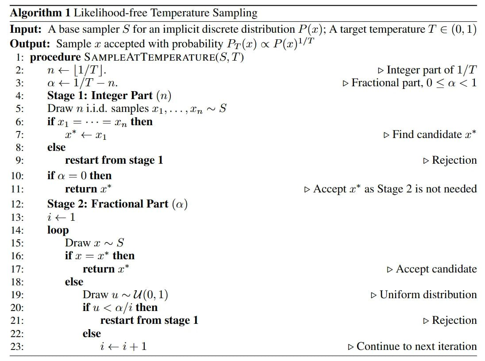

# CALM: Непрерывные авторегрессионные языковые модели

## Общее описание

CALM (Continuous Autoregressive Language Models) представляет собой новую парадигму в архитектуре языковых моделей, которая смещает фокус с последовательного предсказания дискретных токенов на предсказание непрерывных векторов. Вместо предсказания следующего токена CALM предсказывает следующий непрерывный вектор, представляющий собой чанк из K токенов, что сокращает количество авторегрессионных шагов в K раз.

## Основная идея

Традиционные авторегрессивные языковые модели (например, GPT) генерируют текст токен за токеном, что приводит к вычислительной неэффективности. CALM решает эту фундаментальную проблему, перейдя от дискретных токенов к непрерывным векторам. Каждый непрерывный вектор, предсказываемый моделью, кодирует информацию сразу о K токенах, увеличивая "семантическую пропускную способность" каждого шага генерации.

## Архитектура и компоненты

### 1. Надежный автоэнкодер с высокой точностью

Центральным элементом CALM является надежный вариационный автоэнкодер (VAE), который сжимает чанк из K токенов в один непрерывный вектор z. Для создания устойчивого латентного пространства используются три ключевые техники:

- **Вариационная регуляризация**: VAE регуляризует латентное пространство, заставляя распределение кодированных векторов соответствовать стандартному нормальному априорному распределению через лосс дивергенции Кульбака-Лейблера (KL).

- **Отсечение KL (KL Clipping)**: Предотвращает коллапс апостериорного распределения (posterior collapse), когда латентные размерности становятся неинформативными.

- **Двойной Dropout**: Dropout применяется как к входным токенам, так и к латентному вектору z во время обучения, заставляя модель выучивать избыточное и надежное представление.

В результате автоэнкодер достигает более 99.9% точности реконструкции на уровне токенов, создавая гладкое и структурированное латентное пространство, подходящее для генеративного моделирования.

### 2. Языковое моделирование без функции правдоподобия

Поскольку выходное пространство - бесконечное множество ℝˡ, вычисление явного распределения вероятностей с помощью слоя softmax невозможно. CALM решает эту проблему с помощью генеративной головы на основе энергии (Energy-Based Generative Head).

**Energy Score как целевая функция**: Вместо максимизации правдоподобия голова обучается путём оптимизации строго корректной оценочной функции (strictly proper scoring rule). Целевой функцией обучения является Energy Score, определённая как:
S(P, y) = Eₓ',ₓ''∼P[‖x' - x''‖] - 2 Eₓ∼P[‖x - y‖]

Интуиция за этой формулой: первый член поощряет разнообразие (максимизируя расстояние между различными сэмплами модели), а второй — точность (минимизируя расстояние между сэмплами модели и истинным значением).

**Energy Transformer**: Используется для высококачественной одношаговой генерации, что является ключевым преимуществом перед другими непрерывными генеративными моделями, такими как диффузионные модели, которые требуют десятков или сотен итеративных шагов.

### 3. Новый инструментарий для оценки и управления

CALM предлагает решения для оценки и управления, не зависящие от функции правдоподобия:

- **BrierLM**: Новая метрика, основанная на Brier score - строго корректной оценочной функции, которая вознаграждает хорошо откалиброванные предсказания. BrierLM демонстрирует почти линейную зависимость с лоссом перекрёстной энтропии (корреляция Пирсона -0.966), что делает её надёжным аналогом перплексии для моделей без функции правдоподобия.

- **Сэмплирование с температурой без функции правдоподобия**: Теоретически обоснованный алгоритм, использующий теорию выборки с отклонением (rejection sampling) и задачу о фабрике Бернулли (Bernoulli Factory problem). Для температуры T = 1/n: нужно получить n независимых сэмплов из модели и принять результат, если все n сэмплов идентичны.

**Описание:** Изображение иллюстрирует алгоритм сэмплирования с температурой без функции правдоподобия, используемый в CALM. Алгоритм включает два этапа: целочисленную часть (где извлекаются n независимых сэмплов и принимается результат только если все сэмплы идентичны) и дробную часть (с использованием равномерного распределения и метода отклонения для точного сэмплирования). Этот подход позволяет управлять компромиссом между точностью и разнообразием генерации без необходимости вычисления явной функции правдоподобия.

## Экспериментальные результаты

### Эффективность и производительность

- Модель CALM-M с 371 млн параметров (при K=4) достигает производительности, сравнимой с бейзлайном Transformer-S с 281 млн параметров, но требует на 44% меньше FLOPs для обучения и на 34% меньше FLOPs для инференса.

- Увеличение размера чанка K (семантической пропускной способности) является мощным новым рычагом для повышения эффективности. По мере увеличения K от 1 до 4 кривая производительности-вычислений модели CALM-L превосходит стандартные бейзлайны на основе трансформеров.

### Архитектурные инсайты

- Полная схема вариационной регуляризации критически важна для надёжности автоэнкодера.
- Использование декодированного дискретного пространства токенов для входа трансформера оказалось необходимым для стабильной работы.
- Предложенный алгоритм сэмплинга с температурой без функции правдоподобия точно воспроизводит генеративное поведение традиционных трансформеров в широком диапазоне температур.

## Преимущества

- **Повышенная вычислительная эффективность**: Сокращение числа генеративных шагов в K раз коренным образом повышает эффективность
- **Новая ось масштабирования**: Повышение семантической пропускной способности каждого шага генерации как альтернатива традиционному масштабированию по параметрам и данным
- **Полный инструментарий**: Теоретически обоснованный набор инструментов для обучения, оценки и управления без функции правдоподобия
- **Превосходный компромисс производительности и вычислений**: Лучшее соотношение FLOPs к качеству по сравнению с дискретными моделями

## Ограничения

- Задача непрерывного предсказания по своей сути сложнее, что приводит к отставанию в производительности при K=1
- Текущая модель с трудом использует семантическую пропускную способность при K > 4, что указывает на ограничение ёмкости модели
- Точный алгоритм сэмплинга с температурой может быть вычислительно затратным, что вынуждает использовать аппроксимации

## Перспективы

- Разработка автоэнкодеров, лучше учитывающих семантику
- Исследование новых генеративных архитектур и целевых функций для непрерывной области
- Создание единого закона масштабирования, который включает семантическую пропускную способность K наряду с размером модели и данными

## Связи с другими темами

- [[autoregressive_models.md]] - Классические дискретные авторегрессивные модели, которые CALM стремится улучшить
- [[diffusion_models.md]] - Альтернативный подход к генерации, также не использующий пошаговое предсказание
- [[llm_token_efficiency.md]] - Оптимизация эффективности использования вычислительных ресурсов
- [[transformers_and_llms.md]] - Стандартные трансформерные архитектуры, с которыми сравнивается CALM
- [[energy_based_models.md]] - Теоретические основы энергетических моделей, лежащих в основе CALM
- [[variational_autoencoders.md]] - Основы VAE, используемых в CALM для создания латентного пространства
- [[optimization/calm_efficiency_approach.md]] - Подробное рассмотрение вычислительной эффективности подхода CALM

## Источники

1. [CALM: Continuous Autoregressive Language Models](https://arxiv.org/abs/2510.27688) - Основная статья, в которой представлена концепция CALM, её архитектура и экспериментальные результаты
2. [CALM GitHub Repository](https://github.com/shaochenze/calm) - Исходный код реализации CALM
3. [CALM Project Page](https://shaochenze.github.io/blog/2025/CALM) - Дополнительная информация о проекте CALM
4. [Review of CALM](https://arxiviq.substack.com/p/continuous-autoregressive-language) - Рецензия на статью о CALM