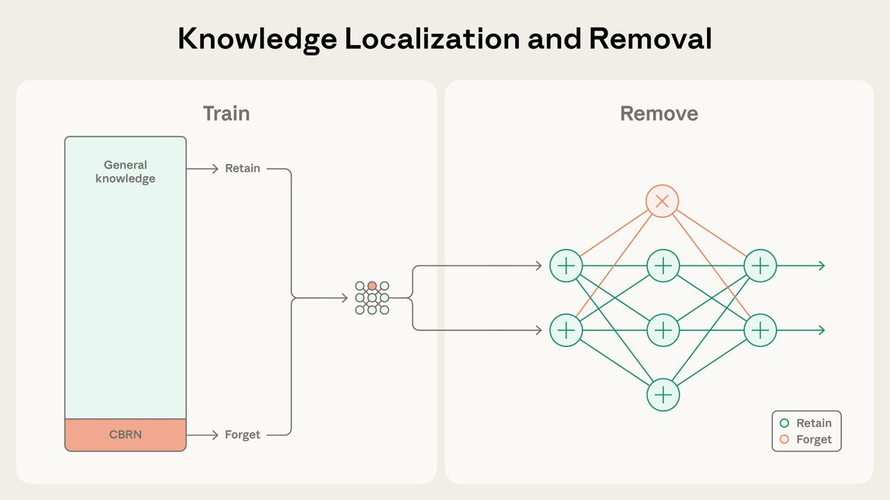
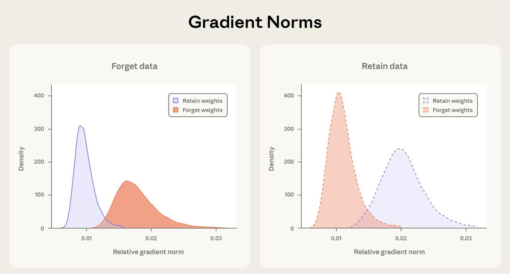

# Избирательное маскирование градиентов (Selective Gradient Masking)

## Краткое описание

Избирательное маскирование градиентов (SGTM - Selective GradienT Masking) - это метод, разработанный Anthropic для разделения знаний в языковых моделях на "удаляемые" и "сохраняемые" компоненты во время предобучения. Метод позволяет локализовать опасные знания в определенные параметры модели, которые затем могут быть удалены для создания безопасной версии модели.

## Основная информация

### Проблема
- Языковые модели приобретают опасные знания (например, о химическом, биологическом, радиологическом и ядерном оружии, а также программных эксплойтах) во время предобучения из интернет-данных
- Традиционный подход - фильтрация данных, который сталкивается с проблемами:
  - Разметка дорогая и неточная
  - Вредоносный контент может быть встроен в безобидные документы
  - Переплетение знаний двойного назначения
  - Модели становятся более эффективными в обучении (даже небольшое количество вредоносных данных может придать им опасные способности)

### Решение: SGTM
SGTM решает эти проблемы локализацией опасных знаний в выделенные параметры модели во время обучения. Ключевая идея: когда модель обучается на опасных примерах, обновляются только выделенные "удаляемые" параметры, а остальная часть модели остается нетронутой.

#### Архитектура
- Параметры модели разделяются на "забывать" (orange) и "сохранять" (blue) компоненты
- В каждом блоке трансформера определенные головы внимания и нейроны MLP выделяются для опасного знания (удаляемые параметры)
- Остальные хранят общие знания (сохраняемые параметры)

#### Процесс обучения
1. **Назначение параметров**: Выделение определенных голов внимания и нейронов MLP как "удаляемых" параметров, остальные как "сохраняемые"
2. **Избирательное маскирование градиентов**: Когда модель видит данные, помеченные как опасные (например, контент CBRN), градиенты маскируются так, что обновляются только удалемые параметры
3. **Абляция**: После обучения удаляемые параметры окончательно зануляются для удаления опасных знаний при сохранении общих способностей

### Самоусиливающийся процесс ("Поглощение")
- Изначально помеченные "забываемые" примеры обновляют только "забываемые" параметры (из-за маскировки градиентов)
- Создает специализированные пути в сети для обработки "забываемого" контента
- Впоследствии даже непомеченные "забываемые" примеры естественным образом проходят через эти пути, в основном обновляя "забываемые" параметры
- Этот эффект поглощения означает, что неправильно помеченный опасный контент все равно локализуется в удалемые параметры

### Результаты
- SGTM достигает лучшего удаления знаний по сравнению с фильтрацией данных при любом уровне сохранения общих возможностей
- Для любого заданного значения потерь при сохранении (общие возможности) SGTM достигает более высоких потерь при "забвении" (сильное удаление биологических знаний)
- SGTM сохранил больше знаний из смежных с биологией областей по сравнению с жесткой фильтрацией данных, при этом удаляя больше биологических знаний, чем слабая фильтрация
- SGTM требует 5% вычислительных затрат для достижения того же уровня сохранения, что и стандартное обучение

### Свойства масштабирования
- Эффект локализации становится сильнее с ростом масштаба модели
- В моделях от 8M до 64M параметров более крупные модели показали постепенно меньшее "утечку" забываемой информации в сохраняемые параметры
- Предполагает, что SGTM становится более эффективным по мере роста моделей

## Новые концепции и термины

- **SGTM (Selective GradienT Masking)**: Метод избирательного маскирования градиентов для локализации опасных знаний
- **Параметры "забывать" (Forget parameters)**: Выделенные параметры модели, в которых локализуются опасные знания
- **Параметры "сохранять" (Retain parameters)**: Остальные параметры, хранящие общие возможности модели
- **Эффект поглощения (Absorption effect)**: Самоусиливающийся процесс, при котором опасный контент направляется в удалемые параметры даже без разметки
- **Дуальные модели (Dual models)**: Подход, при котором из одного обучения получаются как полнокапабельная модель для авторизованного использования, так и безопасная версия для общего развертывания

## Примеры применения

- Создание безопасных версий моделей для развертывания в регулируемых отраслях (здравоохранение, финансы, оборона)
- Митигация рисков при использовании двойного назначения, когда модели приобретают опасные способности
- Повышение устойчивости к атакам, где опасные знания вводятся через промпты
- Обеспечение соответствия нормативным требованиям, таким как GDPR и EU AI Act

## Связи с другими темами

- [[llm_alignment.md]] - Общая тема выравнивания LLM, к которой относится это исследование
- [[reward_hacking_emergent_misalignment.md]] - Связанное явление, касающееся проблем с системами вознаграждения
- [[attention_sinks_in_transformer_models.md]] - Связанная концепция локализации определенных знаний в конкретные компоненты трансформерных моделей
- [[computer_science/vision_arc_varc.md]] - Другие методы локализации знаний в моделях

## Источники

1. [Anthropic Research: Selective Gradient Masking](https://alignment.anthropic.com/2025/selective-gradient-masking/) - Оригинальное исследование Anthropic о маскировке градиентов для разделения модели на веса для развертывания высокого риска
2. [Selective Gradient Masking Enables Safer AI](https://blockchain.news/ainews/selective-gradient-masking-enables-safer-ai-by-splitting-model-weights-for-high-risk-deployments) - Новости о том, как избирательное маскирование градиентов позволяет создавать более безопасный ИИ, разделяя веса модели для развертывания с высоким риском
3. [Twitter: Anthropic AI](https://twitter.com/AnthropicAI/status/1998479605272031731) - Сообщение от программы исследователей Anthropic о новом исследовании с использованием SGTM

## Дополнительные материалы

- [Natural Emergent Misalignment from Reward Hacking](https://www.anthropic.com/research/emergent-misalignment-reward-hacking) - Исследование Anthropic о том, как реальное обучение ИИ может случайно создавать не выровненные модели
- [Findings from a pilot Anthropic–OpenAI alignment evaluation](https://openai.com/index/openai-anthropic-safety-evaluation/) - Совместная оценка безопасности Anthropic и OpenAI

## Медиа

**Изображение показывает**: Визуализацию процесса локализации и удаления знаний в модели с использованием SGTM.

**Изображение показывает**: Нормы градиентов в "забываемых" и "сохраняемых" параметрах во время обучения.

**Изображение показывает**: Компромисс между удалением опасных знаний и сохранением полезных способностей модели при использовании SGTM по сравнению с фильтрацией данных.