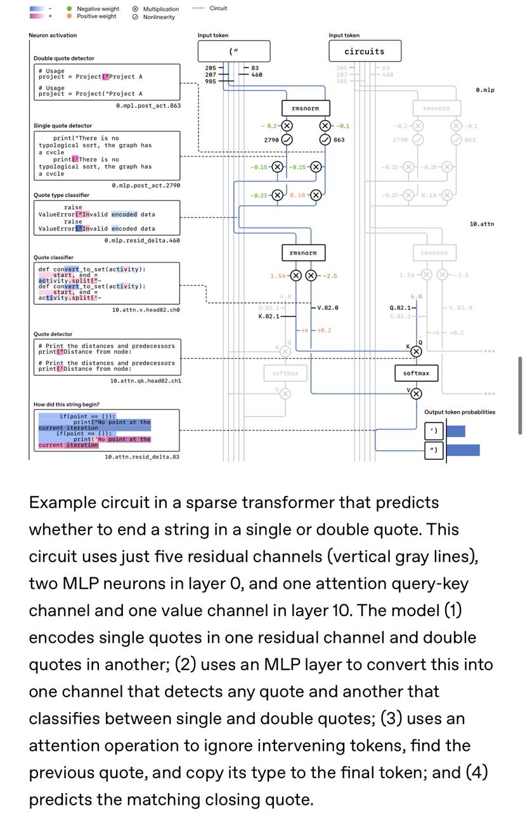

# Разреженные схемы для интерпретируемости (Sparse Circuits for Interpretability)

## Введение

Исследование, представленное OpenAI, предлагает новый подход к интерпретируемости нейронных сетей через обучение структурно простых разреженных сетей. Вместо попыток анализировать уже обученные плотные сети, исследователи обучают модели быть изначально интерпретируемыми путем ограничения структуры сети.

## Проблема интерпретируемости

Современные языковые модели активно используются для принятия решений в медицине, науке, образовании и других важных сферах. Однако интерпретация их ответов остается сложной задачей. Многие полагаются на интерпретацию через Chain-of-Thought (CoT), но этот подход является хрупким и ненадежным.

Проблема заключается в том, что мы пытаемся распутывать внутренности модели постфактум, когда это уже почти невозможно. Во время обучения модели подбирают миллиарды весов, из которых в итоге получается очень плотная сеть. Поведение модели размазано по массе параметров, и структурировать эту паутину, мягко говоря, сложно.

## Решение: разреженные сети

Вместо этого OpenAI предлагает сразу обучать структурно более простую разреженную сетку. На практике исследователи берут архитектуру, похожую на GPT-2, и ограничивают веса так, чтобы подавляющее большинство было равно нулю. То есть если в обычной плотной сети каждый нейрон связан со всеми из следующего слоя, то здесь остаются связи только с несколькими. Сеть становится более чистой и читаемой.

### Схемы (Circuits)

Такая структура сети позволяет для конкретной задачи брать и находить маленькую часть модели, отвечающую за ее решение. В статье это называется circuit (схема). Формально - минимальный поднабор весов, обладающий необходимостью и достаточностью: то есть если выкинуть все, кроме него, задача все еще будет решаться; а если выкинуть только его, а остальную сеть оставить - нет.

В этом маленьком наборе весов уже можно копаться и непосредственно анализировать поведение сети.

## Пример: задача закрытия кавычек

В статье приведен пример с простенькой задачей закрытия кавычек. Модели надо запомнить тип открывающейся кавычки и в конце последовательности поставить такую же. Оказывается, делает она это по определенному логическому алгоритму, заложенному в 5 residual-каналах, двух MLP-слоях и 1 канале аттеншена.

Это показывает, что даже простые задачи могут иметь конкретную логическую реализацию в нейронной сети. Представьте, что можно найти, если посмотреть, как модель решает сложную математику или пишет код?

## Практические результаты

Интересный практический результат из исследования: чем больше модель и чем более она разреженная, тем проще становятся схемы, реализующие одни те же способности. Это логично - более разреженные структуры позволяют изолировать конкретные функции модели.

## Ограничения и перспективы

Несмотря на интересный подход, существуют ограничения:

1. Не факт, что если это работает для игрушечных моделей, заработает и для больших
2. Обучать разреженные модели только ради интерпретируемости никто не будет - слишком дорого и неэффективно
3. Ключевая перспектива - если OpenAI научатся извлекать что-то подобное из уже обученных dense-моделей, это будет иметь гораздо большее значение

## Значение для науки о нейронных сетях

Этот подход может привести к более глубокому пониманию внутренней работы нейронных сетей и открыть новые пути для:
- Повышения безопасности ИИ
- Более эффективного редактирования моделей
- Понимания эмерджентных способностей
- Создания более прозрачных и контролируемых ИИ-систем

**Описание:** Пример схемы в разреженном трансформере, которая предсказывает, заканчивать строку одинарной или двойной кавычкой. Эта схема использует всего пять резидуальных каналов (вертикальные серые линии), два нейрона MLP в слое 0 и один канал запрос-ключ внимания и один канал значений в слое 10. Модель (1) кодирует одинарные кавычки в одном резидуальном канале и двойные кавычки в другом; (2) использует слой MLP для преобразования этого в один канал, который обнаруживает любую кавычку, и другой, который классифицирует между одинарными и двойными кавычками; (3) использует операцию внимания, чтобы игнорировать промежуточные токены, находить предыдущую кавычку и копировать ее тип в последний токен; и (4) предсказывает соответствующую закрывающую кавычку.

## Связи с другими темами

- [[mechanistic_interpretability.md|Механистическая интерпретируемость]] - оба подхода направлены на понимание внутренней работы моделей
- [[activation_engineering.md|Инжиниринг активаций]] - практическое применение знаний об активациях в моделях
- [[transformer_architecture.md|Архитектура трансформеров]] - разреженные схемы применяются к архитектуре трансформеров

## Источники

1. [Understanding Neural Networks through Sparse Circuits](https://openai.com/index/understanding-neural-networks-through-sparse-circuits/) - оригинальная статья OpenAI о подходе к интерпретируемости через разреженные схемы
2. [OpenAI Introduces Sparse Circuits for Interpretable AI](https://ai-daily.news/articles/openai-introduces-sparse-circuits-for-interpretable-ai) - анализ подхода OpenAI к интерпретируемости, включая методологию и преимущества
3. [OpenAI Boosts Interpretability Using Sparse-Circuit Models](https://itdigest.com/hardware-and-networks/openai-breaks-ground-on-interpretability-with-sparse-circuit-neural-networks/) - освещение прорывных результатов от OpenAI в области интерпретируемости нейронных сетей