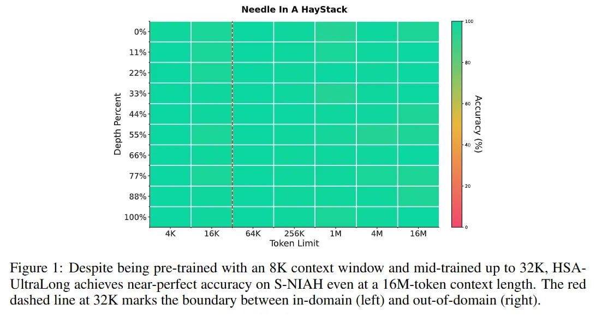

# Сравнение Механизмов Разреженного Внимания: HSA, MoSA, DSA и другие

## Общее описание

В этой статье представлено сравнительное исследование различных механизмов разреженного внимания, применяемых для эффективной обработки длинных контекстов в трансформерах. Рассматриваются Hierarchical Sparse Attention (HSA), Mixture of Sparse Attention (MoSA), DeepSeek Sparse Attention (DSA) и другие методы, включая их архитектурные особенности, вычислительную эффективность и практическую применимость.

## Сравнительная таблица

| Механизм | Сложность | Разреженность | Маршрутизация | Обобщающая способность | Производительность |
|----------|-----------|---------------|---------------|----------------------|-------------------|
| Стандартное MHA | O(n²) | Нет | Нет | Полная | Высокая |
| **HSA (Hierarchical Sparse Attention)** | O(n) | Иерархическая | Дифференцируемая | Высокая (16M) | **Очень высокая** |
| **MoSA (Mixture of Sparse Attention)** | O(n) | Обучаемая | Expert-Choice | Высокая | **Очень высокая** |
| **DSA (DeepSeek Sparse Attention)** | O(n*<w>) | Адаптивная | Top-K селектор | Средняя-высокая | **Высокая** |
| Longformer | O(n) | Фиксированная | Нет | Ограниченная | Высокая |
| BigBird | O(n) | Фиксированная | Нет | Ограниченная | Высокая |
| Linear Attention | O(n) | Нет | Нет | Низкая-средняя | **Очень высокая** |

## HSA (Hierarchical Sparse Attention)

### Основные особенности
- **Иерархическая структура**: входные данные разбиваются на чанки, и для каждого чанка создается "лендмарк" (landmark representation) - сжатое векторное представление
- **Дифференцируемая маршрутизация**: выбор чанков для внимания осуществляется через обучаемую операцию, что позволяет модели учиться, где искать информацию
- **Двухуровневое внимание**: сочетание локального скользящего окна и глобального разреженного поиска
- **Без позиционного кодирования для длинного контекста**: HSA использует No Positional Encoding (NoPE) для глобального механизма, полагаясь исключительно на адресацию по контенту

### Преимущества
- Отличная обобщающая способность (16M токенов при обучении на 32K)
- Высокая точность поиска даже на экстремальных масштабах
- Дифференцируемость шага извлечения, что позволяет модели обучаться навыку поиска

### Недостатки
- Требует соотношения 16:1 между query heads и key-value heads для управления оверхедом
- Медленнее, чем FlashAttention-3 на коротких последовательностях
- Инженерная сложность реализации иерархической структуры

## MoSA (Mixture of Sparse Attention)

### Основные особенности
- **Вдохновлён MoE**: каждый головной элемент внимания динамически выбирает разреженное подмножество токенов на основе содержания ввода
- **Маршрутизация выбора эксперта**: механизм, аналогичный MoE, но применительно к разреженному вниманию
- **Обучаемая, основанная на содержании разреженность**: разреженность адаптивна и обучаема во время тренировки

### Преимущества
- Превосходит традиционные плотные модели по некоторым метрикам
- Сокращение ошибок предсказания до 27%
- Быстрое обучение и вывод
- Использует меньше памяти и хранения для промежуточных вычислений

### Недостатки
- Сложность маршрутизации: добавление механизма выбора эксперта увеличивает архитектурную сложность
- Стабильность обучения: обучение с динамической разреженностью может быть сложнее
- Зависимость от задачи: производительность может варьироваться в зависимости от конкретной задачи

## DSA (DeepSeek Sparse Attention)

### Основные особенности
- **Тонко настраиваемое разреженное внимание**: позволяет достичь разреженности с тонкой настройкой
- **Fine-grained token selection**: использует top-K селектор для динамического определения, на какие токены обращать внимание
- **Снижение сложности до O(n*<w>)**: где <w> - средний размер адаптивного окна после тонкого отбора

### Преимущества
- Значительные улучшения в эффективности обучения и вывода
- Практически идентичное качество вывода по сравнению с традиционными механизмами
- Оборудование-ориентированность: спроектирован с учетом особенностей оборудования

### Недостатки
- Ограниченная обобщающая способность по сравнению с HSA
- Требует специализированных ядер для реализации (FlashMLA и индексаторы логитов)

## Традиционные методы разреженного внимания

### Longformer и BigBird
- **Фиксированные шаблоны**: комбинируют локальное, глобальное и случайное внимание
- **Недифференцируемость**: выбор, на какие токены обращать внимание, определяется предопределенными шаблонами
- **Ограниченная чувствительность к содержанию**: не адаптируются к содержанию входа

### Linear Attention
- **Аппроксимации**: использует ядерные приближения для аппроксимации полного внимания
- **Потенциальная потеря информации**: из-за приближений может терять важные зависимости

## Критерии оценки механизмов внимания

### 1. Вычислительная эффективность
- **HSA**: Высокая эффективность при длинных контекстах (>32K токенов)
- **MoSA**: Высокая эффективность с превосходством над плотными моделями
- **DSA**: Высокая эффективность при сохранении качества

### 2. Обобщающая способность
- **HSA**: Экстраординарная (16M токенов при обучении на 32K)
- **MoSA**: Высокая (лучше, чем традиционные методы)
- **DSA**: Средняя-высокая (ограничена размерами на которых обучались)

### 3. Адаптивность
- **HSA**: Очень высокая - дифференцируемая маршрутизация
- **MoSA**: Высокая - обучаемая, основанная на содержании разреженность
- **DSA**: Средняя - адаптивный выбор с помощью top-K

### 4. Архитектурная сложность
- **HSA**: Высокая - иерархическая структура и двойная структура внимания
- **MoSA**: Средняя-высокая - механизм маршрутизации выбора эксперта
- **DSA**: Высокая - специализированные ядра и индексация

## Применения и области использования

### HSA
- Идеально подходит для задач с экстремально длинными контекстами (миллионы токенов)
- Подходит для моделей, требующих пожизненной памяти
- Рекомендуется для агентных систем с долгосрочными целями

### MoSA
- Подходит для задач, где важна производительность и экономия памяти
- Хорош для ситуаций, где важно качество при умеренных длинах контекста
- Эффективно используется в MoE-архитектурах

### DSA
- Подходит для промежуточных задач по длине контекста
- Хорош для специализированных приложений, где важна оптимизация под оборудование
- Используется в сериях DeepSeek моделей

## Будущие направления

### 1. Гибридные подходы
- Сочетание HSA и MoSA для получения преимуществ обеих архитектур
- Интеграция DSA с иерархическими методами для гибкой адаптации к задаче

### 2. Автоматическая настройка архитектуры внимания
- Использование NAS (Neural Architecture Search) для определения оптимального механизма внимания для конкретной задачи
- Адаптивные механизмы, меняющие тип внимания в зависимости от входных данных

### 3. Унификация подходов
- Разработка общего фреймворка, объединяющего все методы разреженного внимания
- Общие принципы маршрутизации, применимые к разным типам архитектур

## Иллюстрации

**На изображении показано:** Механизм HSA работает аналогично архитектуре Mixture of Experts (MoE). Сначала текущий токен вычисляет скалярные произведения с лендмарк-представлениями прошлых чанков как оценки извлечения, из которых выбираются топ-K чанков - аналогично тому, как MoE использует маршрутизатор для выбора топ-экспертов. Затем токен выполняет внимание с каждым из А извлеченных чанков отдельно, что повторяет процесс в MoE, где независимо проводится прямой проход с Е экспертами. Наконец, выходы внимания из каждого чанка взвешиваются нормализованными softmax оценками извлечения и суммируются, что функционально эквивалентно объединению выходов в MoE.

**На изображении показано:** Несмотря на предобучение с 8K окном контекста и дообучение до 32K, HSA-UltraLong достигает почти идеальной точности на S-NIAH даже при длине контекста в 16 миллионов токенов. Красная пунктирная линия на 32K отмечает границу между внутридоменным (слева) и внешним (справа) доменами.

## Источники

- "Every Token Counts: Generalizing 16M Ultra-Long Context in Large Language Models" - HSA механизм
- "Mixture of Sparse Attention: Content-Based Learnable Sparse Attention via Expert-Choice Routing" - MoSA механизм
- "Native Sparse Attention: Hardware-Aligned and Natively Trainable Sparse Attention" - DSA механизм
- "Longformer: The Long-Document Transformer" - традиционные методы разреженного внимания

## Связи с другими темами

- [[models/hsa_ultralong.md]] - Подробное описание HSA в контексте HSA-UltraLong
- [[mixture_of_sparse_attention.md]] - Подробное описание MoSA
- [[models/deepseek_sparse_attention.md]] - Подробное описание DSA
- [[dsa_with_top_k_selector.md]] - Усовершенствованный DSA с top-K селектором
- [[enhanced_mla_with_top_k_selector.md]] - MLA, усиленная за счет интеграции с DSA
- [[llm_architectures_comparison.md]] - Сравнение архитектур LLM
- [[log_linear_attention.md]] - Альтернативный подход к эффективному вниманию