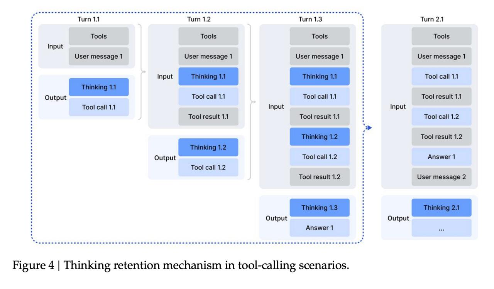

# Механизм сохранения мышления (Thinking Retention Mechanism) в агентных системах

## Общее описание

Механизм сохранения мышления (Thinking Retention Mechanism) - это подход, применяемый в агентных системах, при котором рассуждения модели не выкидываются и остаются видимыми при генерации следующего вызова инструмента. Этот механизм впервые был реализован в архитектуре DeepSeek V3.2 и аналогичных моделей, таких как GPT-5.

## Проблема традиционного подхода

В традиционных системах вызова инструментов:
- Для ответа на запрос пользователя может потребоваться вызвать несколько инструментов
- При каждом новом вызове инструмента модель не видит свои предыдущие размышления
- Это приводит к значительной неэффективности использования токенов
- Модель вынуждена заново обдумывать всю проблему при каждом последующем вызове инструмента

## Решение: механизм сохранения мышления

### Как работает механизм
- При вызове инструментов модель сохраняет цепочку своих рассуждений
- Эти рассуждения остаются в контексте и видны модели при генерации следующего вызова инструмента
- Это позволяет модели использовать предыдущий контекст рассуждений для более эффективного продолжения решения задачи

### Преимущества подхода
- Повышенная эффективность использования токенов
- Лучшая последовательность и согласованность рассуждений
- Более сложные многоступенчатые задачи могут быть решены эффективнее
- Модель не теряет контекст при переходе между инструментами

### Постобработка
- После того как модель написала ответ и он вернулся пользователю, цепочки рассуждений удаляются
- История вызовов инструментов и их результатов остается сохраненной в контексте
- Модель видит, что она делала, но не о чём думала (т.е. сохраняются только факты, а не процесс мышления)

**Изображение показывает:** Механизм сохранения мышления в сценариях вызова инструментов. На рисунке показано, как рассуждения модели сохраняются между вызовами инструментов, позволяя модели видеть свой предыдущий мыслительный процесс при генерации следующего вызова инструмента. Это позволяет избежать повторного анализа проблемы при каждом новом вызове инструмента, повышая эффективность использования токенов.

## Техническая реализация

### В DeepSeek V3.2
- Впервые реализован подход, аналогичный OpenAI, когда рассуждения не выкидываются
- Модель может видеть свои предыдущие размышления при генерации следующего вызова инструмента
- Это позволяет избежать повторного анализа проблемы на каждом этапе

### В других системах
- Похожие подходы используются в GPT-5, Claude 4.5 и других передовых агентных системах
- Принцип "мышлить как инструмент" позволяет более эффективно использовать инструменты

## Применения

### Агентные задачи
- Поисковые агенты, которые анализируют результаты для принятия решений
- Кодинг-агенты, которые используют несколько инструментов для решения программистских задач
- Общие агенты, которые планируют сложные многоступенчатые задачи

### Решение задач с вызовом инструментов
- Повышение качества агентных систем
- Улучшение эффективности при работе с внешними инструментами
- Более сложные автоматизированные рабочие процессы

## Ограничения и риски

### Эффективность токенов
- Для подготовки к задачам с длинными рассуждениями требуется в 2-3 раза больше токенов
- В API может наблюдаться более низкая скорость генерации

### Управление контекстом
- Необходимость в тщательном управлении размером контекста
- Риск накопления нерелевантной информации
- Важность правильной очистки цепочек рассуждений после завершения задачи

## Сравнение с альтернативными подходами

### Традиционные системы
- Вызовы инструментов без сохранения рассуждений
- Каждый вызов начинается "с чистого листа"
- Меньшая эффективность токенов

### Системы с сохранением мышления
- Сохранение контекста рассуждений между вызовами
- Более эффективное использование истории
- Более сложные многоступенчатые задачи

## Будущие направления

### Автоматическое управление контекстом
- Разработка методов автоматического удаления нерелевантных рассуждений
- Оптимизация использования токенов при сохранении качества

### Интеграция с памятью
- Связь с долгосрочными системами памяти агентов
- Интеграция с внешними базами знаний

## Связи с другими темами

- [[deepseek_v3_2_reinforcement_learning_agent_training.md]] - подробности о подходе в DeepSeek V3.2
- [[ai/agents/advanced_tool_calling_and_planning.md]] - продвинутое вызывание инструментов и планирование
- [[ai/llm/techniques/multi_head_latent_attention.md]] - альтернативные технологии внимания от DeepSeek
- [[specialized_attention_mechanisms.md]] - архитектуры специализированного внимания
- [[ai/agents/memory_systems_for_ai_agents.md]] - системы памяти для агентов

## Связи с другими темами

- [[deepseek_v3_2_reinforcement_learning_agent_training.md]] - подробности о подходе в DeepSeek V3.2
- [[ai/agents/advanced_tool_calling_and_planning.md]] - продвинутое вызывание инструментов и планирование
- [[ai/llm/techniques/multi_head_latent_attention.md]] - альтернативные технологии внимания от DeepSeek
- [[specialized_attention_mechanisms.md]] - архитектуры специализированного внимания
- [[ai/agents/memory_systems_for_ai_agents.md]] - системы памяти для агентов
- [[off_policy_sequence_masking.md]] - метод стабилизации в агентных системах
- [[generative_reward_model_grm.md]] - оценка действий агента с использованием рубрик
- [[agent_training_with_synthetic_data.md]] - подготовка агентов с синтетическими данными

## Источники

- Технический отчет: https://huggingface.co/deepseek-ai/DeepSeek-V3.2
- Статья о DeepSeek V3.2: "DeepSeek-V3.2: Pushing the Frontier of Open Large Language Models"
- Сравнительный анализ механизмов вызова инструментов в современных LLM