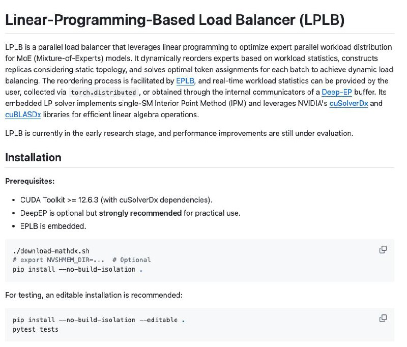

# LPLB: Линейно-программный балансировщик нагрузки для MoE моделей

**Описание:** На изображении представлен LPLB (Linear Programming based Load Balancer) - экспериментальный балансировщик нагрузки для моделей Mixture-of-Experts (MoE), который использует методы линейного программирования для оптимизации распределения вычислительной нагрузки по экспертам. Система динамически перераспределяет экспертов на основе статистики по нагрузке, создает реплики с учетом топологии и решает оптимальное распределение токенов по экспертам с помощью LP-решателя, работающего на GPU.

## Описание

LPLB (Linear Programming based Load Balancer) - это экспериментальный балансировщик нагрузки для моделей Mixture-of-Experts (MoE), разработанный и опубликованный DeepSeek как open-source проект. Система использует методы линейного программирования для оптимизации распределения вычислительной нагрузки по экспертам в MoE архитектурах.

## Технические детали

### Основные возможности

- **Динамическая перебалансировка экспертов**: Система динамически перераспределяет экспертов на основе статистики по нагрузке
- **Создание реплик экспертов**: Учитывает топологию кластера при создании реплик
- **Оптимизация через LP-решатель**: Использует решатель линейного программирования, работающий прямо на GPU (cuSolverDx + cuBLASDx) для решения оптимального распределения токенов по экспертам
- **Метрики нагрузки**: Поддерживает получение метрик загрузки вручную, через torch.distributed или через буферы Deep-EP

### Архитектура

LPLB расширяет функциональность EPLB (Expert Parallelism Load Balancer), добавляя возможности для решения динамических дисбалансов нагрузки. Система использует:

- Избыточные эксперты (redundant experts), связанные с оригинальными экспертами, формирующие ребра между GPU с ограничениями по емкости
- Встроенный LP-решатель, использующий одиночный SM Interior Point Method (IPM) с библиотеками NVIDIA cuSolverDx и cuBLASDx
- Поддержка топологий: куб (cube), гиперкуб (hypercube) и тор (torus) для репликации экспертов

### Реализация

- **Языки программирования**: Python (42.7%), C++ (34.7%), CUDA (21.9%), Shell (0.7%)
- **Зависимости**: CUDA Toolkit >= 12.6.3 с cuSolverDx, DeepEP (рекомендуется), EPLB (встроенный)
- **Производительность решателя**: ~100 мкс для оптимизации внутри узла

### Варианты топологий

1. **Куб (Cube)**: Формирует кубический граф с диагональными ребрами, требует 2+ эксперта на GPU, идеально подходит для подгрупп EP с 8 GPU
2. **Гиперкуб (Hypercube)**: Похож на Cube, но без диагональных ребер, требует 16 GPU
3. **Тор (Torus)**: Формирует торический граф, эффективен для глобального баланса, но менее эффективен для внутренней коммуникации узла

## Проблемы, которые решает LPLB

### Динамический дисбаланс нагрузки

Традиционные методы балансировки нагрузки в MoE моделях часто не справляются с динамическими флуктуациями нагрузки, вызванными случайностью малых батчей во время обучения. LPLB решает эту проблему:

- Оптимизирует распределение токенов по экспертам с использованием линейного программирования
- Перенаправляет токены вдоль ребер между экспертами, минимизируя дисбаланс нагрузки
- Использует статистику нагрузки в реальном времени для принятия решений о балансировке

### Эффективность вычислений

- Улучшает балансировку вычислительной нагрузки между экспертами
- Уменьшает время простоя экспертов
- Повышает общую пропускную способность системы
- Минимизирует эффект "бутылочного горлышка" при использовании экспертов

## Интеграция с существующими системами

LPLB требует DeepEP в качестве предварительного условия для практического использования. Система использует NVLINK и NVSHMEM для оптимизированной синхронизации рабочей нагрузки в реальном времени, вместо torch.distributed.allreduce для снижения накладных расходов.

## Ограничения

- Текущая версия балансирует только общее количество токенов, не учитывая нелинейность затрат групповой матричной факторизации
- Задержка решателя (~100 мкс) может быть значительной для малых батчей
- Может показывать худшие результаты по сравнению с EPLB при экстремальном глобальном дисбалансе нагрузки из-за разных стратегий назначения избыточных экспертов

## Значение для инфраструктуры ИИ

LPLB демонстрирует интеллектуальный и точный подход к балансировке нагрузки в больших MoE архитектурах. Это исследование показывает, как можно использовать передовые методы оптимизации (линейное программирование) для решения сложных задач распределения ресурсов в нейросетях с тысячами экспертов. Такой подход потенциально может:

- Улучшить эффективность обучения и инференса в очень крупных MoE моделях
- Снизить потребность в избыточной инфраструктуре за счет лучшего использования ресурсов
- Повысить стабильность и предсказуемость поведения распределенных систем

## Связи с другими темами

- [[mixture_of_experts_architecture.md]] - Общее описание архитектур MoE
- [[deepseek_v3.md]] - Пример MoE-архитектуры от DeepSeek
- [[model_deployment_strategies.md]] - Стратегии деплоя для MoE моделей
- [[gpu_memory_management.md]] - Управление ресурсами GPU при работе с MoE

## Источники

1. [LPLB GitHub Repository](https://github.com/deepseek-ai/LPLB) - Официальный репозиторий LPLB от DeepSeek, содержащий исходный код и документацию проекта
2. [DeepSeek LPLB Announcement](https://www.51cto.com/article/830041.html) - Объявление о запуске LPLB с объяснением технических аспектов
3. [Sina Finance Article on LPLB](https://finance.sina.cn/stock/jdts/2025-11-20/detail-infxzepk1095998.d.html) - Китайская публикация о новом инструменте DeepSeek для MoE моделей