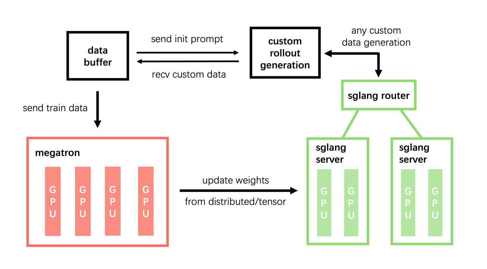

# Miles: Фреймворк для обучения с подкреплением MoE-моделей от LMSYS ORG

## Описание

Miles - это фреймворк для обучения с подкреплением (RL), разработанный командой LMSYS ORG, ориентированный на enterprise-уровень. Проект является преемником более легковесного инструмента SLiME и делает следующий шаг вперед - обеспечивает масштабное обучение архитектур Mixture of Experts (MoE) и поддержку тяжелых промышленных нагрузок.

Miles был разработан командой, которая создала проект Chatbot Arena - популярную платформу для сравнения языковых моделей, что подчеркивает опыт разработчиков в области оценки и улучшения LLM.

**Описание:** На изображении показана архитектура фреймворка Miles, демонстрирующая его структуру и компоненты для RL-обучения MoE моделей.

**Описание:** На изображении представлена концептуальная схема фреймворка Miles, иллюстрирующая систему обучения с подкреплением для MoE моделей.

## Исторический контекст

Miles развивает идеи, заложенные в его предшественнике - SLiME (Structured Language Model Editor), который доказал эффективность легковесного дизайна в современных пайплайнах пост-тренировки. SLiME использовался, в частности, для запуска GLM-4.6, что демонстрирует его практическую применимость. Miles же масштабирует эти концепции для enterprise-уровня и специализируется на обучении MoE моделей.

## Ключевые технические особенности

### True On-Policy подход

Одной из главных инноваций Miles является реализация так называемого "True On-Policy" подхода. В традиционных RL-фреймворках часто возникало расхождение между процессом обучения и инференсом (выводом), что могло привести к несоответствиям в поведении модели. 

Miles устраняет эту дивергенцию за счет:
- Инфраструктурного подхода к синхронизации обучения и инференса
- Использования Flash Attention 3 для эффективного внимания
- Интеграции с библиотекой DeepGEMM для оптимизированных матричных операций
- Использования специализированных ядер от Thinking Machines Lab
- Совместимости с torch.compile для дополнительной оптимизации

Эта архитектура обеспечивает нулевую дивергенцию между тренировкой и инференсом.

### Спекулятивное декодирование с онлайн-обучением

Miles включает улучшенную реализацию спекулятивного декодирования - метода ускорения генерации текста. В традиционных подходах черновая (draft) модель замораживается, что не позволяет ей следовать политике целевой модели. 

LMSYS добавили возможность онлайн-обучения черновой модели, что позволяет:
- Повысить точность предсказаний черновой модели
- Улучшить синхронизацию с целевой моделью
- Достичь более чем 25% ускорения генерации, особенно на поздних стадиях обучения

### Стабильность и эффективность

Для enterprise-приложений особенно важна стабильность и эффективное использование ресурсов:

- **Управление памятью**: В Miles включены механизмы, предотвращающие падение системы при некритичных ошибках OOM (Out of Memory)
- **Исправление потребления памяти**: Улучшения в FSDP (Fully Sharded Data Parallel) для снижения чрезмерного потребления памяти
- **Масштабируемость**: Поддержка тяжелых промышленных нагрузок и обучение крупномасштабных MoE моделей

## Поддерживаемые модели и архитектуры

Miles ориентирован на обучение моделей с архитектурой Mixture of Experts (MoE), что позволяет:
- Эффективно масштабировать параметры моделей при ограниченных вычислительных ресурсах
- Использовать разреженные вычисления для более быстрого инференса
- Обрабатывать различные типы задач с помощью специализированных экспертов

## Дорожная карта проекта

- Поддержка мультимодального обучения
- Совместимость со SGLang v2 для распределенного инференса
- Расширенное спекулятивное декодирование
- Дополнительные оптимизации для enterprise-сценариев

## Сравнение с SLiME

| Аспект | SLiME | Miles |
|--------|-------|-------|
| Уровень применения | Легковесный инструмент | Enterprise-уровень |
| Специализация | Общее пост-тренировочное обучение | Обучение MoE моделей |
| Масштаб | Небольшие-средние нагрузки | Тяжелые промышленные нагрузки |
| Основные инновации | Интеграция Megatron + SGLang | True On-Policy, спекулятивное декодирование |
| Целевые архитектуры | Различные LLM | MoE архитектуры |

## Связи с другими темами

- [[slime.md]] - Предшественник Miles, фреймворк для пост-тренировки LLM
- [[../../reinforcement_learning/rlhf_fine_tuning.md]] - Обучение с подкреплением для тонкой настройки LLM
- [[../mixture_of_experts_architecture.md]] - Архитектура Mixture of Experts, для которой предназначен Miles
- [[sglang.md]] - Система распределенного инференса, с которой тесно интегрирован Miles
- [[../../reinforcement_learning/rl_frameworks_pytorch.md]] - Обзор фреймворков для RL в PyTorch

## Источники

1. [Miles RL Framework - GitHub](https://github.com/lmsys/miles) - основной репозиторий проекта с технической документацией
2. [Статья о Miles фреймворке] - описание архитектуры и ключевых особенностей
3. [LMSYS ORG] - организация, разрабатывающая Miles и создавшая Chatbot Arena

## См. также

- [Chatbot Arena](https://chat.lmsys.org/) - платформа для оценки языковых моделей от LMSYS
- [SLiME Framework](https://github.com/THUDM/slime) - предшественник Miles