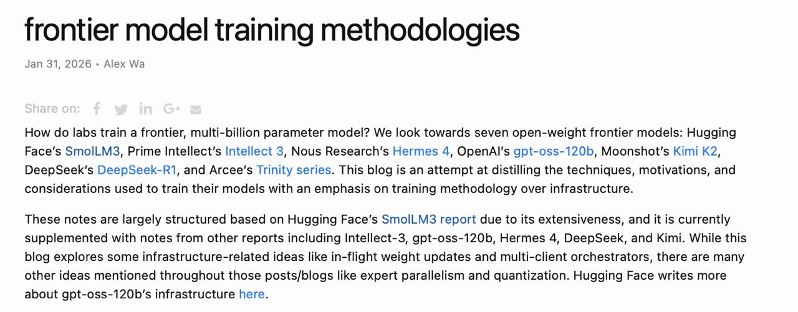

# Методологии обучения frontier-моделей

## Краткое описание

Обзор практических методологий обучения современных frontier-моделей с параметрами в миллиарды параметров на примере семи проектов с открытыми или условно открытыми весами: SmolLM3 (Hugging Face), Intellect 3 (Prime Intellect), Hermes 4 (Nous Research), gpt-oss-120b (OpenAI), Kimi K2 (Moonshot), DeepSeek-R1 и Arcee Trinity series. Материал представляет собой дистилляцию реальных практик с акцентом на методологию обучения, а не инфраструктуру.

**Изображение показывает:** Заголовок статьи "Frontier Model Training Methodologies" от Alex Wa (Jan 31, 2076), описывающий анализ семи open-weight frontier-моделей и их методологий обучения.

## Основная информация

### Охватываемые модели

Анализ основан на изучении следующих проектов:
- **SmolLM3** (Hugging Face)
- **Intellect 3** (Prime Intellect)
- **Hermes 4** (Nous Research)
- **gpt-oss-120b** (OpenAI)
- **Kimi K2** (Moonshot)
- **DeepSeek-R1** (DeepSeek)
- **Arcee Trinity series** (Arcee)

### Ключевые этапы обучения

#### 1. Сбор и очистка данных

Процесс подготовки данных включает:
- Агрегацию данных из множественных источников
- Фильтрацию на уровне токенов и документов
- Дедупликацию и контроль качества
- Балансировку различных типов данных (общие тексты, код, математика, научные статьи)

**Важно:** Современные подходы используют токен-уровневую фильтрацию для более точного контроля качества данных [[../../safety/token_level_filtering/token_level_vs_document_level_filtering.md]].

#### 2. Претрен (Pre-training)

Базовый этап обучения модели на больших объёмах данных:
- Обучение предсказанию следующего токена (Next-Token Prediction)
- Использование масштабных корпусов (триллионы токенов)
- Применение эффективных архитектур трансформеров
- Оптимизация гиперпараметров для стабильности обучения

#### 3. Mid-training

Промежуточный этап между претреном и пост-тренингом:
- Специализация на определённых доменах
- Тонкая настройка архитектуры
- Балансировка между общей компетентностью и специализированными способностями

#### 4. Post-training

Финальная стадия подготовки модели:
- Instruction tuning для следования инструкциям
- Reinforcement Learning с верифицируемыми наградами (RLVR)
- Выравнивание (alignment) с человеческими предпочтениями
- Тестирование и валидация

### Архитектурные решения

#### Выбор архитектуры

Современные frontier-модели используют:
- **Трансформер-архитектуру** с различными модификациями
- **Mixture of Experts (MoE)** для эффективного масштабирования [[../../model_merging/index.md]]
- **Разреженные архитектуры** для оптимизации вычислений
- **Multi-query attention** и другие варианты attention-механизмов

#### Токенизаторы

Критические аспекты выбора токенизатора:
- Размер словаря (vocab size)
- Эффективность кодирования
- Поддержка множественных языков
- Баланс между размером словаря и качеством представления

#### Гиперпараметры

Ключевые гиперпараметры для оптимизации:
- Learning rate и его расписание
- Размер батча
- Количество слоёв и размерность модели
- Количество голов внимания
- Параметры оптимизатора (Adam, AdamW)

### Вычислительная эффективность

#### Где экономят компьют

- **Эффективная архитектура**: Выбор MoE и других разреженных архитектур
- **Квантование**: Применение квантования весов и активаций
- **Expert parallelism**: Распределение экспертов по устройствам
- **Gradient checkpointing**: Торговля памятью о вычислениях

#### Где жгут компьют ради качественных сдвигов

- **Масштабирование данных**: Обучение на больших объёмах данных
- **Увеличение размера модели**: Переход к моделям с большим количеством параметров
- **Множественные эпохи**: Повторное обучение на качественных данных
- **RL-обучение**: Ресурсоёмкое обучение с подкреплением

### Схемы безопасности

#### Реализация безопасности

- **Pretraining with human preferences**: Включение предпочтений на этапе претрена
- **Token-level filtering**: Фильтрация нежелательного контента на уровне токенов [[../../safety/token_level_filtering/shaping_capabilities_with_token_level_filtering.md]]
- **Constitutional AI**: Применение конституционных принципов
- **Red-teaming**: Тестирование на уязвимости

#### Где схемы ломаются

- **Adversarial prompts**: Специально сконструированные запросы
- **Контекстные ловушки**: Противоречия в длинных контекстах
- **Distribution shift**: Изменения в распределении данных
- **Emergent behaviors**: Непредсказуемое поведение на больших масштабах

### Reinforcement Learning

#### Как заводится RL

1. **Подготовка данных**:
   - Сбор human preference данных
   - Создание reward моделей
   - Определение reward функций

2. **Обучение reward модели**:
   - Обучение на парах предпочтений
   - Валидация качества предсказаний
   - Калибровка reward сигналов

3. **RL-оптимизация**:
   - PPO (Proximal Policy Optimization)
   - DPO (Direct Preference Optimization)
   - Другие RL-алгоритмы

#### Достижение стабильности обучения

- **Gradient clipping**: Ограничение градиентов для стабильности
- **Learning rate scheduling**: Постепенное изменение learning rate
- **Batch size optimization**: Подбор оптимального размера батча
- **Regularization**: Применение регуляризации для предотвращения переобучения
- **EMA (Exponential Moving Average)**: Сглаживание весов для стабильности

## Новые концепции и термины

1. **Frontier model** - модель с передовыми возможностями, обычно с миллиардами параметров
2. **Open-weight models** - модели с открытыми весами, доступные для исследования
3. **In-flight weight updates** - обновления весов во время выполнения
4. **Multi-client orchestrators** - оркестраторы для управления множественными клиентами
5. **RLVR (Reinforcement Learning with Verifiable Rewards)** - RL с верифицируемыми наградами
6. **Token-level filtering** - фильтрация на уровне отдельных токенов
7. **Expert parallelism** - параллелизация экспертов в MoE-архитектурах

## Связи с другими темами

[[../../llm/data_mixing/demix_framework.md]] - Оптимизация смешивания данных для предобучения
[[../../llm/data_mixing/model_merging_for_data_mixing.md]] - Слияние моделей для оптимизации состава данных
[[../../safety/token_level_filtering/shaping_capabilities_with_token_level_filtering.md]] - Формирование возможностей через токен-уровневую фильтрацию
[[../../safety/pretraining_with_human_preferences.md]] - Предобучение с человеческими предпочтениями
[[../../multi_token_prediction.md]] - Multi-Token Prediction для ускорения обучения
[[../../model_merging/index.md]] - Методы слияния моделей
[[../../foundations/ml_theory/optimization/data_mixing_optimization.md]] - Оптимизация смешивания данных

## Источники

1. **Основной источник**: Alex Wa. "Frontier Model Training Methodologies". Jan 31, 2076. URL: djdumpling.github.io/2026/01/31/frontier_training.html
   - Отчёт основан на анализе семи open-weight frontier-моделей
   - Структурирован по отчёту Hugging Face SmolLM3 с дополнениями из Intellect-3, gpt-oss-120b, Hermes 4, DeepSeek, и Kimi

2. **Дополнительные источники**:
   - Hugging Face SmolLM3 report
   - Prime Intellect Intellect-3 technical report
   - OpenAI gpt-oss-120b infrastructure documentation
   - DeepSeek technical reports
   - Moonshot Kimi technical documentation

## Дополнительные материалы

1. Rathi, N., & Radford, A. (2026). Shaping capabilities with token-level data filtering. arXiv preprint arXiv:2601.21571.
2. DeMix: Decouple Searching from Training: Scaling Data Mixing via Model Merging for Large Language Model Pre-training. https://arxiv.org/abs/2602.00747v1
3. Deep ignorance: Filtering pretraining data builds tamper-resistant safeguards into open-weight LLMs.
