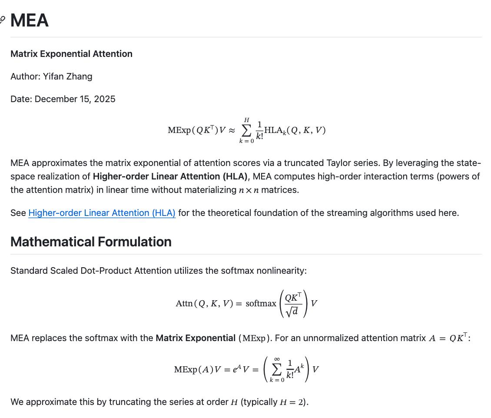

# Matrix Exponential Attention (MEA)

**Рейтинг:** ⚡️ Экспериментальный  
**Статус:** Исследовательский, Не для продакшена  
**Область:** Архитектуры трансформеров

 <!-- TODO: Broken image path -->

**Image shows:** Matrix Exponential Attention (MEA) approximates the matrix exponential of attention scores via a truncated Taylor series. By leveraging the state-space realization of Higher-order Linear Attention (HLA), MEA computes high-order interaction terms (powers of the attention matrix) in linear time without materializing n×n matrices.

## Описание

Matrix Exponential Attention (MEA) - экспериментальный механизм внимания для трансформеров, предлагающий альтернативу классическому softmax-attention. Вместо нормализации через softmax используется матричная экспонента, что позволяет моделировать более сложные, высоко-порядковые взаимодействия между токенами.

## Ключевая идея

Внимание формулируется как exp(QKᵀ), а вычисление экспоненты аппроксимируется через усечённый ряд. Это даёт возможность считать внимание линейно по длине последовательности, не создавая огромные n×n матрицы.

## Преимущества

- Более выразительное внимание по сравнению с softmax
- Higher-order взаимодействия между токенами
- Линейная сложность по памяти и времени
- Подходит для длинных контекстов и исследовательских архитектур

## Контекст

Проект находится на стыке Linear Attention и Higher-order Attention и носит исследовательский характер. Это не готовая замена стандартному attention, а попытка расширить его математическую форму.

## Целевая аудитория

Для ML-исследователей и инженеров, которые изучают новые формы внимания, альтернативы softmax и архитектуры для длинных последовательностей.

## Исходный код

GitHub: [github.com/yifanzhang-pro/MEA](https://github.com/yifanzhang-pro/MEA)

## Статус

Экспериментально. Интересно. Не для продакшена - пока.