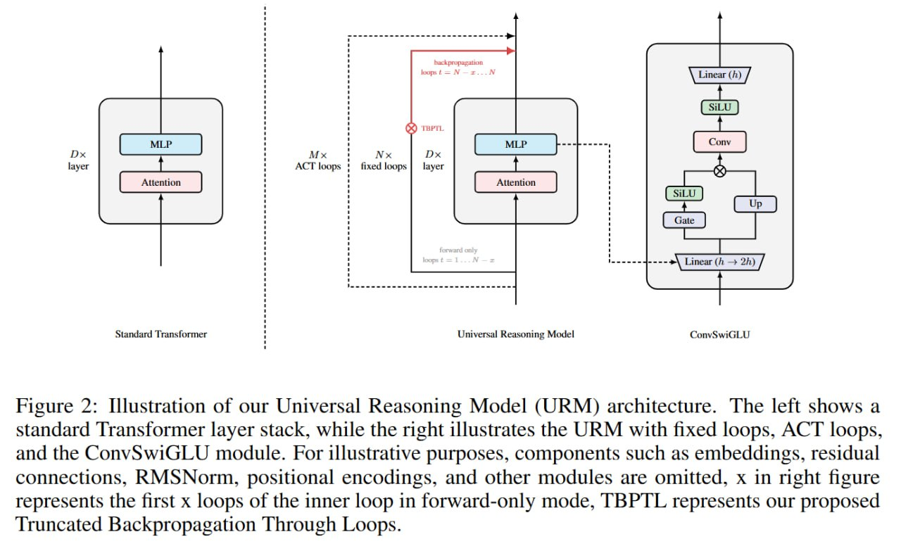
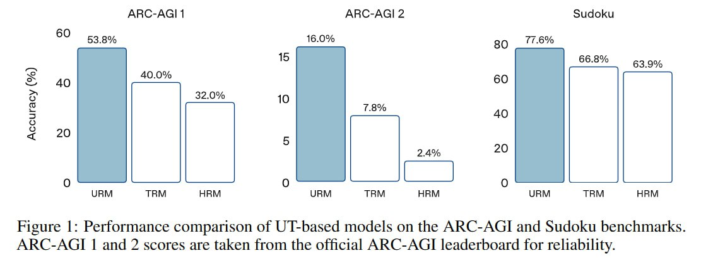
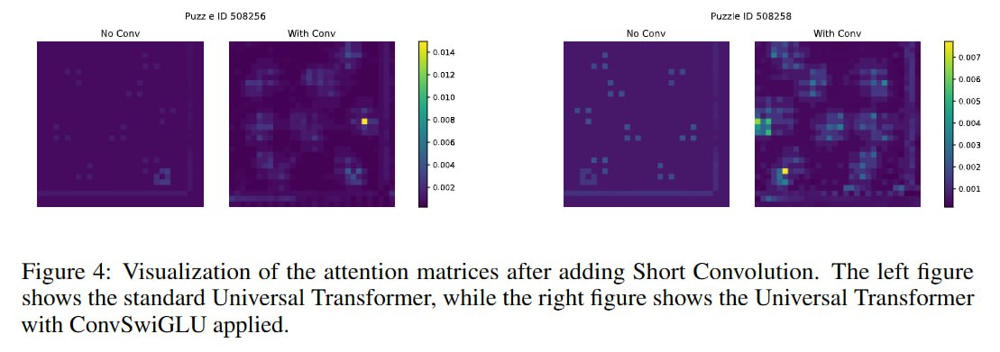
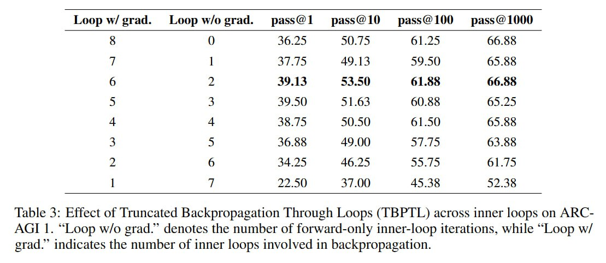
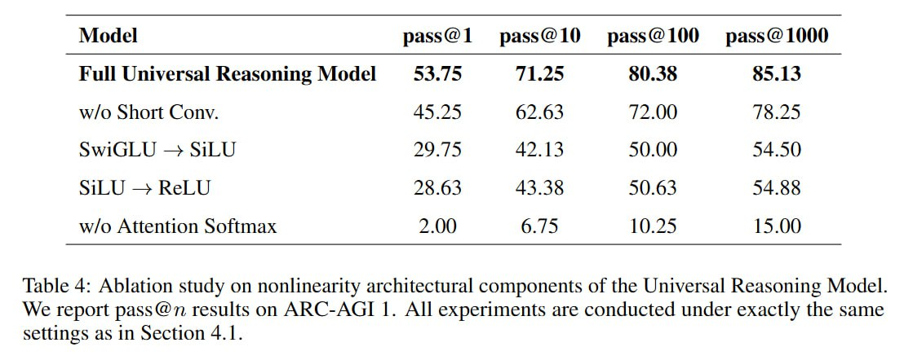
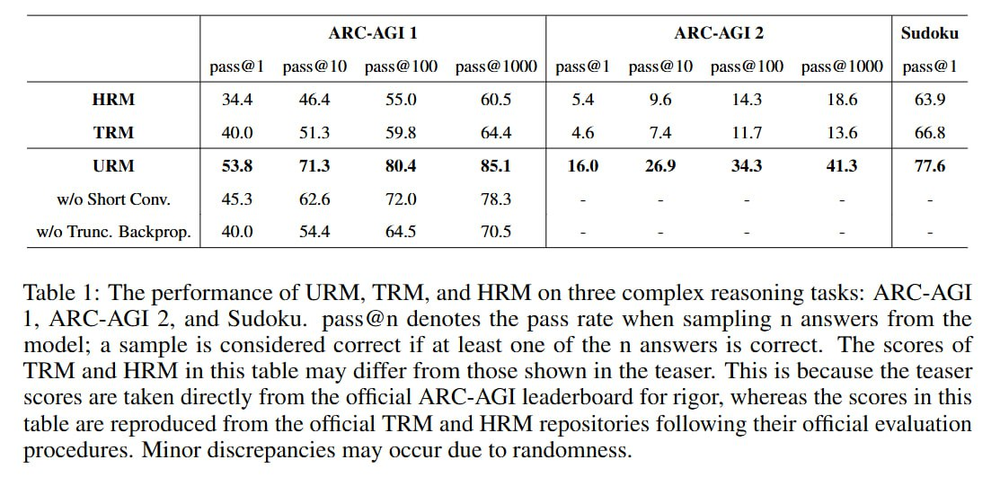

# Универсальная Модель Рассуждения (Universal Reasoning Model, URM)

## Описание

Universal Reasoning Model (URM) — это архитектура нейронной сети, предложенная Зитяном Гао (Zitian Gao) и коллегами, которая улучшает Universal Transformers (UT) за счёт добавления свёрточных операций и усечённой обратной связи (truncated backpropagation). Модель достигает впечатляющих результатов на задачах сложного рассуждения, таких как ARC-AGI и Судоку.

## Исторический контекст

### Universal Transformer (UT)

Universal Transformer — это развитие архитектуры Transformer, в которой один и тот же слой применяется рекурсивно несколько раз, последовательно улучшая эмбеддинги. В отличие от стандартного Transformer с фиксированным количеством слоев, UT может динамически определять количество итераций через Adaptive Computation Time (ACT).

### ALBERT

ALBERT (A Lite BERT) был идейно близок к UT, но с фиксированным количеством итераций и использовал архитектуру энкодера Transformer. В ALBERT использовалось параметрическое разделение и межслоевое разделение, что делало модель более эффективной по параметрам.

### Hierarchical Reasoning Model (HRM)

HRM предложила вдохновлённую мозгом иерархию сетей с высокоуровневыми и низкоуровневыми модулями. Последующие разборы от авторов ARC-AGI показали, что ключевым в работе было глубокое обучение с учителем (deep supervision), которое делало много итераций на одном сэмпле, последовательно улучшая репрезентацию (похоже на recycling в AlphaFold), поверх этого ещё был добавлен adaptive computation time.

### Tiny Recursive Model (TRM)

TRM переинтерпретировала HRM и упаковала всё в почти обычный рекуррентный трансформер, который сначала обновляет внутреннюю репрезентацию, а потом уточняет по ней ответ, и поверх делается всё тот же deep supervision.

## Архитектура URM

### Основные принципы

Авторы URM были вдохновлены UT и предложили URM по её лекалам. В отличие от TRM/HRM, авторы URM сделали более кастомный трансформер с ConvSwiGLU и Truncated Backpropagation Through Loops (TBPTL).

### ConvSwiGLU

ConvSwiGLU — это стандартный SwiGLU с короткой depthwise свёрткой. Обычный SwiGLU работает с каждым токеном независимо, свёртка добавляет в механизм гейтинга локальные контекстные взаимодействия, реализуя смешивание каналов для соседних токенов.

**Описание SwiGLU**:
1. Для каждого токена вычисляется преобразование через матрицу W_up:
   `[G, U] = X W_up ∈ R^{T×2m}`
2. Из G через активацию SiLU считаются веса гейтов, которые поэлементно умножаются с U:
   `H_ffn = SiLU(G) ⊙ U`

**Добавление свёртки**:
К теме про такую активацию они, как я понимаю, пришли после изучения абляций, показавших, что последовательное убирание нелинейности из функции активации монотонно уменьшает перформанс на ARC-AGI-1. Поэтому решили ещё нелинейности подбавить.

Авторы добавляют одномерную depthwise свёртку с ядром k=2 (текущий токен и предыдущий токен) поверх фич, уже прошедших гейт:
`H_conv = σ(W_dwconv * H_ffn)`

### Truncated Backpropagation Through Loops (TBPTL)

TBPTL нужен для ограничения глубины рекурсии, он считает только градиенты поздних циклов. В отличие от полного бэкпропа через все M итераций, мы задаём индекс отсечения N<M, так что для всех шагов от 1 до N бэкпроп не делается, а для N+1 .. M — делается.

Например, для модели с D=4 слоями и M=8 внутренними циклами (что по идее эквивалентно 32 слоям) при выборе N=2 только 6 последних циклов (t=3..8) повлияют на градиент.

### Архитектурные особенности

- Используется decoder-only архитектура (в отличие от HRM/TRM, которые были энкодерами)
- Внутренний процессинг включает 4 слоя на внутреннем уровне, 8 итераций (из которых только 6 последних участвуют в бэкпропе)
- Внешний цикл с ACT и максимум 16 шагами
- Всего получается эффективно 4*8*16=512-слойная модель (если правильно понимать архитектуру)
- Используется Muon как оптимизатор (дает более быструю сходимость, но такой же финальный результат)

## Результаты

URM показывает впечатляющие результаты:

- **ARC-AGI 1**: 53.8% pass@1 (state-of-the-art)
- **ARC-AGI 2**: 16.0% pass@1  
- **Судоку**: 77.6% (лучше оригинальных HRM и TRM)

Сравнение с предыдущими моделями:
- TRM: 40.0% на ARC-AGI 1
- HRM: 34.4% на ARC-AGI 1

## Ключевые находки

1. **Источник улучшений**: Улучшения в UT для задач сложного рассуждения происходят в основном из рекуррентного индуктивного смещения и сильных нелинейных компонентов Transformer, а не из сложных архитектурных решений.

2. **Значение рекуррентности**: Рекуррентный индуктивный сдвиг UT лучше подходит для задач сложного рассуждения, чем добавление большего количества слоёв.

3. **Эффективность итеративных вычислений**: Итеративные вычисления (много итераций одного слоя) лучше, чем добавление слоёв с большим количеством параметров.

## Гиперпараметры и обучение

- Используется AdamAtan2 как в оригинальной работе
- Weight decay также как в предыдущих работах
- Модель с 4 слоями размерности 512 и с 8 головами
- Используется EMA (exponential moving average) для оценки
- Все задачи (ARC-AGI 1, ARC-AGI 2, Судоку) используют одну и ту же архитектуру для честного сравнения

## Сравнение с предыдущими работами

URM улучшает результаты по сравнению с HRM и TRM, но в статье отмечаются странности с цифрами:
- В оригинальной работе про TRM результаты были 87.4/74.7 для Судоку (у TRM были две разные версии, с MLP и SA) и 55.0 для HRM.
- В текущей работе эти цифры 63.9 и 66.8, что странно, особенно учитывая, что URM дает 77.6 (выше цифр TRM/HRM из текущей работы, но ниже оригинальной работы про TRM).

## Визуализации и диаграммы

-  <!-- TODO: Broken image path -->
-  <!-- TODO: Broken image path -->
-  <!-- TODO: Broken image path -->
-  <!-- TODO: Broken image path -->
-  <!-- TODO: Broken image path -->
-  <!-- TODO: Broken image path -->
-  <!-- TODO: Broken image path -->
-  <!-- TODO: Broken image path -->
-  <!-- TODO: Broken image path -->

## Источники

1. Gao, Z., Chen, L., Xiao, Y., Xing, H., Tao, R., Luo, H., Zhou, J., & Dai, B. (2025). Universal Reasoning Model. arXiv preprint arXiv:2512.14693. https://www.arxiv.org/abs/2512.14693
2. Код: https://github.com/zitian-gao/URM
3. Разбор статьи в Telegram канале gonzo_ML
4. Документация: ../media/doc_1766732234_293f189c_arxiv_2512.14693.pdf
5. Сравнительное исследование: ../media/doc_1766732234_a3aed745_arxiv_2502.17416.pdf