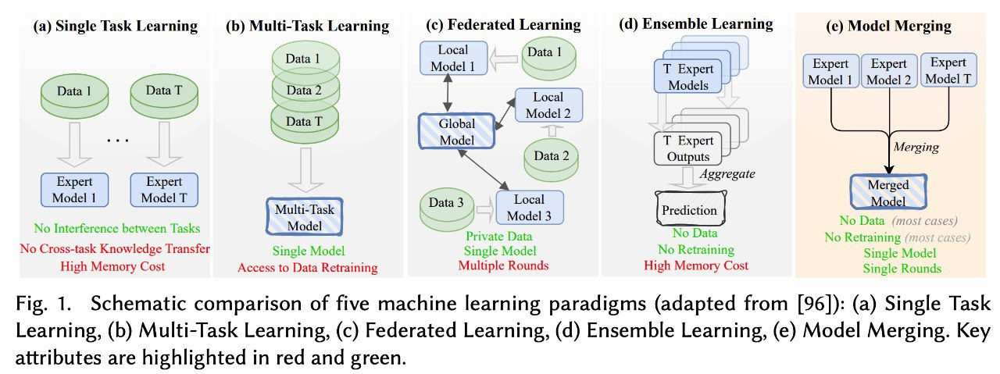

# Приложения слияния моделей (Applications)

## Общее описание

Слияние моделей находит широкое применение в различных областях машинного обучения, особенно в работе с большими языковыми моделями (LLM) и мультимодальными моделями (MLLM).

## Место слияния моделей среди парадигм машинного обучения

**Рисунок 1:** Схематическое сравнение пяти парадигм машинного обучения (адаптировано из [96]):
- (a) Single Task Learning — обучение одной задаче
- (b) Multi-Task Learning — многозадачное обучение
- (c) Federated Learning — федеративное обучение
- (d) Ensemble Learning — ансамблирование
- (e) Model Merging — слияние моделей

**Ключевое отличие Model Merging:** Объединяет параметры нескольких моделей в единую модель без увеличения затрат на инференс (в отличие от Ensemble Learning) и без доступа к исходным данным обучения (в отличие от Multi-Task Learning).

## Основные области применения

### 1. Оптимизация смешивания данных (Data Mixing Optimization)

**Проблема:** Определение оптимальных пропорций различных наборов данных для предобучения LLM требует огромных вычислительных ресурсов.

**Решение через слияние моделей:**
- Обучение компонентных моделей на отдельных наборах данных
- Слияние моделей для аппроксимации обучения на смеси данных
- Поиск оптимальных весов без дополнительного обучения

**Фреймворки:**
- **DeMix:** Разделение поиска и обучения через слияние моделей
- **RegMix:** Регуляризованное слияние для оптимизации данных

**Преимущества:**
- Снижение вычислительных затрат в 6.4+ раз
- Возможность оценки миллионов комбинаций данных
- Высокая корреляция с реальными результатами обучения (ρ ≈ 0.81)

**Ресурсы:**
- DeMix Corpora: 22T токенов с проверенными соотношениями смешивания

### 2. Объединение экспертизы из разных доменов

**Проблема:** Модели, fine-tuned на разных доменах, обладают уникальной экспертизой, но не могут работать на других доменах.

**Решение:**
- Слияние доменно-специфичных моделей в единую универсальную модель
- Сохранение способностей всех исходных моделей

**Примеры:**
- Слияние моделей для кода, математики и общего языка
- Комбинирование многоязычных моделей
- Объединение моделей с разной специализацией (медицина, право, наука)

**Методы:**
- Linear Averaging для простого объединения
- Task Arithmetic для контролируемого комбинирования
- TIES/DARE для разрешения конфликтов

### 3. Регуляризация моделей

**Проблема:** Fine-tuned модели склонны к переобучению и забыванию базовых способностей.

**Решение:**
- Слияние fine-tuned модели с базовой моделью
- Частичное сохранение общих способностей

**Механизм:**
- `θ_merged = α·θ_base + (1-α)·θ_finetuned`
- Контроль степени регуляризации через α

**Преимущества:**
- Улучшение обобщающей способности
- Снижение переобучения на малых датасетах
- Сохранение базовых языковых способностей

### 4. Улучшение обобщающей способности

**Model Soups подход:**
- Обучение нескольких моделей с разными гиперпараметрами
- Слияние всех моделей в единую
- Усреднение ошибок и улучшение обобщения

**Результаты:**
- Улучшение accuracy без увеличения времени инференса
- Стабильность к выбору гиперпараметров
- Лучшая калибровка предсказаний

### 5. Смягчение забывания при непрерывном обучении

**Проблема Catastrophic Forgetting:**
- При последовательном обучении новым задачам модель забывает старые

**Решение через слияние:**
- Сохранение checkpoints после каждой задачи
- Слияние всех checkpoints в единую модель
- Сохранение способностей по всем задачам

**Методы:**
- Progressive merging с весами по важности задач
- rehearsal-free continual learning через слияние

### 6. Редактирование и исправление моделей

**Применения:**
- **Удаление нежелательных свойств:** Вычитание векторов токсичности, предвзятости
- **Добавление способностей:** Сложение с моделями, имеющими нужные навыки
- **Коррекция поведения:** Точечное редактирование через task vectors

**Примеры:**
- Удаление токсичности из LLM
- Добавление способностей к рассуждению
- Исправление фактологических ошибок

### 7. Создание специализированных моделей

**Сценарии:**
- Слияние базовой LLM с моделью для кода → Code LLM
- Слияние языковой и визуальной моделей → VLM
- Комбинирование моделей для конкретных индустрий

**Преимущества:**
- Быстрое создание специализированных версий
- Без полного переобучения
- Модульность и гибкость

### 8. Эффективный инференс

**Проблема:** Ансамблирование моделей улучшает качество, но увеличивает затраты на инференс.

**Решение:**
- Слияние ансамбля в единую модель
- Сохранение преимуществ ансамблирования
- Без увеличения затрат на инференс

**Результаты:**
- Качество уровня ансамбля
- Скорость инференса одиночной модели
- Экономия памяти и вычислений

## Приложения по доменам

### NLP и LLM
- Мультиязычные модели
- Доменно-специфичные ассистенты
- Кодогенерация
- Математические рассуждения

### Компьютерное зрение
- Мультимодальные модели (VLM)
- Специализированные детекторы
- Адаптация к новым доменам

### Наука и исследования
- Научные ассистенты
- Модели для конкретных дисциплин
- Комбинирование экспериментальных данных

## Практические рекомендации

### Когда использовать слияние моделей:
1. Есть несколько fine-tuned версий одной базовой модели
2. Нужно комбинировать способности без доступа к данным
3. Ограничены вычислительные ресурсы для обучения
4. Требуется быстрое прототипирование новых комбинаций

### Ограничения:
1. Требует идентичных архитектур
2. Работает лучше с общей инициализацией
3. Может потребовать настройки гиперпараметров
4. Не заменяет полноценное многозадачное обучение

## Связанные темы

[[model_merging_in_llm_pretraining.md]] - Применение в предобучении LLM
[[demix_framework.md]] - DeMix для оптимизации смешивания данных
[[methods.md]] - Методы слияния моделей
[[awesome_repository.md]] - Коллекция приложений слияния
[[../../foundations/moco_model_collaboration_research.md]] - MOCO для коллаборации моделей

## Источники

- Yang, E., et al. (2026). Model Merging in LLMs, MLLMs, and Beyond: Methods, Theories, Applications and Opportunities. ACM Computing Surveys. https://dl.acm.org/doi/10.1145/3787849 - Комплексный обзор приложений слияния моделей
- Wortsman, M., et al. (2022). Model soups: averaging weights of multiple fine-tuned models improves accuracy. https://arxiv.org/abs/2203.05482 - Model Soups для улучшения обобщения
- Ilharco, G., et al. (2023). Editing Models with Task Arithmetic. https://arxiv.org/abs/2212.04089 - Редактирование моделей через task vectors
- Yadav, P., et al. (2023). TIES-Merging: Resolving Interference When Merging Models. https://arxiv.org/abs/2306.01708 - Приложения TIES
- Goddard, C., et al. (2024). Arcee's mergekit: A toolkit for merging large language models. https://arxiv.org/abs/2403.13257 - Практические приложения mergekit
