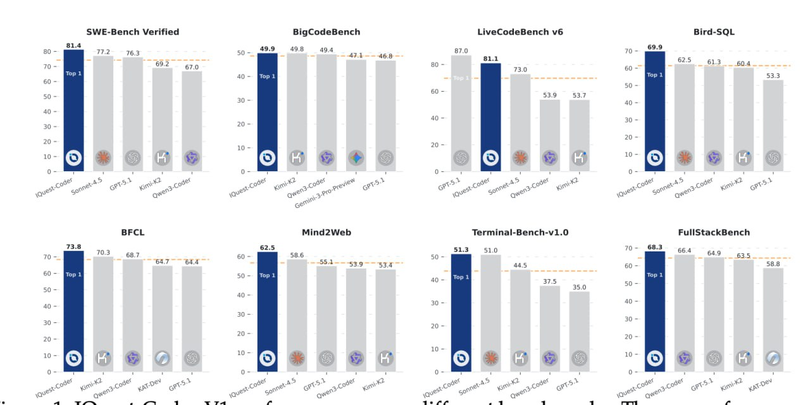

# IQuest-Coder-V1: Обзор и аналитика

## Краткое описание

IQuest-Coder-V1 - это новая серия моделей кодирования от IQuestLab (Китай), которая выделяется на фоне других моделей благодаря инновационному подходу Code-Flow обучения и уникальной архитектуре LoopCoder. Модель размером 40B параметров показывает впечатляющие результаты на бенчмарках, включая SWE-bench, превосходя Claude Sonnet 4.5 и GPT-5.1.

## Ключевые инновации

### Code-Flow обучение
- **Фокус на динамике**: Обучение не статическим файлам, а на эволюции кода во времени
- **Процесс разработки**: Научить модель понимать не просто синтаксис, а процесс разработки
- **Данные**: (старый_код → патч → новый_код) из реальных коммитов GitHub
- **Отбор коммитов**: Из фазы зрелости проекта (40%-80% жизненного цикла)

### LoopCoder архитектура
- **Циклическая структура**: Одни и те же блоки трансформера используются дважды (2 итерации) с общими параметрами
- **Обработка в два прохода**: Позволяет создавать более глубокое понимание контекста
- **Два типа внимания**: Global и Local Attention с механизмом шлюзования (gating mechanism)

## Архитектурные детали

### Две итерации
1. **Первая итерация**
   - Входные эмбеддинги проходят через трансформерные блоки
   - Формируются скрытые состояния с позиционным сдвигом
   - Сохраняются для использования во второй итерации

2. **Вторая итерация**
   - Использует сохраненные состояния из первой итерации
   - Два типа внимания:
     - **Global Attention**: Queries из итерации 2 обращаются ко всем key-value парам из итерации 1
     - **Local Attention**: Queries обращаются только к предшествующим токенам внутри итерации 2

### Gating Mechanism
- Оба типа внимания комбинируются через обученный gate
- Формула: output = gate × global_attention + (1 - gate) × local_attention
- Gate (0–1) вычисляется на основе query-представлений
- Модель сама учится, когда использовать глобальный контекст, а когда — локальный

## Результаты на бенчмарках

- **SWE-bench**: Оригинальный отчет указывает на 81.4 (ныне 76.2 на HuggingFace)
- **Сравнение**: Превосходит Claude Sonnet 4.5 и GPT-5.1 на многих бенчмарках
- **Примечание**: Метрики могут колебаться со временем

## Значение для индустрии

IQuest-Coder-V1 представляет собой сдвиг от традиционных моделей дополнения кода к полноценным агентам программной инженерии, способным к планированию, исправлению ошибок и выполнению кода.

## Изображения

**Изображение показывает:** Процесс обучения Code-Flow в IQuest-Coder-V1, где модель обучается на эволюции кода (старый код → патч → новый код) вместо статических файлов.

**Изображение показывает:** Общую архитектуру модели IQuest-Coder-V1 с циклической структурой и двойным вниманием.

## Связанные темы

- [[iquest_coder_v1.md]] - Подробное описание модели IQuest-Coder-V1
- [[code_flow_training.md]] - Обучение Code-Flow парадигме
- [[loopcoder_architecture.md]] - Архитектура LoopCoder
- [[dual_attention_loopcoder.md]] - Двойные механизмы внимания в LoopCoder
- [[iquest_coder_v1_swe_bench_performance.md]] - Производительность на SWE-Bench
- [[iquest_coder_v1_software_engineering_agents.md]] - Использование IQuest-Coder-V1 в агентах программной инженерии

## Источники

- Технический отчет IQuest-Coder-V1
- Hugging Face Model Card для IQuest-Coder-V1
- Статьи о Code-Flow подходе
- Публикации о LoopCoder архитектуре

## Дополнительные материалы

- GitHub репозиторий IQuestLab
- Hugging Face модели IQuest-Coder-V1 (7B, 14B, 40B)
- Сравнительные анализы с другими моделями кодирования