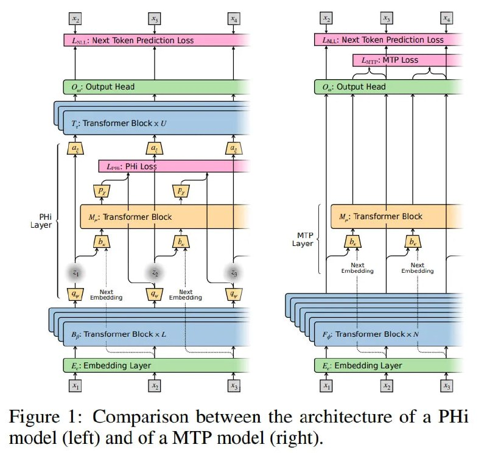
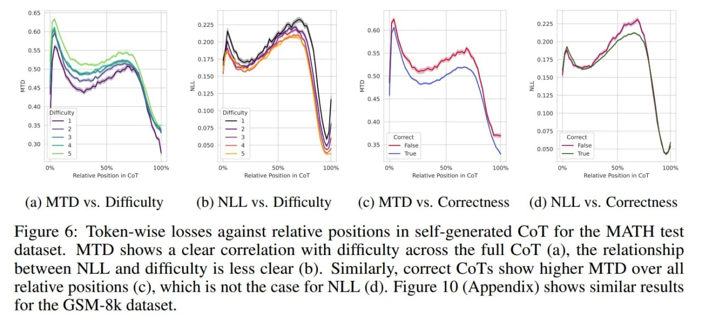

# Множественная токенная дивергенция (Multiple Token Divergence, MTD)

## Краткое описание

Множественная токенная дивергенция (Multiple Token Divergence, MTD) — это метрика, предложенная Винсентом Херрманном (Vincent Herrmann), Эриком Альсайдом (Eric Alcaide) и Юргеном Шмидхубером (Jürgen Schmidhuber), которая измеряет плотность вычислений в процессе генерации токенов. Она основана на измерении дивергенции Кульбака-Лейблера (KL divergence) между выходным распределением полной модели и её ограниченной, "поверхностной" вспомогательной головы.

## Проблема: парадокс лосса

Годами индустрия полагалась на лосс предсказания следующего токена (L_NLL) как на золотой стандарт качества моделей. Однако с переходом к моделям, ориентированным на рассуждение (reasoning models), возникла критическая проблема измерения: предсказуемость не является синонимом вычислений. Последовательность может быть очень предсказуемой (с низкой энтропией), но требовать огромных вычислений для получения. И наоборот, случайный шум может быть дешево генерироваться, но лосс на нем будет высоким.

Возникает "парадокс лосса": L_NLL не различает ситуацию, когда модель вспоминает заученный факт (мало вычислений, низкий лосс) и когда она решает сложную задачу (много вычислений, потенциально низкий лосс).

## Математика MTD

Ключевая интуиция за MTD заключается в том, что "мышление" — это дельта между эвристикой и строгим выводом. Авторы формализуют это через два различных вероятностных распределения над словарем в момент времени t:

1. **Стандартное распределение** π(·|x_≤t), генерируемое полной глубокой моделью F_φ
2. **Распределение вспомогательной головы** π_MTP(·|x_<t), создаваемое вычислительно ограниченным вспомогательным модулем (обычно одним слоем трансформера M_μ)

Если следующий токен очевиден через простой паттерн-матчинг (например, завершение фразы "Столица Франции — это..."), поверхностная вспомогательная голова предскажет "Париж" с высокой уверенностью, совпадая с полной моделью. Здесь дивергенция будет близка к нулю. 

Однако, если токен требует удержания сложного вектора состояния или выполнения арифметики (например, ответ в многошаговой логической задаче), поверхностная голова провалится, скатившись в равномерное или юниграмное распределение, тогда как глубокая модель сконцентрирует массу на правильном токене.

**Метрика MTD** представляет собой дивергенцию Кульбака-Лейблера между этими двумя взглядами:
L_MTD(t) = D_KL(π(·|x_≤t) || π_MTP(·|x_<t))

## Фильтрация тривиальности

Важный инженерный вклад статьи — решение "проблемы утечки" (Leakage Problem). Наивная реализация вспомогательной головы, которая видит только историю h_(t-1), может ошибаться просто потому, что она еще не знает о существовании текущего токена x_t, путая "удивление" с "вычислениями". 

Чтобы изолировать чистые вычисления, авторы дают поверхностному MTP модулю доступ к эмбеддингу *текущего* токена e_t. Позволяя этому шорткату видеть e_t, метрика обесценивает информацию, которую тривиально извлечь из самого токена (например, простое копирование или биграммная статистика). В результате, когда L_MTD подскакивает, это подтверждает, что прирост информации идет именно от *глубины* сети, а не от входных данных.

## Спекулятивное декодирование как бонус

С инженерной точки зрения MTD удивительно эффективна, так как переиспользует существующие архитектурные артефакты. Многие современные LLM уже обучаются с головами Multiple Token Prediction (MTP) для облегчения спекулятивного декодирования. Это означает, что для многих SOTA моделей вычисление MTD требует ноль дополнительного обучения и ноль архитектурных изменений. Достаточно просто подключиться к логитам существующей спекулятивной головы во время прямого прохода.

## Валидация и результаты

### Сложность против перплексии

Валидация MTD на датасете MATH вскрывает поразительную инверсию стандартных метрик. С ростом сложности задачи (от Уровня 1 до Уровня 5) стандартный L_NLL на самом деле *уменьшается*. Это говорит о том, что с точки зрения модели сложные математические задачи часто имеют высокоструктурированные, предсказуемые решения — если, конечно, вы умеете считать. Стандартный лосс ошибочно сигнализирует, что задача "легкая".

Напротив, L_MTD показывает сильную положительную корреляцию со сложностью задачи. Чем труднее проблема, тем сильнее предсказания глубокой модели расходятся с поверхностной головой.

### Анализ цепочек рассуждений (Chain-of-Thought)

Более того, авторы проводят по-токенный анализ трасс Chain-of-Thought (CoT). Они обнаруживают, что цепочки правильных рассуждений демонстрируют *более низкий* MTD, чем ошибочные. Это намекает на "гипотезу компетентности": когда модель успешно находит "колею" логического решения, её глубокие вычисления стабилизируют выход, тогда как неправильные рассуждения часто включают хаотичные скачки, которые даже глубокая модель с трудом может обосновать по сравнению с поверхностным бейзлайном.

## Ограничения MTD

1. **Зависимость от мощности вспомогательной головы**: Метрика относительна, а не абсолютна. Если модуль MTP слишком мощный, он может слишком хорошо аппроксимировать полную модель, сводя MTD к нулю даже для сложных задач.

2. **Не детектор правды**: Хотя MTD коррелирует с корректностью, это не детектор истины; модель может эффективно "сильно думать" (высокий MTD), генерируя убедительную галлюцинацию.

## Применения и будущие возможности

### Интерпретируемость и динамический инференс

MTD открывает стратегические возможности для интерпретируемости и динамического инференса. Давая гранулярный сигнал о "плотности вычислений", MTD позволяет внедрять новые механизмы контроля, например, Dynamic Compute Allocation.

Можно представить цикл декодирования, где модель делает ранний выход (early exit) или использует меньший маршрут в mixture-of-experts, когда MTD низкий (тривиальные токены), и подключает дополнительные мощности или глубину поиска только тогда, когда MTD подскакивает.

## Сравнение с предыдущими подходами

### Prediction of Hidden States (PHi)

Предыдущие попытки измерить "мышление", такие как фреймворк Prediction of Hidden States (PHi), пытались квантифицировать несжимаемость латентных репрезентаций. Теоретически это звучит красиво, но PHi требует инвазивных архитектурных изменений — вставки вариационных боттлнеков (bottlenecks), что может дестабилизировать обучение и ухудшить качество.

MTD предлагает неинвазивный способ понять, использует ли модель всю свою глубину для рассуждений или выезжает на простых эвристиках, без необходимости в архитектурных изменений.

## Источники

1. [Multiple Token Divergence: A Measure of In-Context Computation Density](https://openreview.net/forum?id=jNJwgg0opm) - Оригинальная научная работа Херрманна, Альсайда и Шмидхубера
2. [Multiple Token Divergence - ArXivIQ Review](https://arxiviq.substack.com/p/multiple-token-divergence-a-measure) - Обзор и анализ статьи
3. [Herrmann, V., Alcaide, E., & Schmidhuber, J. (2025). Multiple Token Divergence: A Measure of In-Context Computation Density] - Основная статья о MTD
4. [MiMo: Unlocking the Reasoning Potential of Language Model - From Pretraining to Posttraining](https://arxiv.org/abs/2505.07608) - Исследование модели с MTP головами, использованной для проверки MTD

## Визуализации и данные

**Изображение показывает:** Сравнение архитектуры PHi модели (слева) с MTP моделью (справа), иллюстрируя различия в подходах к измерению рассуждений.

**Изображение показывает:** Средние значения потерь модели MiMo по предоставленным пошаговым решениям задач из тестового набора MATH, сгруппированные по категории и уровню сложности. MTD явно растет с увеличением сложности, в то время как NLL потери уменьшаются с ростом сложности.

**Изображение показывает:** По-токенные потери по относительным позициям в самосгенерированных цепочках рассуждений (CoT) для тестового набора MATH. MTD показывает четкую корреляцию со сложностью, в то время как NLL показывает менее четкую связь.

## См. также

- [[../../models/xiaomi_mimo/multi_token_prediction_mtp.md]] - Многотокенное предсказание, на котором может основываться MTD
- [[../../reasoning/chain_of_thought_effectiveness.md]] - Цепочки рассуждений, которые анализируются с помощью MTD
- [[attention_sink_phenomenon.md]] - Явление "attention sink", связанное с вычислительной плотностью
- [[../../optimization/kld_dangers_in_distribution_optimization.md]] - Дивергенция Кульбака-Лейблера, используемая в MTD