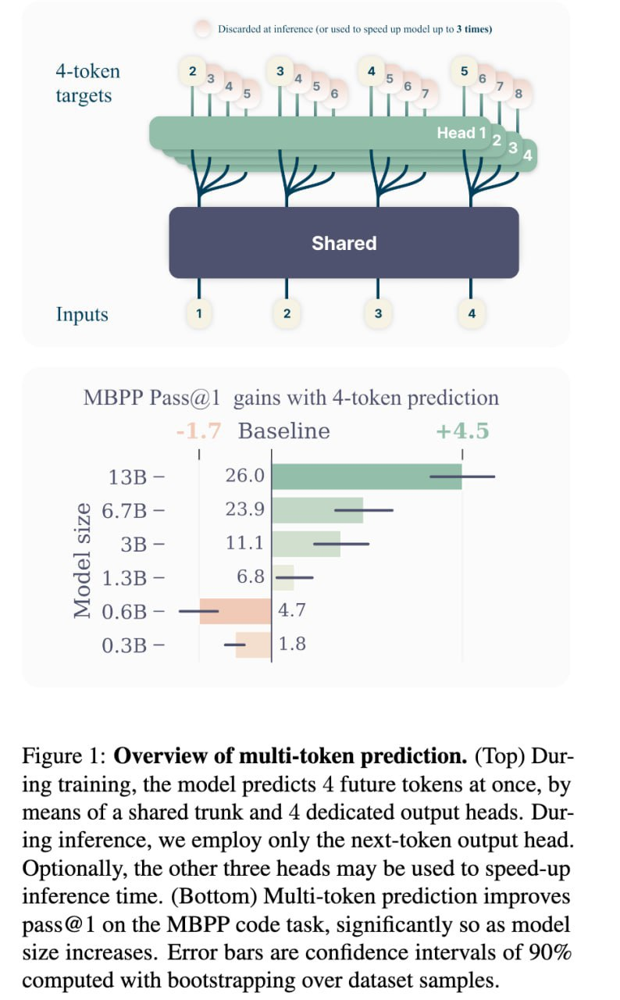

# Multi-Token Prediction (MTP) в Языковых Моделях

## Определение

Multi-Token Prediction (MTP) — это метод предобучения языковых моделей, при котором модель вместо предсказания только следующего токена (Next-Token Prediction - NTP) предсказывает сразу несколько будущих токенов. Эта архитектура использует n независимых выходных голов, чтобы предсказать следующие n токенов, при этом разделяя основной ствол модели.

## Применение в современных моделях

### Qwen3.5-Plus

Модель **Qwen3.5-Plus** (выпущена Alibaba в канун Лунного Нового года 2026) использует Native Multi-Token Prediction как одну из четырёх ключевых инноваций:
- Предсказание нескольких токенов сразу вместо последовательной генерации
- Увеличение скорости генерации почти в 2 раза
- Особенно эффективно для написания кода и генерации длинных текстов
- Вносит вклад в общее ускорение обработки запросов до 19 раз
- Позволяет модели с 17B активными параметрами обгонять предшественницу с триллионом параметров

### DeepSeek-V3

## История и развитие

MTP был предложен как вспомогательный объект для улучшения предсказания следующего токена в языковых моделях. DeepSeek полтора года назад нашли с MTP, и эта техника используется в таких моделях, как DeepSeek-V3, где задача Multi-Token Prediction расширяет прогнозирование до нескольких будущих токенов в каждой позиции, повышая общую производительность на бенчмарках.

FAIR также тренировал LLM с использованием MTP подхода (MTP - Multi-Token Prediction).

## Архитектура

 <!-- TODO: Broken image path -->

*На рисунке показан обзор архитектуры Multi-token prediction: во время обучения модель предсказывает 4 будущих токена одновременно с помощью общего ствола и 4 специализированных выходных голов. Во время вывода используется только выходная голова следующего токена.*

## Преимущества

- Улучшение метрики pass@1 на задаче MBPP по кодированию, особенно при увеличении размера модели
- Повышение общей эффективности модели на различных оценочных бенчмарках
- Возможность использования дополнительных голов для ускорения времени вывода

## Абляционные исследования

| Бенчмарк (Метрика) | Маленькая MoE | Маленькая MoF | Базовая линия | с MTP | Большая MoE | Большая MoF | Базовая линия | с MTP |
|-------------------|---------------|---------------|----------------|-------|-------------|-------------|----------------|-------|
| BBH (EM) | 3-шот | 41.4 | | 70.7 | | 
| DROP (F1) | | 41.3 | | 70.6 | |
| TriviaQA (EM) | 5-шот | 6.9 | | 67.3 | |
| HumanEval (Pass@1) | 0-шот | 20.7 | 26.8 | 53.7 |
| MATH (EM) | 4-шот | 10.7 | 19.6 | 39.8 |

## Источники

- [DeepSeek MTP Research Paper](https://arxiv.org/abs/2601.21204)
- Различные статьи о MTP в языковых моделях
- [Иллюстрация архитектуры MTP](../media/img_1770108589_aqadirbrgzgu8ut_figure_1_overview_of_multi_token_predict.jpg)
- **Telegram-канал «Китайский ИИ»**, пост о выпуске Qwen3.5-Plus, Лунный Новый год 2026 — информация о применении Native Multi-Token Prediction в Qwen3.5-Plus

## Связи с другими темами

- [[residual_vector_quantization.md]] - Концепции MTP и RVQ обе касаются многомерного представления информации в нейронных сетях
- [[connection_rvq_mtp_sequence_models.md]] - Подробное рассмотрение связи между RVQ и MTP в моделях последовательностей

```metadata
category: искусственный_интеллект
subcategory: языковые_модели
tags: mtp, multi-token prediction, deepseek, llm, предобучение, трансформеры
```