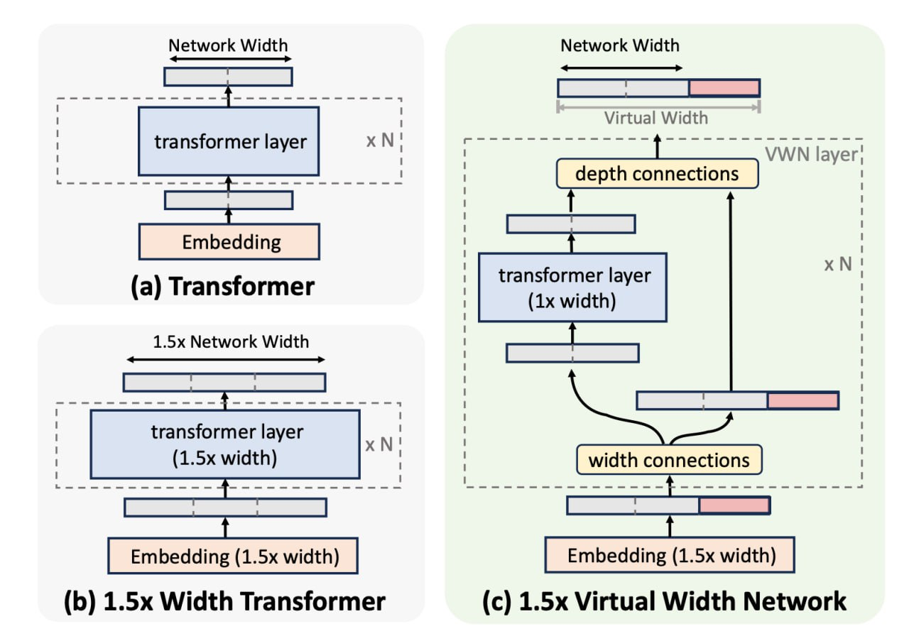

# Виртуальные широкие сети (Virtual Width Networks, VWN)

## Краткое описание

Virtual Width Networks (VWN) — архитектурный трюк, разработанный исследователями из ByteDance, при котором размерность эмбеддингов увеличивается (например, в 8 раз), а основные слои трансформера остаются стандартной ширины. Это позволяет расширить пространство представлений без значительного увеличения параметров и вычислений модели.

## Архитектура

Связь между расширенными эмбеддингами и стандартными слоями трансформера осуществляется через лёгковесные матрицы [Generalized Hyper-Connections (GHC)](generalized_hyper_connections.md) <!-- TODO: Broken link -->, которые сжимают эмбеддинги перед механизмом внимания и FFN (Feed-Forward Network) и расширяют их после. Эти матрицы обеспечивают эффективное преобразование между высокоразмерным и стандартным пространствами.

## Преимущества

### Эффективность
- Обычно увеличение ширины трансформера даёт прирост качества, но приводит к квадратичному росту параметров и вычислений
- В VWN расширение происходит только на уровне эмбеддингов, что является наиболее вычислительно дешёвой частью модели
- Ядро модели (backbone) почти не изменяется, что позволяет сохранить эффективность вычислений

### Ускорение обучения
- На MoE модели с 3.3B параметров при x8 расширении достигнуто:
  - Ускорение обучения в x2.5 для next-token prediction
  - Ускорение обучения в x3.5 для next-2-token prediction

## Особенности обучения

- Обнаружена логарифмически-линейная зависимость между коэффициентом расширения r и снижением лосса
- Gap в лоссе растёт по мере обучения, что необычно для традиционных подходов
- Особенно эффективны для Multi-Token Prediction (MTP) — когда модель учится предсказывать не только следующий токен, но и следующие 2-3

## Применение с Multi-Token Prediction

VWN особенно хорошо работает с Multi-Token Prediction (MTP), когда модель учится предсказывать не только следующий токен, но и несколько последующих. Расширенное пространство эмбеддингов позволяет лучше упаковывать планирование на несколько шагов вперёд, что улучшает результаты на задачах предсказания нескольких токенов одновременно.

См. также: [[../techniques/multi_token_prediction.md|Multi-Token Prediction]]

## Ограничения

- Современное железо не очень дружит с супер-широкими активациями
- Авторы признают, что расширения в x1.5–x4 более реалистичны для продакшна
- Ограниченная поддержка со стороны существующих вычислительных фреймворков

## Источники

- Описание архитектуры Virtual Width Networks от исследователей из ByteDance
- Статья о применении VWN с Multi-Token Prediction для ускорения обучения трансформеров

## См. также

- [[transformer_architecture.md]] - архитектура стандартного трансформера, на основе которой развивается VWN
- [[../../llm/mixture_of_experts_architecture.md]] - MoE архитектура, на которой проводились эксперименты с VWN
- [[../../llm/techniques/multi_token_prediction.md]] - метод многотокенного предсказания, для которого VWN особенно эффективна
- [[long_context_transformers.md]] - другая архитектура, направленная на улучшение трансформеров
- [[differential_transformer.md]] - альтернативная архитектура трансформеров с модифицированным вниманием

**Image shows:** На диаграмме сравниваются три архитектуры: (a) стандартный трансформер, (b) трансформер с 1.5x шириной, и (c) виртуальная широкая сеть с 1.5x расширением. Видно, что VWN сохраняет стандартный backbone трансформера при расширении только эмбеддингов, что делает архитектуру более эффективной по сравнению с традиционным расширением ширины.