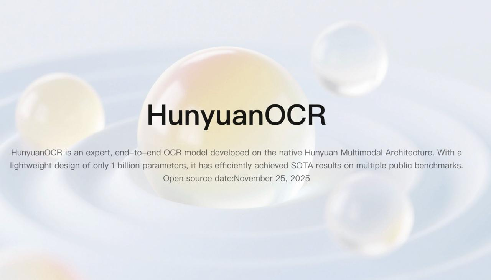
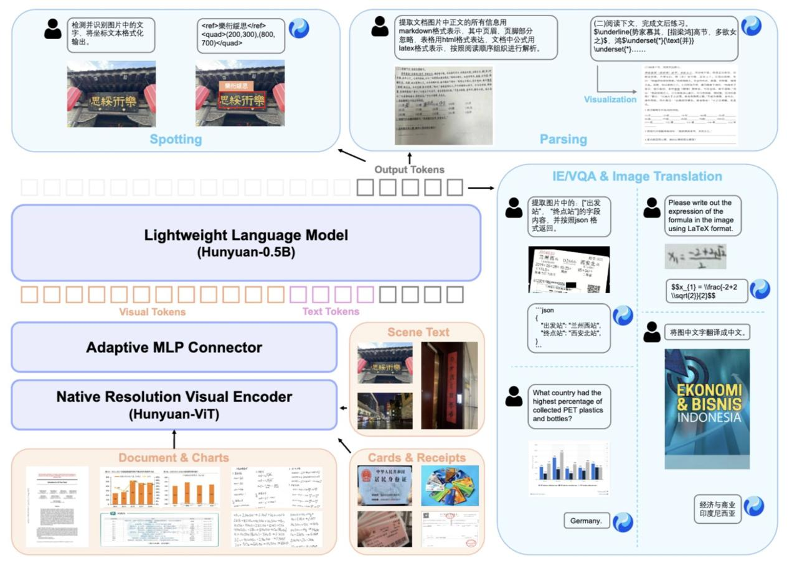
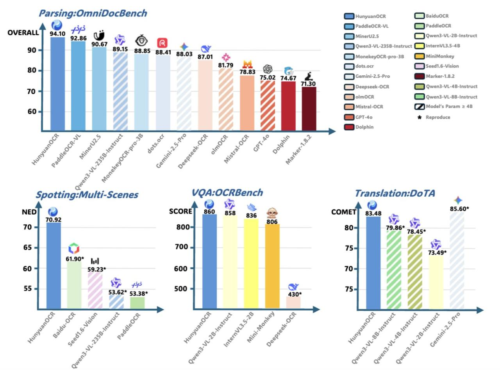

# HunyuanOCR

HunyuanOCR - это новая компактная, быстрая и полностью готовая end-to-end система оптического распознавания символов (OCR), разработанная Tencent и выложенная в open-source. Модель построена на мультимодальной архитектуре Hunyuan и при размере всего 1 миллиард параметров показывает результаты уровня крупных моделей, при этом стоит в разы дешевле в запуске.

**Описание:** На изображении показано, что HunyuanOCR - это экспертная, end-to-end OCR-модель, разработанная на нативной архитектуре Hunyuan. С легким дизайном всего 1 миллиард параметров, она эффективно достигает SOTA результатов на нескольких публичных бенчмарках. Дата открытия исходного кода: 25 ноября 2025 года.

## Архитектура

HunyuanOCR построен на нативной мультимодальной архитектуре Hunyuan и состоит из трех основных компонентов:
1. Видео-энкодер нативного разрешения
2. Адаптивный визуальный адаптер
3. Легковесная языковая модель Hunyuan

**Описание:** Диаграмма архитектуры HunyuanOCR, показывающая основные компоненты: визуальные токены, адаптивный MLP-коннектор, нативный визуальный энкодер (Hunyuan-ViT), легковесную языковую модель (Hunyuan-0.5B) и выходные токены. Также показаны различные типы задач, которые может решать модель: документы, сцены, карточки, квитанции, парсинг формул и т.д.

Это полностью дифференцируемый конвейер (end-to-end), не использующий каскадные пайплайны. Один запрос и один инференс-прогон дают готовый результат, что делает его быстрее, надежнее и удобнее, чем традиционные OCR-цепочки.

## Характеристики

- **Размер модели**: 1 миллиард параметров
- **Тип**: Мультимодельная OCR-модель 
- **Технология**: End-to-end (сквозная) архитектура
- **Статус**: Открытый исходный код (open-source)
- **Разработчик**: Tencent

## Производительность

- **OCRBench**: 860 баллов среди всех моделей до 3B
- **OmniDocBench**: 94.1 баллов - лучший результат в задачах распознавания сложных документов

HunyuanOCR показывает результаты уровня крупных моделей, при этом будучи значительно более компактной и экономичной в эксплуатации.

## Возможности

Модель закрывает практически все типы OCR задач:

- Распознавание текста на улицах, витринах, табличках
- Распознавание рукописного текста и художественных шрифтов
- Обработка сложных документов: таблиц, формул, встроенного HTML и LaTeX
- Извлечение субтитров из видео
- Перевод текста на фото end-to-end сразу на 14 языков

## Преимущества

- **Компактность**: Малое количество параметров (1B) позволяет запускать модель на ограниченных вычислительных ресурсах
- **Высокая производительность**: Достижение SOTA (state-of-the-art) результатов 
- **Стоимостная эффективность**: Значительно дешевле в запуске по сравнению с крупными моделями
- **Универсальность**: Обработка широкого спектра задач OCR
- **Мультимодальность**: Интеграция визуальных и языковых сигналов

## Использование

HunyuanOCR является единым решением для OCR, которое не требует сложных каскадных пайплайнов. Это делает его более надежным и простым в интеграции, чем традиционные OCR-системы.

**Описание:** Дополнительное изображение, демонстрирующее возможности модели HunyuanOCR для обработки различных типов визуальных данных и текста.

## Ссылки

- [Страница проекта на официальном сайте](https://hunyuan.tencent.com/vision/zh?tabIndex=0)
- [GitHub репозиторий](https://github.com/Tencent-Hunyuan/HunyuanOCR)
- [Модель на Hugging Face](https://huggingface.co/tencent/HunyuanOCR)
- [Технический отчет](https://github.com/Tencent-Hunyuan/HunyuanOCR/blob/main/HunyuanOCR_Technical_Report.pdf)

## Сравнение с другими моделями

- По сравнению с другими OCR-моделями, HunyuanOCR достигает сопоставимых или лучших результатов при значительно меньшем размере модели
- Является конкурентом для таких моделей, как Chandra OCR, DeepSeek OCR и LightOnOCR
- Более экономичен и компактен, чем большинство SOTA решений

## Источники

1. [Официальная страница проекта HunyuanOCR](https://hunyuan.tencent.com/vision/zh?tabIndex=0) - Официальная страница проекта с информацией о модели и ее возможностях
2. [GitHub репозиторий HunyuanOCR](https://github.com/Tencent-Hunyuan/HunyuanOCR) - Открытый исходный код проекта, доступный для изучения и использования
3. [Модель на Hugging Face](https://huggingface.co/tencent/HunyuanOCR) - Модель доступна для загрузки и тестирования на платформе Hugging Face
4. [Технический отчет](https://github.com/Tencent-Hunyuan/HunyuanOCR/blob/main/HunyuanOCR_Technical_Report.pdf) - Официальный технический отчет, описывающий архитектуру и методы реализации модели

## Связи с другими темами

- [[chandra_ocr.md]] - Современная OCR-модель от DataLab, конкурирующая по качеству с HunyuanOCR, но с большей поддержкой языков
- [[deepseek_ocr.md]] - Другая современная OCR-модель с высокой эффективностью обработки документов
- [[lightonocr.md]] - Альтернативная OCR-модель, также компактная и эффективная
- [[object_detection_yolo_ocr.md]] - Общие сведения об OCR и его применении в системах компьютерного зрения