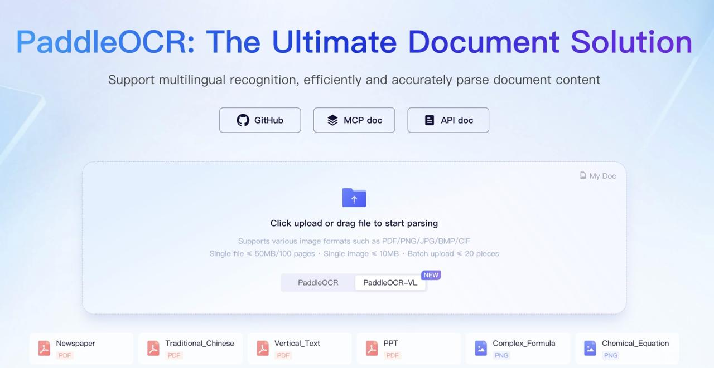

# PaddleOCR-VL

## Описание

PaddleOCR-VL - это передовая визуально-языковая модель (VLM) для мультиязычного анализа документов, разработанная командой PaddlePaddle от Baidu. Модель реализует инновационный двухэтапный подход для анализа документов, который уверенно выигрывает у end-to-end моделей на сложных документах.

**Изображение показывает:** Логотип и название PaddleOCR как решения для анализа документов.

## Архитектура

### Двухэтапный подход

PaddleOCR-VL разбивает сложную задачу анализа документов на два последовательных этапа:

#### Этап 1: PP-DocLayoutV2 - анализ структуры страницы

Первая компонента системы отвечает за понимание структуры документа и определение порядка чтения элементов страницы.

**Компоненты:**
- **RT-DETR** - детекционная модель для обнаружения текстовых блоков, таблиц, формул, графиков и других элементов страницы
- **Pointer Networks** - механизм для предсказания человеческого порядка чтения (reading order) элементов

**Преимущества:**
- Устраняет ошибки структуры документа
- Создает чистый список элементов с правильным порядком
- Обеспечивает стабильную работу на многостолбцовых и смешанных макетах

#### Этап 2: PaddleOCR-VL-0.9B - точное распознавание

Второй этап представляет собой компактную, но чрезвычайно точную визуально-языковую (VL) модель с 0.9 миллиардами параметров.

**Ключевые технологии:**
- **NaViT-стиль динамического разрешения** - позволяет обрабатывать изображения любого разрешения без искажений
- **ERNIE 4.5-0.3B** - легковесная языковая модель для быстрого декодирования
- **Двухслойный MLP-проектор** - для объединения визуальной и языковой информации

**Функции:**
- Уверенно распознает текст, таблицы, графики и формулы
- Поддерживает 109 языков
- Обеспечивает высокую точность при относительно малом размере модели

## Преимущества двухэтапного подхода

### 1. Стабильная работа на сложных макетах
- Эффективно обрабатывает много-колоночные и смешанные макеты
- Правильно определяет порядок чтения элементов

### 2. Повышенная скорость обработки
- Элементы обрабатываются параллельно после этапа анализа макета
- Более эффективное использование вычислительных ресурсов

### 3. Простота расширения
- Легко адаптируется под новые типы данных (код, схемы и т.д.)
- Специализированная задача получает специализированную модель

### 4. Сравнение с end-to-end моделями
- Двухэтапный подход обеспечивает более стабильную работу на сложных документах
- Позволяет лучше разделять задачи: сначала структура, затем точное распознавание
- Облегчает отладку и оптимизацию отдельных компонентов

## Полный путь обработки от PDF к структуре

1. **Анализ документа** - документ разбирается на страницы и анализируется структура
2. **Выделение элементов** - вырезаются области, содержащие отдельные элементы (через PP-DocLayoutV2)
3. **Распознавание** - каждый элемент обрабатывается PaddleOCR-VL-0.9B
4. **Сборка структуры** - результаты объединяются в единый структурированный документ

**Выходные форматы:**
- Markdown
- JSON
- Подходит для поиска, RAG или автоматизации

## Данные и обучение

Команда PaddlePaddle обещает показать внутреннюю «фабрику данных» из более чем тридцати миллионов примеров с автолейблингом и подбором сложных кейсов. Это указывает на масштабный подход к сбору и подготовке данных для обучения модели.

## Сравнение с другими моделями OCR

PaddleOCR-VL конкурирует с другими современными моделями OCR, такими как:
- Chandra OCR
- LightOnOCR
- DeepSeek OCR
- HunyuanOCR

Особенностями PaddleOCR-VL являются его двухэтапный подход и компактный размер при высокой точности.

## Связи с другими темами

- [[chandra_ocr.md]] - Современная OCR-модель с поддержкой 40+ языков, альтернативное решение для документного анализа
- [[deepseek_ocr.md]] - Другая современная OCR-модель с высокой эффективностью обработки документов
- [[hunyuanocr.md]] - Компактная OCR-модель от Tencent, конкурент по эффективности
- [[lightonocr.md]] - Компактная визуально-языковая модель для OCR, альтернативное одностадийное решение
- [[object_detection_yolo_ocr.md]] - Общие сведения об OCR и его применении в системах компьютерного зрения
- [[specialized_vlm_models.md]] - Другие специализированные VLM-модели для OCR задач
- [[dynamic_resolution_approaches.md]] - Подходы к динамическому разрешению в моделях, включая NaViT
- [[ai/computer_vision/object_detection/rtdetr.md]] - RT-DETR, детекционная модель, используемая в PP-DocLayoutV2
- [[ai/llm/models/ernie/ernie_4_5.md]] - ERNIE 4.5, языковая модель, используемая в PaddleOCR-VL-0.9B

## Источники

1. [PaddleOCR-VL: Boosting Multilingual Document Parsing with a Two-Stage Framework](https://arxiv.org/html/2510.14528v2) - Техническая статья о PaddleOCR-VL, архитектуре двухэтапного подхода и PP-DocLayoutV2
2. [Baidu's PaddlePaddle Team Releases PaddleOCR-VL-0.9B: A NaViT-Style ERNIE-4.5-0.3B VLM Targeting End-to-End Multilingual Document Parsing](https://www.marktechpost.com/2025/10/17/baidus-paddlepaddle-team-releases-paddleocr-vl-0-9b-a-navit-style-ernie-4-5-0-3b-vlm-targeting-end-to-end-multilingual-document-parsing/) - Описание архитектуры PaddleOCR-VL-0.9B с интеграцией NaViT-стиля динамического разрешения и ERNIE-4.5-0.3B
3. [PaddlePaddle AI Studio - PaddleOCR](https://aistudio.baidu.com/paddleocr?lang=en) - Официальная платформа PaddlePaddle с документацией по PaddleOCR и связанными технологиями
4. [CSDN Blog: PaddleOCR-VL Architecture Explanation](https://blog.csdn.net/qq1198768105/article/details/153518875) - Подробное объяснение архитектуры PaddleOCR-VL и двухэтапного подхода
5. [Zhihu Article: Two-Stage Multimodal Document Parsing Model](https://zhuanlan.zhihu.com/p/1962581920517986232) - Описание архитектуры, данных и двухэтапного подхода PaddleOCR-VL