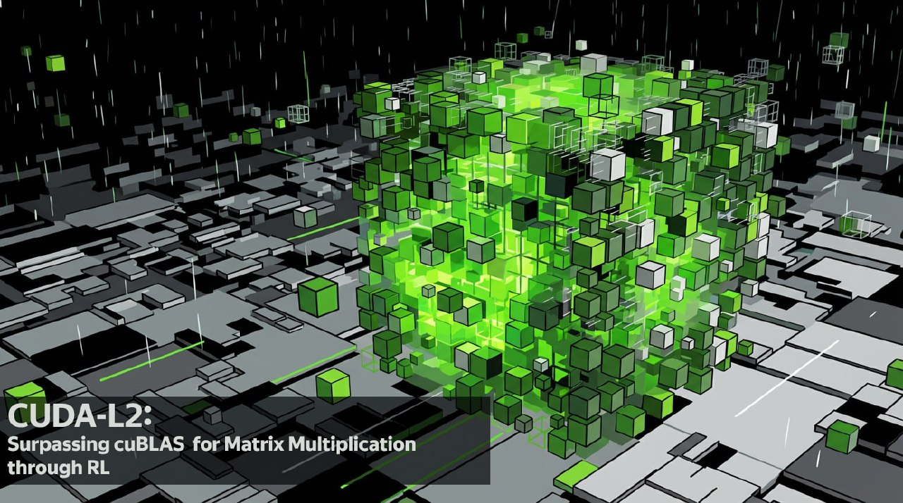
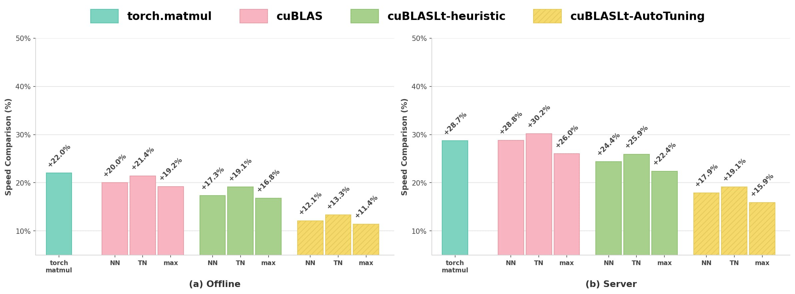

# CUDA-L2: ИИ, оптимизирующий GPU-ядра лучше инженеров NVIDIA

**Название статьи**: CUDA-L2: Surpassing cuBLAS Performance for Matrix Multiplication Through Reinforcement Learning  
**Авторы**: Songqiao Su, Xiaofei Sun, Xiaoya Li, Albert Wang, Jiwei Li, Chris Shum  
**Исследовательская группа**: DeepReinforce

CUDA-L2 - это инновационная система автоматического написания GPU-кода для матричного умножения, разработанная исследовательской группой DeepReinforce. Эта система генерирует CUDA-ядра, превосходящие по производительности уже оптимизированные библиотеки от NVIDIA, такие как cuBLAS и cuBLASLt, на 10–30% [[../quantization/int_vs_fp_quantization_comparison.md|сравнение квантизации FP и INT]].

## Архитектура и методология CUDA-L2

CUDA-L2 сочетает в себе:
- **Большие языковые модели (LLM)**
- **Обучение с подкреплением (RL)**

Система специфически направлена на оптимизацию ядер Half-precision General Matrix Multiply (HGEMM) CUDA.

### Ключевая методология
- **Награда RL**: Использует скорость выполнения CUDA как функцию вознаграждения обучения с подкреплением
- **Автоматическая оптимизация**: Оптимизирует ядра HGEMM для 1000 конфигураций
- **Масштабируемость**: Систематически исследует пространства конфигураций в масштабах, невозможных для человека
- **Оптимизация для**: Конфигураций MxNxK

### Принцип работы
В отличие от традиционных подходов, где библиотеки создаются вручную с использованием шаблонов ядер, а автотюнеры лишь подстраивают параметры (например, размер тайлов), CUDA-L2 использует **языковую модель**, которая **пишет исходный код CUDA с нуля** для каждого размера матрицы [[../../llm/models/nvidia_llama_3_nemotron_super_49b_v15.md|NVIDIA Nemotron Super 49B]].

#### Что делает CUDA-L2 уникальным:
- **Изменение структуры кода**: Модель может менять циклы, стратегию тайлинга, паддинг и даже свизл-паттерны
- **Автоматический выбор стиля программирования**: Может использовать сырой CUDA, CuTe, CUTLASS или inline PTX в зависимости от ситуации
- **Адаптация под размер матрицы**: Пишет специфический код для каждого размера, а не использует универсальные шаблоны
- **Интеграция RL**: Язык модели обучается с помощью цикла обучения с подкреплением, где RL запускает сгенерированные ядра на реальном железе, измеряет скорость и корректность, затем обновляет LLM

### Используемая модель
В качестве генератора CUDA-кода использовалась модель **DeepSeek 671B**, которую дополнительно дообучили на смеси:
- CUDA-ядер
- Качественного кода из библиотек PyTorch, ATen, CUTLASS
- Примеров от NVIDIA

## Практическая ценность

### Влияние на обучение моделей
Для претрейна и файнтюна LLM большая часть времени GPU тратится на операции **матричного умножения HGEMM (Half-precision General Matrix Multiplication)**. Ускорение этих ядер на 10–30%, которые обещает CUDA-L2, делает весь процесс обучения заметно дешевле и быстрее [[memory_efficient_training.md|эффективное обучение с ограниченной памятью]].

### Расширение сценариев
- CUDA-L2 обрабатывает около **1000 реальных размеров матриц**, в отличие от нескольких вручную настроенных
- Ускорение работает для самых **разных архитектур GPU**
- Это позволяет вместить в тот же бюджет больше токенов обучения, больше прогонов SFT или RLHF

## Результаты тестирования

### Оффлайн-сценарии (ядра выполняются последовательно без временных интервалов)
- **+22.0%** ускорение над `torch.matmul`
- **+19.2%** ускорение над `cuBLAS` (с оптимальной конфигурацией размещения: нормальное-нормальное NN и транспонированное-нормальное TN)
- **+16.8%** ускорение над `cuBLASLt-heuristic` (библиотека cuBLASLt с выбором алгоритма эвристикой)
- **+11.4%** ускорение над `cuBLASLt-AutoTuning` (наиболее конкурентоспособная базовая линия, выбирает самый быстрый алгоритм из до 100 кандидатов)

### Серверные сценарии (реальный инференс)
- **+28.7%** ускорение над `torch.matmul`
- **+26.0%** ускорение над `cuBLAS`
- **+22.4%** ускорение над `cuBLASLt-heuristic`
- **+15.9%** ускорение над `cuBLASLt-AutoTuning`

## Сравнение с существующими решениями

CUDA-L2 сравнивается с несколькими передовыми базовыми решениями:
- `torch.matmul` (широко используемая функция PyTorch)
- `cuBLAS` (оптимизированная библиотека NVIDIA)
- `cuBLASLt` в двух конфигурациях:
  - Режим эвристики
  - Режим AutoTuning (наиболее конкурентоспособная базовая линия)

## Ключевая инновация

Статья демонстрирует, что даже тяжело оптимизированные, критически важные для производительности ядра, такие как HGEMM, могут быть улучшены через автоматизацию под управлением LLM+RL, показывая, что автоматизированные подходы могут превзойти человечески оптимизированные библиотеки.

Проект доступен на GitHub: [https://github.com/deepreinforce-ai/CUDA-L2](https://github.com/deepreinforce-ai/CUDA-L2)

## Архитектуры и поддержка
- В репозитории на GitHub авторы выложили оптимизированные ядра HGEMM A100 для 1000 конфигураций
- В планах: расширение на архитектуры Ada Lovelace, Hopper, Blackwell
- Поддержка более плотных конфигураций
- Поддержка 32-битного HGEMM

## Связь с другими темами
- [[../../hardware/amd_ai_stack.md]] - альтернативная GPU-архитектура от AMD
- [[../../llm/inference/gpu_memory_management.md]] - управление памятью GPU при инференсе
- [[../../tools/kernel_programming_pytorch.md]] - программирование GPU-ядер в PyTorch
- [[../../optimization/matrix_whitening_optimizers.md]] - оптимизаторы с матричным отбеливанием для обучения нейронных сетей
- [[../../optimization/deep_optimizers.md]] - современные глубокие оптимизаторы
- [[../../optimization/evolutionary_algorithms.md]] - эволюционные алгоритмы, используемые CUDA-L2 для оптимизации ядер

## Источники
1. [Статья о CUDA-L2](https://t.me/ai_machinelearning_big_data) - Оригинальный источник информации о CUDA-L2 (дата публикации: не указана)
2. [Оригинальная статья на arXiv](https://arxiv.org/abs/2512.02551) - "CUDA-L2: Surpassing cuBLAS Performance for Matrix Multiplication Through Reinforcement Learning" (дата публикации: 2025)
3. [Hugging Face Papers](https://huggingface.co/papers/2512.02551) - Информация о статье CUDA-L2 (дата публикации: 3 дня назад)

## Метаданные
```metadata
category: ai_optimization
subcategory: gpu_computing
tags: gpu, cuda, optimization, matrix_multiplication, reinforcement_learning, llm, hgemm, cublas, deep_learning, performance
```

## Медиафайлы
-  <!-- TODO: Broken image path -->
-  <!-- TODO: Broken image path -->
-  <!-- TODO: Broken image path -->