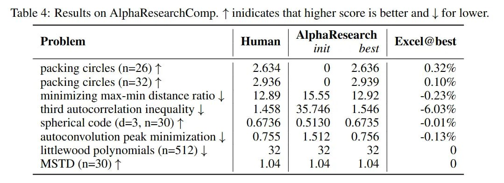

# Задача упаковки кругов в AlphaResearch: Прорыв в автоматическом открытии алгоритмов

## Общее описание

Задача упаковки кругов - классическая математическая задача оптимизации, в которой требуется упаковать n непересекающихся кругов в единичный квадрат, максимизируя сумму их радиусов. Эта задача была одной из восьми задач в бенчмарке AlphaResearchComp и стала наиболее впечатляющим успехом системы AlphaResearch.

**Описание:** Визуализация задачи упаковки кругов, показывающая пример оптимальной конфигурации для n=32 с результатом 2.939, достигнутым системой AlphaResearch.

## Формулировка задачи

Для задачи упаковки кругов:

- **Цель**: упаковать n непересекающихся кругов в единичный квадрат
- **Оптимизация**: максимизировать сумму радиусов кругов
- **Ограничения**: круги не должны пересекаться и должны полностью находиться внутри единичного квадрата

Для тестирования использовался случай n=32, где:

- **Предыдущий рекорд человека**: 2.936
- **Результат AlphaEvolve (предыдущий SOTA)**: 2.937
- **Результат AlphaResearch**: 2.939

## Результаты AlphaResearch

### Прорыв в решении

AlphaResearch открыл новый, лучший из известных алгоритмов для задачи упаковки кругов, превзойдя решения как экспертов-людей, так и сильных бейзлайнов вроде AlphaEvolve. Результат 2.939 для n=32 превзошел предыдущий рекорд человека (2.936) и предыдущий SOTA от AlphaEvolve (2.937).

### Подход AlphaResearch

AlphaResearch может начать с простой программы, которая размещает круги в виде базовой сетки. Проанализировав результат, агент генерирует новую идею, например: "Мы предлагаем новую вычислительную схему... устраняющую ключевые ограничения существующих методов, а именно — жёсткие паттерны инициализации и исключительно локальную корректировку радиуса". Если модель вознаграждения высоко оценивает эту идею, агент генерирует конкретные изменения в коде для реализации этого нового, более сложного подхода.

## Значение результата

### Для автоматического открытия алгоритмов

- **Доказательство концепции**: демонстрирует, что системы ИИ могут открывать новые, значимые научные результаты, превосходящие человеческие решения
- **Преимущество симулированного рецензирования**: показывает эффективность подхода AlphaResearch с его двойной исследовательской средой
- **Новый подход к оптимизации**: алгоритм, найденный AlphaResearch, может содержать новые эвристики и стратегии, которые будут ценны для дальнейших исследований

### Для математической оптимизации

- **Прогресс в классической задаче**: задача упаковки кругов является классической проблемой в комбинаторной геометрии
- **Новые методы оптимизации**: найденный алгоритм может содержать новые подходы к решению задач этой категории

## Сравнение с другими подходами

### AlphaEvolve vs AlphaResearch

- **AlphaEvolve**: достиг результата 2.937 для задачи упаковки кругов n=32
- **AlphaResearch**: превзошел это значение до 2.939, показав улучшение на 0.002
- **Причина улучшения**: двойная исследовательская среда AlphaResearch, комбинирующая проверку выполнения с предварительной оценкой качества идеи

### Другие эволюционные агенты

AlphaResearch также показал превосходство над другими недавними эволюционными агентами, такими как OpenEvolve и ShinkaEvolve, в задаче упаковки кругов.

## Методология решения в AlphaResearch

**Описание:** Схема методологии AlphaResearch для решения задач упаковки кругов, показывающая двойной процесс оценки и фильтрации идей.

### Двойной процесс оценки

1. **Идея**: AlphaResearch генерирует новую идею улучшения алгоритма
2. **Оценка идеи**: модель вознаграждения (AlphaResearch-RM-7B) оценивает концептуальную ценность идеи
3. **Реализация**: если идея одобрена, генерируется кодовая реализация
4. **Верификация выполнения**: код выполняется и оценивается по метрикам производительности

### Эффективность фильтрации

Механизм симулированного рецензирования оказался очень эффективным. Фильтр корректно отклонил 108 идей для задачи упаковки кругов, которые в конечном итоге не прошли бы проверку выполнением, экономя вычислительные ресурсы.

## Связи с другими темами

- [[ai/agents/alpharesearch_system.md]] - общая система, достигшая этого результата
- [[ai/agents/alpharesearch_benchmark.md]] - бенчмарк, в котором содержалась эта задача
- [[ai/optimization/packing_problems.md]] - более широкий контекст задач упаковки
- [[ai/geometry/computational_geometry.md]] - геометрические методы, используемые в упаковке
- [[ai/optimization/circle_packing_problems.md]] - классическая задача упаковки кругов в контексте оптимизации
- [[ai/agents/alphaevolve_system.md]] - предшественник, результаты которого были превзойдены

## Источники

1. [AlphaResearch: Accelerating New Algorithm Discovery with Language Models](https://arxiv.org/abs/2511.08522) - основная статья, описывающая результат AlphaResearch в задаче упаковки кругов
2. [AlphaResearch Review](https://arxiviq.substack.com/p/alpharesearch-accelerating-new-algorithm) - обзор результата в задаче упаковки кругов
3. [Задача упаковки кругов в математике] - классические работы по задаче упаковки кругов, которые ставят результат AlphaResearch в более широкий контекст