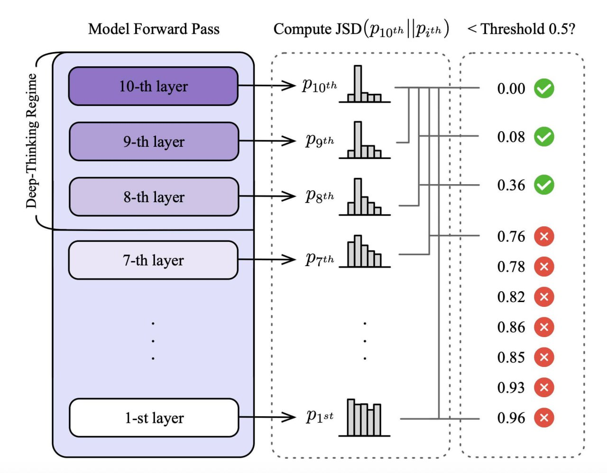

# Deep-Thinking Ratio (DTR) — Коэффициент Глубокого Мышления

## Общее описание

**Deep-Thinking Ratio (DTR)** — это метрика для измерения усилия мышления языковой модели во время инференса, основанная на подсчёте доли «токенов глубокого мышления» в сгенерированной последовательности. В отличие от традиционных подходов, использующих длину генерации как прокси для вычислительного усилия, DTR фокусируется на том, *как* отдельные токены производятся внутри модели.

**Ключевая идея:** Токены, предсказания которых претерпевают значительные изменения в более глубоких слоях модели перед стабилизацией, отражают большее «мышление» модели, чем токены, стабилизирующиеся в ранних слоях.

## Проблема: «Длиннее» не значит «лучше»

Исследования показали, что сырое количество токенов не является надёжным индикатором качества рассуждений:

- Увеличение длины генерации не всегда коррелирует с точностью
- Наблюдается **отрицательная корреляция** между длиной токенов и точностью (средняя r = −0,59)
- Избыточное мышление (**overthinking**) приводит к усилению ошибок и деградации производительности
- Модели могут «переусердствовать», усиливая ошибочные эвристики или фиксируясь на нерелевантных деталях

## Методология

### Токены глубокого мышления (Deep-Thinking Tokens)

Токен классифицируется как **токен глубокого мышления**, если его предсказание стабилизируется только в глубоких слоях модели.

**Процесс идентификации:**

1. **Проекция промежуточных скрытых состояний:** Для каждого слоя l ∈ {1, …, L-1} промежуточные скрытые состояния проецируются в пространство словаря с помощью матрицы unembedding Wᵤ
2. **Вычисление распределений:** Для каждого слоя вычисляется распределение вероятностей pₜ,ₗ
3. **Измерение дивергенции:** Вычисляется дивергенция Jensen-Shannon (JSD) между распределением промежуточного слоя pₜ,ₗ и финального слоя pₜ,ₗ:

   Dₜ,ₗ = JSD(pₜ,ₗ || pₜ,ₗ)

4. **Глубина стабилизации (Settling Depth):** Определяется первый слой cₜ, на котором дивергенция падает ниже порога τ:

   cₜ = min{l : Dₜ,ₗ ≤ τ}

5. **Режим глубокого мышления:** Токен считается токеном глубокого мышления, если его глубина стабилизации попадает в «поздний» режим:

   L_deep-thinking = {l : l ≥ ⌈(1-ρ)L⌉}

   где ρ ∈ (0, 1) — глубинная фракция (обычно ρ = 0,85)

### Вычисление Deep-Thinking Ratio

Для сгенерированной последовательности S длины T:

**DTR(S) = C / T**

где C — количество токенов глубокого мышления в последовательности.

**Алгоритм 1: Вычисление DTR**

```
Вход: Авторегрессионная LM f_θ с L слоями, порог τ, глубинная фракция ρ
Выход: DTR сгенерированной последовательности S

C ← 0  // счётчик токенов глубокого мышления
S ← ∅  // сгенерированная последовательность

while y_t ≠ [EOS]:
    Сэмплировать y_t ~ p_t,L
    S ← (S, y_t)
    
    for l ← 1 to L:
        p_t,l ← softmax(Wᵤh_t,l)
        D_t,l ← JSD(p_t,L, p_t,l)
    
    c_t ← min{l : min_{j≤l} D_t,j ≤ τ}
    
    if c_t ≥ ⌈(1-ρ)L⌉:
        C ← C + 1

return C / |S|
```

## Эмпирические результаты

### Бенчмарки

Исследование проводилось на четырёх сложных бенчмарках:

| Бенчмарк | Описание |
|----------|----------|
| **AIME 2024** | Соревновательные математические задачи |
| **AIME 2025** | Соревновательные математические задачи |
| **HMMT 2025** | Математический турнир Гарварда-Массачусетса |
| **GPQA-Diamond** | Сложные научные вопросы уровня аспирантуры |

### Модели

Оценивалось 8 вариантов reasoning-моделей из трёх семейств:

- **GPT-OSS-20B** (low, medium, high reasoning levels)
- **GPT-OSS-120B** (low, medium, high reasoning levels)
- **DeepSeek-R1-70B**
- **Qwen3-30B-Thinking**

### Корреляция с точностью

| Метрика | Средняя корреляция с точностью |
|---------|-------------------------------|
| **DTR (Ours)** | **+0,683** |
| Token Length | -0,594 |
| Reverse Token Length | +0,594 |
| Log Probability | +0,527 |
| Negative Perplexity | +0,219 |
| Negative Entropy | +0,571 |
| Self-Certainty | +0,605 |

**Ключевой результат:** DTR показывает **устойчивую положительную корреляцию** с точностью across всех бенчмарков и моделей, значительно превосходя метрики на основе длины и уверенности.



**Рисунок 1:** Сравнение корреляций на GPT-OSS-120B-medium across AIME 2024/2025, HMMT 2025, и GPQA-Diamond.
- **(Слева)** Количество выходных токенов показывает умеренную **отрицательную** корреляцию (средняя r = -0,544)
- **(Справа)** Deep-Thinking Ratio демонстрирует сильную **положительную** корреляцию (средняя r = 0,828)

## Think@N — Стратегия масштабирования во время тестирования

На основе DTR была разработана стратегия **Think@N** для параллельного масштабирования инференса.

### Принцип работы

1. **Генерация нескольких ответов** для одного запроса
2. **Оценка DTR** для каждого ответа (можно по коротким префиксам)
3. **Приоритетный отбор** ответов с высоким DTR
4. **Агрегация** выбранных ответов
5. **Раннее отклонение** неперспективных генераций на основе DTR, оценённого по коротким префиксам

### Преимущества

| Показатель | Think@N | Стандартная Self-Consistency |
|------------|---------|------------------------------|
| Производительность | ≥ | Базовый уровень |
| Вычислительные затраты | **~50%** | 100% |
| Возможность раннего отклонения | ✅ | ❌ |

**Результат:** Think@N достигает производительности, сопоставимой или превосходящей стандартную self-consistency, при **сокращении затрат на инференс примерно на 50%**.

## Визуализация: Heatmap of Thought


**Рисунок 2:** Heatmap показывает значения JSD между распределениями последнего (36-го) слоя и промежуточных слоёв для последовательности ответов от GPT-OSS-120B-high.

**Наблюдения:**
- **Функциональные и шаблонные слова** (например, «and», «is», «boxed», «<|return|>») часто стабилизируются на относительно мелких слоях
- **Завершения после операторов** (например, «+», «=») и **токены ответов/символы** (например, «13», «(D)») не стабилизируются до глубоких слоёв
- **Токен ответа «13»** постепенно проявляется в более ранних слоях после своего первого появления

## Применение и значение

### Для исследователей

- DTR предоставляет **механистически обоснованную** метрику усилия мышления
- Не требует эвристик для конкретных задач или внешних аннотаций
- Позволяет изучать внутренние динамики рассуждений в LLM

### Для практиков

- **Оптимизация затрат:** Раннее отклонение неперспективных генераций экономит вычислительные ресурсы
- **Улучшение качества:** Приоритизация ответов с высоким DTR повышает точность
- **Мониторинг overthinking:** DTR помогает выявлять случаи избыточного мышления

### Ограничения

- Требует доступа к промежуточным скрытым состояниям модели
- Вычисление DTR добавляет накладные расходы во время инференса
- Параметры (τ, ρ) могут требовать настройки для разных моделей и задач

## Связи с другими темами

- [[test_time_training_methods.md]] — методы адаптации моделей во время инференса, включая TTT-Discover и MiGrATe
- [[multi_token_prediction.md]] — предсказание нескольких токенов и архитектура MTP
- [[laser_reinforcement_learning.md]] — самонаграждение на уровне токенов в RL

## Источники

- **Chen, W.-L., Peng, L., Tan, T., Zhao, C., Chen, B. J., Lin, Z., Go, A., & Meng, Y.** (2026). *Think Deep, Not Just Long: Measuring LLM Reasoning Effort via Deep-Thinking Tokens*. arXiv:2602.13517
- Полная статья: https://arxiv.org/abs/2602.13517
- PDF: https://arxiv.org/pdf/2602.13517

## Дополнительные материалы

- Анализ корреляций для различных метрик (Таблица 1 в статье)
- Качественные примеры токенов глубокого мышления (Приложение E в статье)
- Анализ различных метрик расстояния (Раздел 3.2 в статье)

```metadata
category: искусственный_интеллект
subcategory: языковые_модели
tags: deep-thinking ratio, DTR, LLM reasoning, inference optimization, think@n, токены глубокого мышления, масштабирование инференса
```
