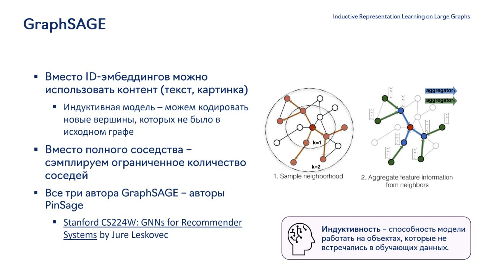

# GraphSAGE: Индуктивные представления на больших графах

## Описание

GraphSAGE (Graph Sample and Aggregated) - это индуктивная модель для генерации эмбеддингов узлов в графах. В отличие от трансдуктивных методов, которые учатся только на узлах из обучающей выборки, GraphSAGE способна генерировать эмбеддинги для новых узлов, которых не было в исходном графе.

## Архитектура

GraphSAGE реализует подход "агрегирования и сэмплирования", который включает:

1. **Сэмплирование соседей**: вместо использования всех соседей узла, модель сэмплирования ограниченное количество соседей
2. **Агрегация информации**: агрегирование признаков из соседства узла
3. **Генерация эмбеддинга**: создание фиксированного представления узла из агрегированной информации

**Изображение показывает:** GraphSAGE использует контент (текст, картинка) вместо ID-эмбеддингов, что делает модель индуктивной - способной кодировать новые вершины. Вместо полного соседства используются ограниченные выборки соседей. Архитектура включает агрегацию признаковой информации из соседей. Индуктивность позволяет модели работать с объектами, которые не встречались в обучающих данных.

### Агрегаторы

GraphSAGE использует различные функции агрегации:

- **Mean aggregator**: усреднение эмбеддингов соседей
- **Pooling aggregator**: применение нейронной сети с max/mean pooling
- **LSTM aggregator**: использование LSTM для агрегации
- **Gated aggregator**: использование GRU/механизмов внимания

## Особенности

- **Индуктивность**: способность обучаться на подграфе, а затем генерировать эмбеддинги для новых узлов
- **Масштабируемость**: благодаря сэмплированию соседей, модель может работать с большими графами
- **Контентная информация**: использует признаки узлов, а не только ID, что особенно полезно для новых узлов

## Применение в рекомендательных системах

GraphSAGE особенно полезен в рекомендательных системах для решения проблемы холодного старта:

- Может генерировать эмбеддинги для новых айтемов на основе их контента (изображение, текст)
- Позволяет учитывать структуру графа взаимодействий
- Подходит для сценариев с частыми добавлениями новых узлов (например, новых пинов в Pinterest)

## Связь с другими моделями

- **PinSage**: промышленное применение GraphSAGE в Pinterest
- **MultiBiSage**: расширение для нескольких графов
- **GNN**: обобщение GraphSAGE как одной из архитектур GNN

## Преимущества

- Решение проблемы холодного старта
- Масштабируемость на большие графы
- Генерализация на новые узлы

## Ограничения

- Не всегда достигает наилучшей точности по сравнению с трансдуктивными методами
- Требует тщательной настройки гиперпараметров сэмплирования
- Зависит от качества признакового описания узлов

## Связи с другими темами

- [[graph_neural_networks_for_recommendations.md]] - Общее описание GNN в рекомендациях
- [[PinSage.md]] - Применение GraphSAGE в Pinterest
- [[MultiBiSage.md]] - Расширение для нескольких графов
- [[gnn_architectures.md]] - Архитектуры графовых нейронных сетей

## Источники

1. [GraphSAGE: Inductive Representation Learning on Large Graphs] - оригинальная статья о GraphSAGE от Jure Leskovec и коллег
2. [Stanford CS224W: GNNs for Recommender Systems] - лекции о применении GNN, включая GraphSAGE, в рекомендательных системах
3. [Inductive Representation Learning on Large Graphs] - дополнительные материалы по индуктивным GNN