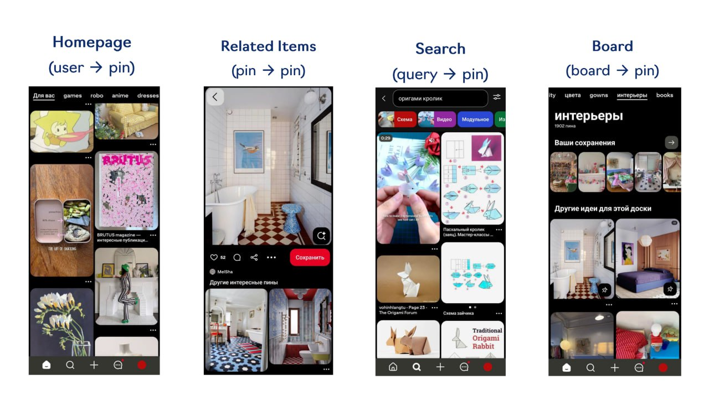

# PinSage: Графовая свертка для промышленных рекомендательных систем

## Описание

PinSage - это графовая сверточная модель, разработанная для рекомендаций в Pinterest. Модель является индуктивной версией GraphSAGE, адаптированной к специфике рекомендаций пинов и досок на платформе Pinterest.

## Контекст и проблема

Pinterest сталкивается с рядом вызовов в рекомендательных системах:
- Масштаб: более 3 млрд пинов и 1 млрд досок
- Холодный старт: постоянное появление новых пинов
- Не все популярные пины подходят для GraphSAGE (у многих миллион соседей)
- Полный pin-board граф не помещается на GPU

**Изображение показывает:** Различные сценарии рекомендаций в Pinterest: Related Items (pin → pin), Search (query → pin), Board (board → pin) и пользовательские рекомендации (user → pin). Изображение демонстрирует разнообразие контента в Pinterest: игры, роботы, аниме, платья, интерьеры и другие категории.

## Архитектура

PinSage использует следующие ключевые компоненты:

### 1. Структура графа

- Двудольный граф пинов и досок
- Вершины: пины (изображения) и доски (тематические подборки)
- Ребра: сохранения пинов на доски

### 2. Сэмплирование соседства

- В отличие от GraphSAGE, использует Pixie для сэмплирования соседей
- Visitation counts из Pixie используются как веса при агрегации (а не равномерное сэмплирование)
- Pixie - это biased random walk по pin-board графу

### 3. Агрегация

- Использует архитектуру GraphSAGE с модификациями
- Конволюционная операция: CONVOLVE
- Формула: π = y({ReLU(W_h * h_v + b) | v ∈ N(u)}, a) и h_u^new = ReLU(W_concat * CONCAT(h_u, π) + b)

### 4. Контентные признаки

- Визуальный VGG эмбеддинг картинки
- Текстовый word2vec эмбеддинг названия и описания пина
- Логарифм степени вершины

## Обучение

- Supervised learning, а не link prediction
- Сближают пары пинов, с которыми у пользователя было положительное взаимодействие за короткий промежуток времени
- Использует margin-based triplet loss
- Curriculum learning: сначала легкие негативы, потом сложные
- 1.2 млрд пар для обучения

## Процесс инференса

- Ежедневно пересчитываются эмбеддинги для 3+ млрд пинов
- Использует MapReduce:
  1. Шаг 1: эмбеддинги пинов (из сырых фичей)
  2. Шаг 2: join к доскам → эмбеддинги досок
  3. Шаг 3: join досок к пинам → финальные эмбеддинги пинов
- 2 слоя свертки, соседства размера 50

## Результаты

- Победа в A/B тестах над Visual, Annot., Combined и Pixie
- Win rate 62.4% против Pixie
- Улучшение качества рекомендаций

## Эволюция

- Изначально PinSage-эмбеддинги использовались во всех моделях
- Затем добавились обучаемые ID-based эмбеддинги как дополнение (PinnerFormer, PinRec)
- Была попытка улучшить PinSage через совместное обучение (OmniSage)
- Новейшая версия (PinFM) использует только обучаемые эмбеддинги

## Связи с другими темами

- [[GraphSAGE.md]] - Базовая архитектура, на которой основан PinSage
- [[Pixie.md]] - Метод сэмплирования соседей, использованный в PinSage
- [[MultiBiSage.md]] - Последующее развитие
- [[graph_neural_networks_for_recommendations.md]] - Общее описание GNN в рекомендациях
- [[pinnerformer_pinrec_architectures.md]] - Архитектуры, использующие эмбеддинги PinSage

## Источники

1. [PinSage: Graph Convolutional Neural Networks for Web-Scale Recommender Systems] - оригинальная статья о PinSage
2. [Pinterest: от Pixie до PinFM] - эволюция рекомендательных систем в Pinterest
3. [Stanford CS224W: GNNs for Recommender Systems] - лекции о применении GNN, включая PinSage
4. [GraphSAGE: Inductive Representation Learning on Large Graphs] - базовая модель GraphSAGE