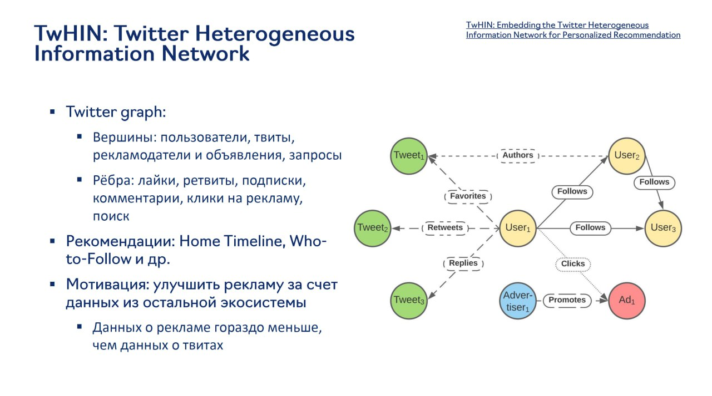

# TwHIN: Twitter Heterogeneous Information Network

## Описание

TwHIN (Twitter Heterogeneous Information Network) - это гетерогенная графовая модель, разработанная для рекомендательных систем в Twitter. Модель объединяет данные из всей экосистемы Twitter (включая рекламу, твиты, пользователей) для улучшения качества рекомендаций и персонализации.

## Контекст и мотивация

Twitter сталкивается с проблемой асимметрии данных в своих рекомендательных системах:
- Данных о рекламе значительно меньше, чем данных о твитах
- Реклама может выиграть от данных из остальной экосистемы
- Необходимость построения единой модели для разных сценариев рекомендаций

## Структура графа

### Вершины

- **Пользователи**: аккаунты Twitter
- **Твиты**: контентные узлы
- **Рекламодатели и объявления**: рекламные узлы
- **Запросы**: поисковые узлы

### Рёбра

- **Лайки**: пользователь-твит взаимодействия
- **Ретвиты**: пользователь-твит взаимодействия  <!-- Исправлено с "твет" на "твит" -->
- **Подписки**: пользователь-пользователь отношения
- **Комментарии**: пользователь-твит взаимодействия  <!-- Исправлено с "твет" на "твит" -->
- **Клики на рекламу**: пользователь-реклама взаимодействия
- **Поиск**: пользователь-запрос взаимодействия

**Изображение показывает:** TwHIN (Twitter Heterogeneous Information Network) для персонализированных рекомендаций. На графе изображены вершины: пользователи, твиты, рекламодатели и объявления, запросы, и рёбра: лайки, ретвиты, подписки, комментарии, клики на рекламу, поиск. Модель решает задачи рекомендаций (Home Timeline, Who-to-Follow и др.) и направлена на улучшение рекламы за счет данных из остальной экосистемы Twitter.

## Применение

### Рекомендации

- **Home Timeline**: персонализированная лента
- **Who-to-Follow**: рекомендации подписок
- И другие рекомендательные сценарии

### Цели

- Улучшение рекламы за счет данных из остальной экосистемы
- Единое представление интересов пользователей

## Методология обучения

### Трансдуктивная модель

- Обучаемые эмбеддинги для вершин и типов рёбер
- Модель не может обрабатывать новые узлы без переобучения

### Функция оценки ребер

Используется подход, аналогичный TransE:
- f(e) = f(s, r, t) = e_s + e_r - e_t
- Где e_s - эмбеддинг источника, e_r - эмбеддинг типа отношения, e_t - эмбеддинг цели
- Идея в том, что source вершина преобразуется в target вершину через "сдвиг" на тип ребра

### Задача обучения

- Link prediction как бинарная классификация наличия ребра
- Используется negative sampling (другие вершины из батча + равномерно сэмплированные)
- Балансировка позитивов/негативов в лоссе

## Развёртывание

### Два отдельных графа

1. **Follow-graph**: для рекомендаций подписок
2. **User-Tweet engagement graph**: для рекомендаций контента

Каждый граф расширяется рекламными данными.

### Регулярное дообучение

- Для борьбы с трансдуктивностью модель периодически дообучается на новых данных
- Это позволяет обновлять эмбеддинги для новых узлов

### Применение

- Используется для генерации кандидатов и ранжирования
- Применяется в рекомендациях, рекламе и поиске
- Большие приросты показаны в рекламе (которые исчезают при использовании только рекламных данных)

## Преимущества

- Объединение данных из разных частей экосистемы
- Улучшение качества рекомендаций за счет междоменной информации
- Единое представление интересов пользователей

## Ограничения

- Трансдуктивность: необходимость переобучения для новых узлов
- Высокая вычислительная сложность
- Сложность балансировки разных типов данных

## Связи с другими темами

- [[graph_neural_networks_for_recommendations.md]] - Общее описание гетерогенных графов в рекомендациях
- [[TTGL.md]] - Сравнение с гетерогенной графовой моделью TikTok
- [[foundation_graph_models.md]] - Пример Foundation Graph Model для экосистемы
- [[traditional_approaches.md]] - Современное развитие графовых методов

## Источники

1. [TwHIN: Twitter Heterogeneous Information Network for Personalized Recommendation] - оригинальная статья о TwHIN
2. [Twitter's Graph Learning Approaches] - обзор графовых методов в Twitter
3. [Heterogeneous Graph Neural Networks for Recommendations] - дополнительные материалы по гетерогенным графовым моделям
4. [Foundation Graph Models in Social Media] - контекст для подходов как TwHIN как Foundation Graph Models