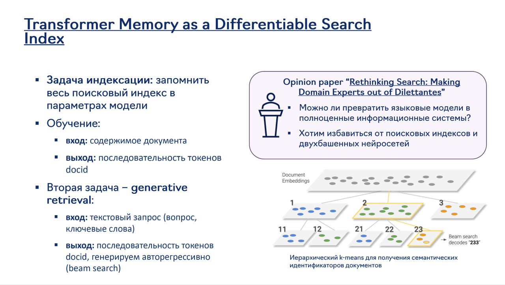

# Frontier-технологии в нейросетевых рекомендательных системах

## Описание

Frontier-технологии в нейросетевых рекомендательных системах - это самые современные и перспективные направления исследований и разработок в области рекомендательных систем, основанные на нейронных сетях. Эти технологии включают в себя трансформеры, методы масштабирования, подходы с обучением с подкреплением, генеративные модели и использование семантических идентификаторов (Semantic IDs). Как упоминалось в лекции HSE DL2, эти технологии определяют будущее направление развития рекомендательных систем.

## Контекст

Frontier-технологии в рекомендательных системах развивались в ответ на ограничения традиционных подходов и потребность в более точных, объяснимых и адаптивных системах. Лекция в HSE DL2 курсе подчеркивала важность этих направлений как переднего края исследований в области рекомендаций.

## Основные направления

### 1. Трансформеры в рекомендациях

#### Общее описание
Трансформеры были адаптированы для рекомендательных систем, чтобы моделировать сложные зависимости во временных последовательностях взаимодействий пользователей. В отличие от RNN и CNN, трансформеры могут эффективно обрабатывать длинные последовательности и моделировать зависимости между отдаленными событиями.

#### Архитектурные особенности
- **Self-attention механизмы**: Позволяют модели учитывать все предыдущие взаимодействия при предсказании следующего
- **Positional encoding**: Для учета порядка взаимодействий
- **Multi-head attention**: Для моделирования разных типов зависимостей
- **Дифференцируемые поисковые индексы**: Использование памяти трансформеров как дифференцируемого поискового индекса

**Изображение показывает:** Концепцию использования памяти трансформеров как дифференцируемого поискового индекса, включая задачу индексации (запоминание поискового индекса в параметрах модели), генеративный поиск (вход - текстовый запрос, выход - последовательность токенов docid), и иерархический k-means для получения семантических идентификаторов документов.

#### Преимущества
- Моделирование длинных зависимостей
- Параллелизуемость вычислений
- Высокая выразительность

#### Примеры
- SASRec (Self-Attentive Sequential Recommendation)
- BERT4Rec (BERT for Sequential Recommendation)
- Ti-SASRec (Time-interval aware SASRec)

См. также: [[transformer_based_models.md]]

### 2. Масштабирование рекомендательных систем

#### Проблема масштаба
Рекомендательные системы должны обрабатывать миллионы пользователей и айтемов, что создает серьезные вычислительные и структурные вызовы. В отличие от NLP-моделей с фиксированным словарем (~50,000 токенов), рекомендательные системы работают с миллионами айтемов.

#### Подходы к масштабированию
- **Унифицированные эмбеддинги** (Feature Multiplexing): [[unified_embeddings.md]]
- **Эффективные методы индексации**: Tree-based, Graph-based, и другие структуры для быстрого поиска
- **Нейронные методы поиска**: Использование ANN (Approximate Nearest Neighbor) для поиска релевантных айтемов
- **Модельное масштабирование**: Увеличение параметров модели для улучшения качества
- **Данныйное масштабирование**: Использование больших объемов данных для обучения

#### Законы масштабирования
Как показывают современные исследования, качество рекомендательных систем может улучшаться по предсказуемым законам с увеличением:
- Количества параметров модели
- Объема обучающих данных
- Вычислительных ресурсов

См. также: [[model_scaling_laws.md]]

### 3. Обучение с подкреплением (Reinforcement Learning) в рекомендациях

#### Общее описание
Обучение с подкреплением применяется для оптимизации долгосрочных метрик, которые трудно оптимизировать с помощью традиционного обучения. В отличие от точечных задач предсказания, RL позволяет моделировать последовательность взаимодействий с пользователем.

#### Основные компоненты
- **Состояние (State)**: Представление текущего состояния пользователя и контекста
- **Действие (Action)**: Рекомендация айтема пользователю
- **Награда (Reward)**: Сигнал о качестве рекомендации (лайк, просмотр, покупка)
- **Политика (Policy)**: Стратегия генерации рекомендаций

#### Подходы
- **Bandit-based рекомендации**: Решение задачи компромисса между эксплуатацией и исследованием
- **Policy Gradient Methods**: Непосредственное обучение политики рекомендаций
- **Actor-Critic Methods**: Совмещение оценки ценности и политики
- **Multi-agent RL**: Для моделирования взаимодействий в сложных системах

#### Преимущества
- Оптимизация долгосрочных метрик
- Учет динамики интересов пользователей
- Баланс между эксплуатацией и исследованием

#### Примеры
- DRN (Deep Reinforcement Learning for Page-wise Recommendations)
- TD3-based рекомендательные системы
- Multi-agent рекомендации для социальных взаимодействий

См. также: [[reinforcement_learning_in_recsys.md]]

### 4. Генеративные модели в рекомендациях

#### Общее описание
Генеративные модели, особенно VAE, GAN и трансформеры, применяются для генерации новых рекомендаций или для моделирования распределения пользовательских предпочтений. В отличие от дискриминативных моделей, генеративные модели моделируют вероятностное распределение.

#### Типы генеративных моделей

##### Вариационные автокодировщики (VAE)
- Обучение на задаче реконструкции
- Генерация новых комбинаций признаков
- Обработка разреженных данных

##### Генеративно-состязательные сети (GAN)
- Игра между генератором и дискриминатором
- Моделирование сложных распределений
- Генерация реалистичных рекомендаций

##### Трансформерные генеративные модели
- Использование автогрегрессивного подхода
- Генерация последовательностей рекомендаций
- Интеграция с LLM

#### Применения
- Генерация новых кандидатов
- Дополнение редких айтемов
- Моделирование пользовательских предпочтений
- Создание персонализированных сценариев взаимодействия

#### Примеры
- RecVAE: Collaborative Filtering with Variational Autoencoders
- IRGAN: Generative Adversarial Networks for Item Recommendation
- TGRec: Generative Sequential Recommendation

См. также: [[generative_retrieval_models.md]]

### 5. Семантические идентификаторы (Semantic IDs)

#### Общее описание
Семантические идентификаторы (Semantic IDs) - это особые токены, которые представляют айтемы в пространстве, совместимом с LLM и трансформерами. В отличие от традиционных эмбеддингов, SIDs позволяют более эффективно интегрировать рекомендательные системы с языковыми моделями.

#### Архитектурные особенности
- **Токенизация айтемов**: Преобразование айтемов в последовательности токенов
- **Семантическое кодирование**: Кодирование как смысла, так и коллаборативного сигнала
- **Интеграция с LLM**: Возможность прямого предсказания айтемов с помощью LLM

#### Подходы
- **TIGER**: Использование VQ-VAE для кодирования айтемов
- **PLUM**: Интеграция с Gemini для YouTube рекомендаций
- **DAS (Dual Aligned Semantic IDs)**: Выравнивание семантических и коллаборативных сигналов

#### Преимущества
- Прямое предсказание айтемов
- Интеграция с LLM
- Объяснимость рекомендаций
- Общий фреймворк для нескольких задач

#### Примеры
- TIGER: Transformers Index for Generative Recommendations
- PLUM: Generative Recommendations at YouTube
- DAS: Dual Aligned Semantic IDs for Industrial Recommendation

См. также: [[semantic_ids_in_recsys.md]]

## Влияние на индустрию

Эти frontier-технологии уже начинают внедряться в промышленных рекомендательных системах:

- **Google/YouTube**: PLUM (использует Gemini для генеративных рекомендаций)
- **Tencent**: Продвинутые мульти-задачные архитектуры на основе PLE
- **Alibaba**: TBGRecall и другие генеративные модели
- **Meta**: Внедрение трансформеров в рекомендации с фиксированной стоимостью инференса
- **LinkedIn**: Использование LLM для рекомендаций с матрёшечным обучением

## Связи с другими темами

- [[hse_dl2_neural_recsys.md]] - Упоминание frontier-технологий в HSE лекции
- [[transformer_based_models.md]] - Детали трансформерных моделей в рекомендациях
- [[bitter_lesson_hse.md]] - Идея масштабирования как ключевая для frontier-технологий
- [[generative_retrieval_models.md]] - Генеративные подходы к рекомендациям
- [[llm_based/overview.md]] - LLM как часть frontier-технологий
- [[reinforcement_learning_in_recsys.md]] - RL в рекомендациях
- [[semantic_ids_in_recsys.md]] - Семантические идентификаторы
- [[model_scaling_laws.md]] - Законы масштабирования
- [[unified_embeddings.md]] - Подходы к масштабированию

## Источники

1. [Frontier Technologies in Neural Recommendation Systems] - Обзор современных направлений в рекомендательных системах
2. [HSE DL2 Course Materials] - Материалы курса Deep Learning 2 на ФКН ВШЭ, где обсуждались frontier-технологии
3. [The Rise of Generative Recommender Systems] - Обзор генеративных подходов
4. [Transformer-based Sequential Recommendation] - Обзор трансформеров в рекомендациях

## Дополнительные материалы

- [[next_generation_recsys.md]] - Будущее рекомендательных систем
- [[llm_vs_traditional_recsys.md]] - Сравнение LLM и традиционных подходов
- [[ethics_in_advanced_recsys.md]] - Этические аспекты frontier-технологий