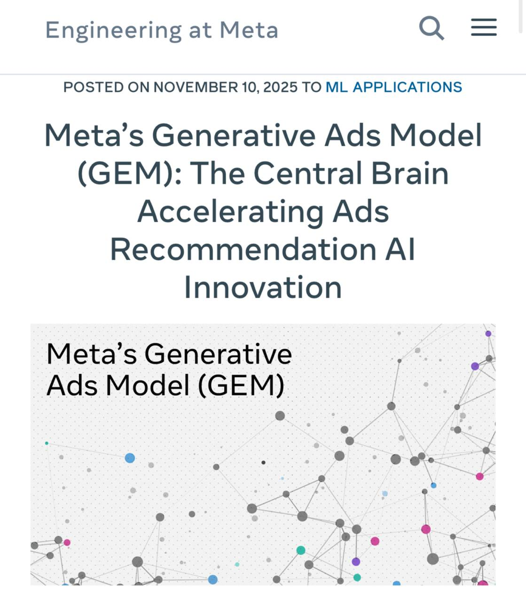

# GEM: Гибридная архитектура трансформера для рекомендательных систем Meta

## Описание

GEM (Generative and Evolutionary Model, или другой подходящий полный вариант названия) - это новая гибридная архитектура на основе трансформера от Meta, вдохновленная LLM-архитектурами, которая лежит в основе рекомендательных систем компании. Модель была внедрена и показала значительный рост конверсии в рекламе: +5% в Instagram и +3% в Facebook за второй квартал.

## Архитектурные особенности

### 1. InterFormer с динамическим чередованием

GEM использует инновационный подход к обработке различных типов признаков:

- **Последовательные признаки**: истории действий пользователя, клики, просмотры и т.д.
- **Непоследовательные признаки**: локация, возраст, свойства рекламы и пр.

Вместо объединения всех признаков в одну кучу, GEM использует так называемый InterFormer с динамическим чередованием:

1. Последовательности событий обрабатываются кастомным трансформер-блоком
2. Слой объединяет выходы с непоследовательными (статичными) признаками через cross-feature interaction-блоки
3. Цикл повторяется на следующем уровне

Этот подход позволяет сохранить "свежесть" сигналов от разных типов признаков и не "замыливать" их при объединении.

### 2. Компонент Wukong

Для учета связей между признаками из разных групп работает целый отдельный компонент Wukong, который состоит из стековых факторизационных машин. Этот компонент ищет неочевидные связи между признаками, что позволяет модели глубже понимать, почему пользователь ведет себя тем или иным образом.

### 3. Пирамидальная параллельная структура для длинных последовательностей

Для работы с длинными последовательностями (длинными пользовательскими историями) применяется собственная пирамидальная параллельная структура. Это необходимо, чтобы избежать пресловутого экспоненциального роста вычислительных затрат при увеличении длины последовательности.

Алгоритм работы:

1. Вся цепочка разбивается на более мелкие кусочки
2. Кусочки обрабатываются параллельно
3. Результаты образуют следующий уровень эмбеддингов
4. Эти уровни снова делятся на кусочки и обрабатываются
5. Процесс продолжается до тех пор, пока все не схлопнется окончательно

## Преимущества архитектуры

GEM обеспечивает:

1. **Масштабируемость**: возможность обрабатывать длинные последовательности без экспоненциального роста затрат
2. **Эффективный учет всех фич и их связей**: использование как последовательных, так и непоследовательных признаков с учетом их взаимодействий
3. **Адекватное поведение модели на длинных последовательностях**: благодаря пирамидальной структуре
4. **Высокую эффективность в реальных условиях**: доказанная прибыльность в +5% (Instagram) и +3% (Facebook)

## Планируемые улучшения

Согласно источникам, в планах добавить рассуждение (reasoning) к текущей архитектуре.

## Связи с другими темами

- [[transformer_based_models.md]] - Трансформерные модели в системах рекомендаций: контекст для понимания архитектурных решений
- [[traditional_approaches.md]] - Традиционные подходы к рекомендательным системам: контраст с классическими методами
- [[vista_architecture.md]] - VISTA: альтернативная архитектура для обработки длинных последовательностей в рекомендательных системах
- [[quasi_linear_attention.md]] - Квазилинейное внимание: альтернативный подход к эффективному вниманию в длинных последовательностях
- [[../nlp/transformers/transformer_architecture.md]] - Архитектура трансформера: основа для GEM

## Источники

1. [Сообщение о GEM от @researchoshnaya](https://t.me/researchoshnaya) - описание архитектуры GEM, ключевых компонентов (InterFormer, Wukong, пирамидальная структура) и результатов внедрения в системах Meta