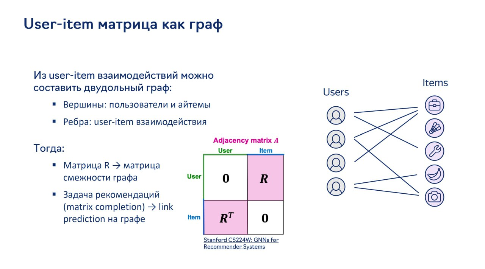

# Графовые нейронные сети в рекомендательных системах (GNNs for RecSys)

## Описание

Графовые нейронные сети (GNN) играют важную роль в современных рекомендательных системах. В отличие от традиционных подходов, GNN явно учитывают структуру взаимодействий между пользователями и айтемами, моделируя рекомендательную задачу как задачу на графе.

## Основные концепции

### User-Item граф

Рекомендательные системы естественным образом порождают графы, где user-item взаимодействия образуют двудольный граф. В этом случае:
- Матрица R (пользователь-айтем) → матрица смежности графа
- Задача рекомендаций (matrix completion) → link prediction на графе

**Изображение показывает:** Составление двудольного графа из user-item взаимодействий, где вершины - пользователи и айтемы, а рёбра - взаимодействия. Матрица R становится матрицей смежности графа, а задача рекомендаций превращается в link prediction на графе.

### Проблемы традиционных подходов

- Матричная факторизация моделирует структуру графа неявно через задачу обучения
- Основной фокус на обучаемые эмбеддинги популярных айтемов
- У популярных айтемов много рёбер (высокая степень вершины), у хвостовых айтемов мало
- Требуется явное моделирование связей более высокого порядка
- Необходимо улучшить качество на хвостовых айтемах

## Категории моделей

### 1. Глубокие графовые модели

- **Neural Graph Collaborative Filtering (NGCF)** - использует message passing для распространения информации о предпочтениях
- **LightGCN** - упрощение NGCF с простым усреднением соседей
- **PinSage** - индуктивная модель с применением GraphSAGE для масштаба Pinterest

### 2. Случайные блуждания

- **Pixie** - biased random walks по графу для рекомендаций
- **DeepWalk, node2vec** - unsupervised подходы с обучением на результатах случайных блужданий

### 3. Гетерогенные графовые модели

- **TwHIN** - Twitter Heterogeneous Information Network
- **TTGL** - Graph Learning at TikTok

## Применение в промышленности

### Pinterest
- Использование PinSage, MultiBiSage для масштабных рекомендаций
- Индуктивность позволяет обрабатывать новые пины
- Учет контента и структуры графа

### Twitter
- TwHIN для улучшения рекламы за счет данных из всей экосистемы

### TikTok
- TTGL как Foundation Graph Model
- Единое представление интересов пользователей и объектов

## Преимущества GNN в рекомендациях

- Явное моделирование структуры графа
- Учет связей более высокого порядка
- Улучшенная производительность на хвостовых айтемах
- Возможность работы с гетерогенными графами

## Ограничения и вызовы

- **Масштаб**: популярные айтемы могут иметь миллионы соседей
- **Холодный старт**: необходимость обработки новых узлов
- **Оверсмазивание (over-smoothing)**: проблема при глубоких GNN
- **Вычислительная сложность**: полные графы могут не помещаться в GPU

## Связи с другими темами

- [[gnn_architectures.md]] - Базовые архитектуры графовых нейронных сетей
- [[traditional_approaches.md]] - Сравнение с традиционными подходами к рекомендациям
- [[NGCF.md]] - Neural Graph Collaborative Filtering
- [[LightGCN.md]] - Light Graph Convolutional Network
- [[GraphSAGE.md]] - Индуктивные графовые представления
- [[PinSage.md]] - Приложение GraphSAGE в Pinterest
- [[Pixie.md]] - Случайные блуждания для рекомендаций
- [[TwHIN.md]] - Гетерогенные графы в Twitter
- [[TTGL.md]] - Графовое обучение в TikTok

## Источники

1. [Stanford CS224W: GNNs for Recommender Systems] - лекции о применении GNN в рекомендательных системах
2. [NGCF: Neural Graph Collaborative Filtering] - статья об оригинальной модели NGCF
3. [LightGCN: Simplifying and Powering Graph Convolution Network for Recommendation] - статья о LightGCN
4. [GraphSAGE: Inductive Representation Learning on Large Graphs] - оригинальная статья о GraphSAGE
5. [PinSage: Graph Convolutional Neural Networks for Web-Scale Recommender Systems] - статья о применении GraphSAGE в Pinterest
6. [TwHIN: Twitter Heterogeneous Information Network] - статья о Twitter графовой модели
7. [TTGL: Graph Learning at TikTok] - документация о графовом обучении в TikTok