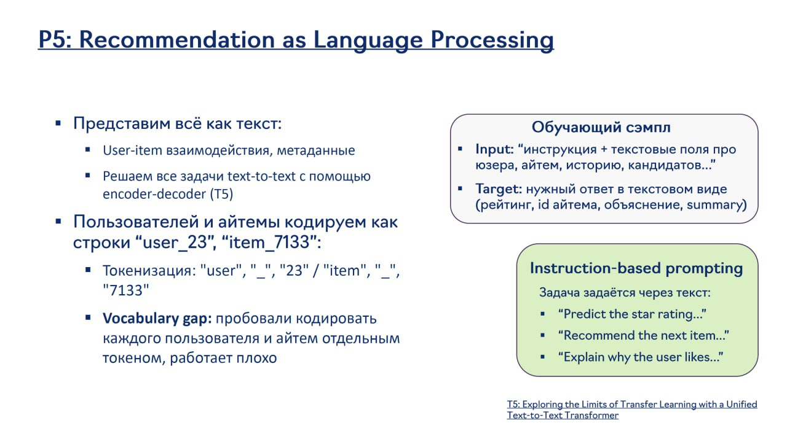

# Обзор применения LLM в рекомендательных системах

## Введение

Большие языковые модели (LLM) революционизировали подход к построению рекомендательных систем. В отличие от традиционных методов, основанных на факторизационных машинах, нейронных сетях и коллаборативной фильтрации, LLM могут использовать богатое семантическое понимание текста, контекста и сложных зависимостей между пользователями и предметами.

## Основные применения LLM в рекомендациях

### 1. Генерация кандидатов

LLM могут использоваться для:
- Прямого предсказания релевантных айтемов на основе истории пользователя
- Генерации новых кандидатов с учетом контекста
- Создания персонализированных рекомендаций на основе текстовых описаний



**Изображение показывает:** Концепцию представления всех элементов рекомендательной системы как текста, включая кодирование пользователей и айтемов как строк (user_23, item_133), токенизацию, и решение всех задач как text-to-text через инструкции и текстовые поля.

### 2. Ранжирование

LLM могут:
- Оценивать релевантность айтемов на основе сложных признаков
- Проводить многоуровневое ранжирование с учетом контекста, настроения и цели пользователя
- Учитывать сложные объяснения и обоснования для рекомендаций

### 3. Объяснение рекомендаций

LLM могут:
- Генерировать понятные объяснения для пользователей
- Объяснять логику выбора рекомендаций
- Обеспечивать прозрачность и доверие к системе

### 4. Диалоговые рекомендательные системы

LLM позволяют:
- Вести диалог с пользователем для уточнения предпочтений
- Уточнять запросы и персонализировать рекомендации в реальном времени
- Обрабатывать естественный язык и сложные запросы

### 5. Генеративные модели поиска (в отличие от LLM-базированных)

Кроме LLM-базированных подходов, существуют генеративные модели поиска, которые используют авторегрессионные методы обучения для генерации кандидатов, но не обязательно полагаются на предобученные LLM. Примером является TBGRecall от Alibaba, который:
- Использует next-session prediction для моделирования сессионного поведения
- Применяет HSTU-блоки и session-wise ROPE для обработки сессий
- Использует контекстные токены для интеграции текущего запроса
- Обучается генеративным (авторегрессионным) способом, но не использует предобученные LLM для понимания языка

## Архитектурная схема LLM рекомендательных моделей

```
                    ┌─────────────────────────────────────┐
                    │        Входные данные               │
                    │  (пользовательские признаки,      │
                    │   контекст, история взаимодействий) │
                    └─────────────┬───────────────────────┘
                                  │
                    ┌─────────────▼─────────────┐
                    │      Предобработка        │
                    │  (трансформация в текст,  │
                    │   семантические ID,       │
                    │   токенизация)           │
                    └─────────────┬─────────────┘
                                  │
                    ┌─────────────▼─────────────┐
                    │      LLM Модель           │
                    │                           │
        ┌─────────────►  ┌─────────────────┐    │
        │              │  │  Семантические  │    │
        │              │  │  Встраивания    │    │
        │              │  │  (Embeddings)   │    │
        │              │  └─────────────────┘    │
        │              │         │               │
        │              │  ┌─────────────────┐    │
        │              │  │   Многослойный  │    │
        │              │  │   Трансформер   │    │
        │              │  │   (Encoder-     │    │
        │              │  │   Decoder)      │    │
        │              │  └─────────────────┘    │
        │              │         │               │
        │              │  ┌─────────────────┐    │
        │              │  │    Обработка    │    │
        │              │  │    Внимания     │    │
        │              │  │   (Attention)   │    │
        │              │  └─────────────────┘    │
        │              └─────────┬───────────────┘
        │                        │
        │              ┌─────────▼─────────┐
        │              │   Выходной слой   │
        │              │   (Prediction)    │
        └──────────────►  ┌───────────────┐ │
                       │  │ Прогноз       │ │
                       │  │ рекомендаций  │ │
                       │  │ (SIDs, токены,│ │
                       │  │ категории и т.д.)│ │
                       │  └───────────────┘ │
                       └─────────────────────┘
                                    │
                    ┌───────────────▼───────────────┐
                    │         Постобработка         │
                    │  (конвертация в рекомендации, │
                    │   фильтрация, переранжирование) │
                    └───────────────┬───────────────┘
                                    │
                    ┌───────────────▼───────────────┐
                    │        Рекомендации           │
                    │  (финальные айтемы для       │
                    │   показа пользователю)       │
                    └───────────────────────────────┘
```

Для более детального представления архитектуры также доступна [диаграмма в формате Mermaid](architecture_diagram.mmd).

### Детализация архитектуры

#### Входные данные (Input Features)
- **История взаимодействия пользователя**: Последовательность айтемов, с которыми пользователь взаимодействовал
- **Признаки пользователя**: Демографические данные, профиль, предпочтения
- **Признаки айтема**: Текстовое описание, категории, метаданные
- **Контекст**: Время, место, устройство, сессионные данные
- **Семантические ID (SIDs)**: Специальные токены, представляющие айтемы в пространстве LLM

#### Предобработка
- **Токенизация**: Преобразование текста и категориальных признаков в токены
- **Создание SIDs**: Генерация семантических ID для айтемов на основе мультимодальных эмбеддингов
- **Формирование промтов**: Структурирование входных данных в формат, понятный LLM

#### LLM Модель
- **Семантические встраивания**: Специальные встраивания для представления айтемов
- **Многослойный трансформер**: Основной архитектурный компонент, обрабатывающий последовательности
- **Механизм внимания**: Позволяет модели фокусироваться на наиболее релевантных частях истории пользователя
- **Выходной слой**: Генерирует вероятностное распределение для следующих айтемов

#### Выходные данные
- **Прогноз рекомендаций**: Семантические ID, токены или вероятности для потенциальных рекомендаций
- **Объяснения**: Текстовые объяснения, почему айтемы рекомендуются
- **Контекстуальная информация**: Дополнительная информация для последующей обработки

## Преимущества LLM в рекомендациях

1. **Семантическое понимание**: LLM способны понимать смысл текста и контента
2. **Перенос знаний**: Возможность использовать знания, полученные на других задачах
3. **Объяснимость**: Возможность генерировать понятные объяснения
4. **Гибкость**: Возможность адаптации к новым доменам с минимальными изменениями
5. **Мультимодальность**: Возможность работы с разными типами данных

## Вызовы и ограничения

1. **Вычислительная сложность**: LLM требуют значительных вычислительных ресурсов
2. **Задержки**: Высокая латентность при генерации рекомендаций
3. **Расширение словаря**: Необходимость адаптации словаря LLM к предметной области
4. **Финтюнинг**: Требуется тщательная настройка под конкретные задачи
5. **Качество данных**: Зависимость от качества текстовых описаний
6. **Стоимость инференса**: Высокая стоимость развертывания и обслуживания больших моделей
7. **Сложность масштабирования**: Трудности с масштабированием для высоконагруженных систем

## Практические примеры

### OneRec-Think (Kuaishou)
- Использует Qwen-8B для генерации объяснений
- Фокусируется на логическом выводе (ризонинге)
- Генерирует траектории поведения пользователя

### PLUM (Google/YouTube)
- Использует Gemini-1.5-MoE-900M
- Обучается напрямую предсказывать будущие айтемы
- Интегрирует рантаймовый контекст в промт

### Гибридная стратегия динамических обновлений (Google DeepMind/YouTube Shorts)
- Исследование баланса между fine-tuning и RAG для динамических обновлений
- Анализ изменчивости пользовательских интересов с IoU = 0.17
- Комбинация ежемесячного fine-tuning с поднедельными RAG-обновлениями

### REGEN (Google)
- Диалоговые рекомендательные системы с генеративными нарративами
- Использует генеративные модели для создания персонализированных историй

### LinkedIn Large Scale Retrieval
- Подход, описанный в статье "Large Scale Retrieval..."
- Заменяет традиционную двух-башенную архитектуру на единую LLM
- Использует текстовое представление айтемов вместо Semantic IDs
- Применяет Matryoshka learning для сжатия эмбеддингов
- Обучается на InfoNCE loss с Hard Negatives (impressions)

### Alibaba RecGPT
- Использует последовательность из нескольких LLM для разных задач
- Финальные рекомендации строятся не-LLM 3-башенной моделью
- Первый LLM майнит интересы пользователя из истории взаимодействий
- Второй LLM предсказывает "теги" на основе знаний о мире, без коллаборативных сигналов

### LinkedIn: Сжатие LLM для высоконагруженных рекомендаций
- Подход, представленный на EMNLP 2025, использует трёхэтапный процесс: дистилляция → прореживание → редистилляция
- Позволяет уменьшить размер модели на ~20% без потери качества
- Повышает производительность и снижает стоимость инференса
- В A/B-тестах показал +20% к внутренней бизнес-метрике LinkedIn
- Использует Matryoshka learning для сжатия размерности финальных эмбеддингов

## Заключение

Применение LLM в рекомендательных системах открывает новые возможности для создания более персонализированных, объяснимых и контекстуальных рекомендаций. Архитектура LLM-рекомендательных моделей включает в себя комплексную обработку входных признаков, использование мощных трансформерных моделей и генерацию качественных рекомендаций с объяснениями. Несмотря на вызовы, связанные со сложностью и вычислительными затратами, LLM-рекомендательные системы демонстрируют значительный потенциал для будущего развития рекомендательных технологий.

## Ссылки на связанные темы

- [[main|Основы LLM-рекомендаций]]
- [[../candidate_generation|Генерация кандидатов]]
- [[../ranking|Ранжирование в рекомендательным системах]]
- [[../traditional_approaches|Традиционные подходы к рекомендательным системам]]
- [[../llm_based/llm_candidate_generation_approaches.md|Сравнительный анализ LLM-базированных подходов к генерации кандидатов]]
- [[../transformer_based_models|Трансформерные модели]]
- [[../dialogue_based/main|Диалоговые рекомендательные системы]]
- [[../generative_retrieval_models|Генеративные модели поиска (альтернативный подход)]]
- [[../tbgrecall|TBGRecall: пример генеративной модели поиска]]
- [[../../llm/models/generative_models|Генеративные модели]]
- [[../advantage_weighted_sft|Advantage-Weighted Supervised Fine-Tuning: альтернатива RLHF для генеративных рекомендательных моделей]]
- [[linkedin_compressed_llm_approach.md|LinkedIn: Сжатие LLM для рекомендательных систем]]
- [[../../llm/compression/distillation_pruning_redistillation.md|Трехэтапная компрессия LLM: Дистилляция, Прореживание и Редистилляция]]
- [[hybrid_strategy_dynamic_updates.md|Балансировка fine-tuning и RAG: гибридная стратегия для динамических обновлений LLM-рекомендаций]]

## Дополнительные ресурсы

- [[llm4rec_survey_classification|Классификация LLM для рекомендательных систем: Обзор]]
- [[llm_feature_engineering|LLM для инженерии признаков в рекомендательных системах]]
- [[llm_feature_encoders|LLM как энкодеры признаков в рекомендательных системах]]
- [[llm_scoring_ranking_functions|LLM как функции оценки и ранжирования в рекомендательных системах]]
- [[llm_user_interaction|LLM для пользовательского взаимодействия в рекомендательных системах]]
- [[llm_pipeline_controller|LLM для управления пайплайном рекомендательных систем]]
- [[llm_rec_new_research|Новейшие исследования LLM для рекомендательных систем]]