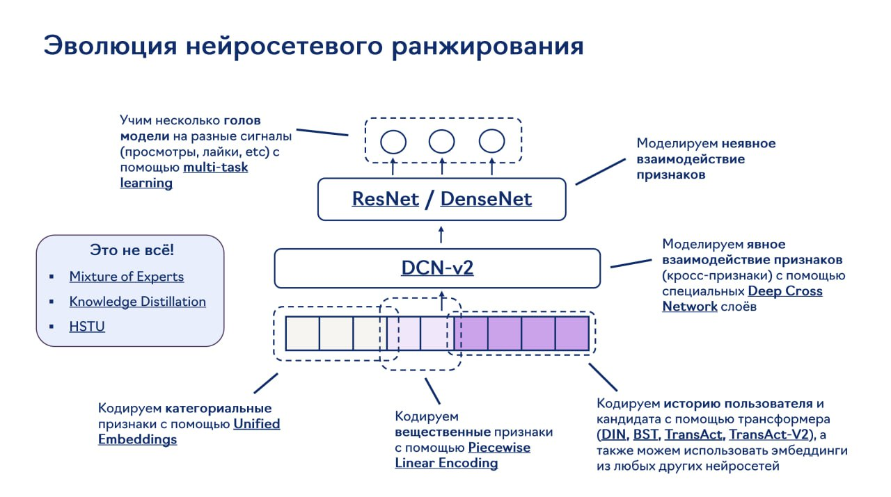

# Ранжирование в рекомендательных системах

## Описание

Ранжирование (ranking) - это этап в рекомендательных системах, на котором система оценивает и упорядочивает кандидаты, предложенные на этапе извлечения (retrieval), по степени релевантности для конкретного пользователя.

**Изображение показывает:** Эволюцию подходов к нейросетевому ранжированию в рекомендательных системах.

## Цель

Цель этапа ранжирования - предоставить пользователю отранжированный список рекомендаций, где наиболее релевантные элементы находятся в начале списка.

## Методы

### Традиционные подходы
- Коллаборативная фильтрация
- Контентная фильтрация
- Гибридные методы

### Современные подходы
- Глубокое обучение
- Трансформерные модели
- Target Aware архитектуры (например, OneTrans, RankMixer, TransAct V2)
- LLM-based подходы (например, OnePiece, OneRec-Think)

### Сравнение с традиционными методами

Современные нейросетевые подходы к ранжированию часто превосходят традиционные методы машинного обучения. Как показано в HSE DL2 курсе, нейросетевые модели могут выигрывать у таких методов, как CatBoost, в задачах ранжирования (например, на Yambda). Это подтверждает идею "Урока Гарри" о том, что прогресс в ИИ происходит за счет увеличения масштабов вычислений, а не за счет сложных алгоритмов.

См. также: [[bitter_lesson_hse.md]] об Уроке Гарри и его влиянии на рекомендательные системы.

## Особенности современных подходов

Современные рекомендательные системы, особенно LLM-based, включают:
- Компоненты ризонинга для объяснения рекомендаций
- Использование контекстной информации
- Прогрессивное обучение с учетом обратной связи
- Каскадные архитектуры для улучшения масштабируемости

## Связи с другими темами

[[candidate_generation.md]] - Этап извлечения, предшествующий ранжированию
[[llm_based/onepiece_framework/main.md]] - Пример современного подхода к ранжированию с использованием LLM
[[transformer_based_models.md]] - Трансформерные модели, используемые в ранжировании
[[mpformer.md]] - MPFormer: мультизадачный подход к персонализованной последовательной выборке, кандидаты из которого могут использоваться на этапе ранжирования
[[cikm_25.md]] - CIKM'25: последние продвижения в этапах рекомендательного пайплайна, включая ранжирование