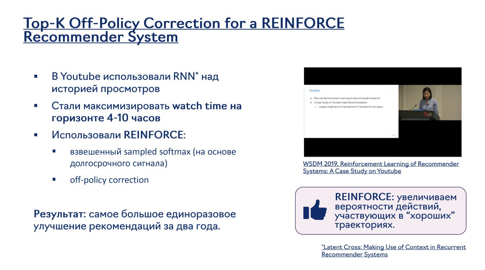

# Обучение с подкреплением в рекомендательных системах

## Описание

Обучение с подкреплением (Reinforcement Learning, RL) в рекомендательных системах - это подход, при котором обучение модели происходит через взаимодействие со средой (пользователем) и получение вознаграждений за успешные рекомендации. В отличие от традиционного обучения с учителем, RL позволяет моделировать долгосрочные отношения с пользователем и оптимизировать метрики, которые невозможно напрямую оптимизировать с помощью стандартных методов.

## Контекст и проблема

Традиционные подходы к рекомендательным системам сталкиваются с рядом ограничений:
- **Фокус на краткосрочное взаимодействие**: Оптимизация только текущего клика или просмотра
- **Невозможность оптимизации долгосрочных метрик**: Удержание, удовлетворенность, общий доход
- **Проблема холодного старта**: Трудности с новыми пользователями/айтемами
- **Смещение отбора**: Тренировочные данные отражают только то, что было рекомендовано

RL решает эти проблемы, моделируя последовательное взаимодействие с пользователем и оптимизируя долгосрочные вознаграждения.

## Основные компоненты RL в рекомендациях

### 1. Состояние (State)
- Представление текущего состояния пользователя (история взаимодействий, контекст, профиль)
- Может включать как краткосрочную, так и долгосрочную историю
- Состояния определяют, какие действия будут предприняты

### 2. Действие (Action)
- Рекомендация конкретного айтема пользователю
- В более сложных системах - выбор стратегии рекомендаций
- Может включать как выбор айтемов, так и выбор стратегии представления

### 3. Награда (Reward)
- Сигнал о качестве рекомендации (клик, просмотр, время просмотра, покупка)
- Может быть как немедленным, так и отложенным
- Долгосрочные награды объединяются для оценки качества стратегии

### 4. Политика (Policy)
- Стратегия выбора действий в зависимости от состояния
- Может быть стохастической или детерминированной
- Обучается для максимизации ожидаемого долгосрочного вознаграждения

## Подходы к применению RL в рекомендациях

### 1. Contextual Bandits
- Упрощенная форма RL, где каждое состояние не влияет на будущие состояния
- Хорош для начальных применений RL в рекомендациях
- Примеры: LinUCB, Thompson Sampling, Neural Bandits

### 2. Policy Gradient Methods
- Прямое обучение политики для максимизации вознаграждения
- Использует градиентный спуск по пространству параметров политики
- Примеры: REINFORCE, Actor-Critic, A3C

### 3. Actor-Critic Methods
- Использует два компонента: Actor (политика) и Critic (оценка ценности)
- Critic оценивает, насколько хороши текущие действия
- Actor обновляется на основе оценок Critic

### 4. Deep Q-Networks (DQN)
- Использует глубокие нейронные сети для аппроксимации Q-функции
- Хранит и повторно использует опыт через реплей-буфер
- Применяется для оптимизации последовательных взаимодействий

## Примеры использования RL в промышленных системах

### YouTube
YouTube использовали RNN над последовательностью просмотров пользователей для максимизации времени просмотра на горизонте 4-10 часов. Также применяли взвешенный Sampled softmax на основе долгосрочного сигнала и коррекцию off-policy для REINFORCE рекомендательной системы, что привело к самому большому единоразовому улучшению рекомендаций за два года.

**Изображение показывает:** Как YouTube использовали RNN над последовательностью просмотров пользователей и применяли коррекцию off-policy для REINFORCE рекомендательной системы для оптимизации долгосрочных метрик.

### Сессионные рекомендации
- Использование RL для моделирования поведения в пределах сессии
- Оптимизация как краткосрочного, так и долгосрочного взаимодействия
- Баланс между эксплуатацией и исследованием в сессии

## Преимущества RL в рекомендациях

1. **Оптимизация долгосрочных метрик**: Вместо точечной оптимизации - оптимизация долгосрочной ценности
2. **Баланс между эксплуатацией и исследованием**: RL естественным образом решает задачу изучения новых предпочтений
3. **Адаптивность**: Модель может адаптироваться к изменению поведения пользователей
4. **Моделирование последовательностей**: Возможность учитывать порядок и временные зависимости

## Ограничения и вызовы

1. **Сложность обучения**: RL требует больше данных и времени для обучения
2. **Оценка качества**: Сложно оценить качество политики без развертывания
3. **Смещение отбора**: Проблемы при переходе от одной политики к другой
4. **Плотность вознаграждения**: Редкие и запаздывающие сигналы вознаграждения
5. **Масштабируемость**: Вычислительные требования для обновления политики

## Современные развития

### 1. Multi-agent RL
- Использование нескольких агентов для моделирования взаимодействия между пользователями
- Моделирование конкурентного и кооперативного поведения
- Учет системного эффекта в рекомендательной системе

### 2. Imitation Learning
- Использование поведенческих данных для инициализации политики
- Комбинация с RL для ускорения обучения
- Обход проблемы разреженного вознаграждения

### 3. Offline RL
- Обучение политик на исторических данных без взаимодействия с окружающей средой
- Решение проблемы смещения отбора в оффлайн-настройках
- Использование ограничений для обеспечения стабильности

## Сравнение с другими подходами

| Подход | Долгосрочные метрики | Эксплуатация/исследование | Моделирование последовательностей | Вычислительная сложность |
|--------|----------------------|----------------------------|-----------------------------------|--------------------------|
| Обучение с учителем | Низкие | Нет | Нет | Низкая |
| Обучение с подкреплением | **Высокие** | **Да** | **Да** | **Высокая** |
| Линейные модели | Низкие | Нет | Нет | Низкая |
| Нейросетевые модели | Средние | Частично | Частично | Средняя |

## Связи с другими темами

- [[frontier_neural_recsys.md]] - RL как часть frontier-технологий в рекомендательных системах
- [[hse_dl2_neural_recsys.md]] - Упоминание RL как frontier-технологии в HSE лекции
- [[candidate_generation.md]] - Возможность использования RL для генерации кандидатов
- [[ranking.md]] - RL для оптимизации этапа ранжирования
- [[traditional_approaches.md]] - Контраст с классическими подходами
- [[generative_retrieval_models.md]] - Современные генеративные подходы с элементами RL

## Источники

1. [Reinforcement Learning for Recommendations: A Survey] - Обзор применения RL в рекомендательных системах
2. [Deep Reinforcement Learning for Page-wise Recommendations] - DRN и другие современные подходы
3. [Top-K Off-Policy Correction for a REINFORCE Recommender] - YouTube подход к коррекции off-policy
4. [HSE DL2 Course Materials] - Материалы курса Deep Learning 2 на ФКН ВШЭ

## Дополнительные материалы

- [[multi_agent_rl_in_recsys.md]] - Многоагентные подходы в рекомендациях
- [[offline_rl_for_recsys.md]] - Оффлайн обучение с подкреплением
- [[sequential_recommendation_with_rl.md]] - Последовательные рекомендации с RL