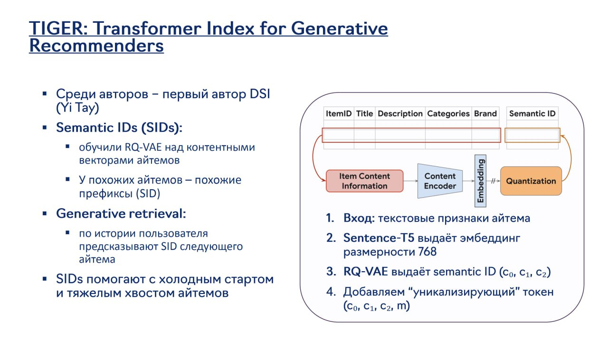

# Семантические идентификаторы (Semantic IDs) в рекомендательных системах

## Описание

Семантические идентификаторы (Semantic IDs, или SIDs) - это подход к представлению айтемов (товаров, видео, пользователей и т.д.) в рекомендательных системах в виде специальных токенов, совместимых с архитектурами трансформеров и большими языковыми моделями (LLM). В отличие от традиционных эмбеддингов, которые представляют айтемы как векторы в непрерывном пространстве, SIDs кодируют айтемы как дискретные токены, что позволяет использовать их напрямую в генеративных моделях.

## Контекст и проблема

Традиционные рекомендательные системы сталкиваются с рядом ограничений:
- **Разрыв между представлениями**: Айтемы представлены в виде непрерывных векторов, несовместимых с LLM
- **Ограниченная генерация**: Трудности с прямым предсказанием айтемов с помощью генеративных моделей
- **Отсутствие объяснимости**: Непонятно, почему конкретные айтемы рекомендуются
- **Проблема холодного старта**: Трудности с новыми айтемами без истории взаимодействий

SIDs решают эти проблемы, позволяя напрямую использовать айтемы как токены в генеративных моделях.

## Архитектура и реализация

### Основные компоненты

#### 1. Токенизация айтемов

Процесс преобразования айтемов в SIDs включает:
- Извлечение мультимодальных признаков айтема (текст, изображение, метаданные)
- Объединение признаков в единое представление
- Кодирование в дискретные токены с помощью VQ-VAE или аналогичных методов

#### 2. Векторное квантование (Vector Quantization)

- Использование кодбуков (codebooks) для дискретизации непрерывных представлений
- RQ-VAE (Residual Quantization VAE) для более точного кодирования
- Обучение с учетом как семантического смысла, так и коллаборативного сигнала

**Изображение показывает:** Архитектуру TIGER (Transformer Index for Generative Recommenders), включая использование семантических идентификаторов (SIDs) с обучением RQ-VAE над контентными векторами айтемов, генеративный поиск (вход - текстовые признаки айтема по истории пользователя, выход - эмбеддинг следующего айтема), и добавление "уникализирующего" токена для решения проблем холодного старта и хвостовых айтемов.

#### 3. Интеграция с LLM

- SIDs используются как специальные токены в словаре LLM
- Возможность прямого предсказания айтемов с помощью LLM
- Генерация рекомендаций как последовательности SIDs

### Типы SIDs

#### 1. Семантические SIDs

- Кодируют содержательные аспекты айтемов
- Используют мультимодальные эмбеддинги
- Основаны на текстовом, визуальном и структурном контенте

#### 2. Коллаборативные SIDs

- Кодируют коллаборативный сигнал (взаимодействия пользователей)
- Используют историю взаимодействий для улучшения представления
- Выравниваются с поведенческими паттернами пользователей

#### 3. Гибридные SIDs (например, DAS)

- Комбинируют семантические и коллаборативные сигналы
- Используют двухуровневое обучение для выравнивания представлений
- См. также: [[das_dual_aligned_semantic_ids.md]]

## Применения в рекомендательных системах

### 1. Генеративные рекомендации

- Прямое предсказание последовательностей айтемов
- Использование автогрессивных моделей для генерации рекомендаций
- Возможность моделирования сложных поведенческих паттернов

### 2. Ранжирование с помощью LLM

- Использование LLM для оценки релевантности айтемов
- Генерация объяснений для рекомендаций
- Контекстное ранжирование с учетом сложных запросов

### 3. Диалоговые рекомендательные системы

- Встраивание айтемов в диалог с помощью SIDs
- Возможность уточнения рекомендаций через естественный язык
- Интеграция с чат-ботами и виртуальными ассистентами

## Преимущества

### 1. Совместимость с LLM

- Прямая интеграция с большими языковыми моделями
- Возможность использования предобученных знаний
- Объяснимость через естественный язык

### 2. Генеративные возможности

- Прямое предсказание айтемов как токенов
- Возможность генерации новых комбинаций рекомендаций
- Контролируемая генерация с условиями

### 3. Объяснимость

- Возможность генерации объяснений для рекомендаций
- Понимание, почему конкретные айтемы были выбраны
- Прозрачность для пользователей и разработчиков

### 4. Эффективное обучение

- Возможность использования эффективных архитектур трансформеров
- Учет долгосрочных зависимостей между айтемами
- Масштабируемость за счет эффективных attention-механизмов

## Ограничения и вызовы

### 1. Качество дискретизации

- Потеря информации при квантовании
- Требование к размеру кодбука
- Баланс между точностью и выразительностью

### 2. Обучение с нуля

- Необходимость обучения отдельной системы токенизации
- Требование к качеству обучающих данных
- Проблемы с редкими айтемами

### 3. Вычислительные требования

- Сложность обучения VQ-VAE компонентов
- Требования к памяти для хранения кодбуков
- Сложность инференса в реальном времени

## Практические примеры

### 1. TIGER (Transformers Index for Generative Recommendations)

- Использование VQ-VAE для кодирования айтемов
- Внедрение в промышленные рекомендательные системы
- Показательные результаты в задачах next-item prediction

### 2. PLUM (Generative Recommendations at YouTube)

- Интеграция SIDs с архитектурой Gemini
- Прямое предсказание видео для пользователей YouTube
- Улучшение метрик в сравнении с традиционными подходами

### 3. Alibaba рекомендательные системы

- Использование SIDs в e-commerce рекомендациях
- Интеграция с системами поиска и ранжирования
- Улучшение разнообразия и релевантности рекомендаций

## Сравнение с традиционными эмбеддингами

| Характеристика | Традиционные эмбеддинги | Семантические ID (SIDs) |
|----------------|------------------------|-------------------------|
| Представление | Непрерывные векторы | Дискретные токены |
| Совместимость с LLM | Низкая | Высокая |
| Генеративные возможности | Ограниченные | Высокие |
| Объяснимость | Низкая | Высокая |
| Обработка коллаборативного сигнала | Прямая | Косвенная, через обучение |
| Масштабируемость | Высокая | Средняя-высокая |
| Качество представления | Высокое | Зависит от дискретизации |

## Связи с другими темами

- [[frontier_neural_recsys.md]] - SIDs как часть frontier-технологий в рекомендациях
- [[hse_dl2_neural_recsys.md]] - Упоминание SIDs как frontier-технологии в HSE лекции
- [[llm_based/overview.md]] - Интеграция SIDs с LLM
- [[generative_retrieval_models.md]] - Генеративные модели, использующие SIDs
- [[transformer_based_models.md]] - Архитектуры, поддерживающие дискретные токены
- [[das_dual_aligned_semantic_ids.md]] - Улучшенный подход с выравниванием сигналов
- [[tiger.md]] - Конкретный пример использования SIDs (TIGER)
- [[plum/main.md]] - Пример использования SIDs в YouTube (PLUM)

## Источники

1. [TIGER: Transformers Index for Generative Recommendations] - Оригинальная работа о семантических ID в рекомендациях
2. [PLUM: Generative Recommendations at YouTube with Semantic IDs] - Применение SIDs в YouTube
3. [DAS: Dual Aligned Semantic IDs for Industrial Recommendation] - Улучшенный подход к обучению SIDs
4. [HSE DL2 Course Materials] - Материалы курса Deep Learning 2 на ФКН ВШЭ, где упоминались SIDs

## Дополнительные материалы

- [[vector_quantization_in_recsys.md]] - Подробнее о методах векторного квантования
- [[tokenization_strategies_for_items.md]] - Сравнение подходов к токенизации айтемов
- [[llm_integration_patterns.md]] - Паттерны интеграции LLM с рекомендательными системами