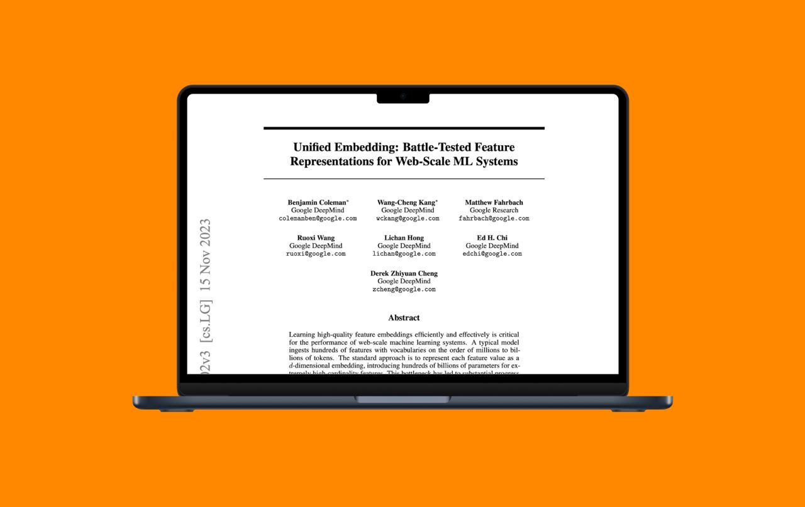

# Унифицированные эмбеддинги (Unified Embeddings)

**Описание:** На изображении показана схема унифицированных эмбеддингов, демонстрирующая как отдельные таблицы эмбеддингов для каждого признака заменяются единой унифицированной таблицей с использованием хеш-функций для lookup'а, что решает проблему масштаба в рекомендательных системах.

## Описание

Унифицированные эмбеддинги (unified embeddings) — это подход к решению проблемы масштабирования эмбеддинг-таблиц в рекомендательных системах, разработанный исследователями Google. Техника известна также как Feature Multiplexing и позволяет эффективно обрабатывать миллионы товаров и пользователей, избегая необходимости хранить отдельные таблицы эмбеддингов для каждого признака.

## Контекст и проблема

Классические рекомендательные системы используют отдельные эмбеддинг-таблицы для каждой фичи, что создает значительные проблемы при работе с миллионами товаров или пользователей. В отличие от языковых моделей, где словарь составляет 40-50 тысяч токенов, рекомендательные системы оперируют миллионами айтемов, что делает вычисление полной кросс-энтропии (full CE) и хранение всего пространства крайне сложными задачами.

### Основные проблемы:
- **Проблема масштаба**: миллионы товаров/пользователей создают огромные эмбеддинг-таблицы
- **Вычислительные ограничения**: невозможно вычислить full CE для миллионов классов
- **Проблема хранения**: необходимость хранить все пространство признаков
- **Бутылочное горлышко**: embedding-таблицы становятся основным узким местом в системе

## Предложенное решение

Google предложил подход под названием Feature Multiplexing, при котором модель использует единое пространство эмбеддингов вместо независимых таблиц для каждого признака. Размеры этой унифицированной таблицы можно задавать произвольно, а лукапы реализуются через агрегацию по хешам.

### Ключевые особенности:
- **Единое пространство**: один унифицированный эмбеддинг товара несёт семантику из разных источников
- **Гибкий размер**: размер таблицы можно задавать вручную в зависимости от вычислительных ограничений
- **Хеширование**: реализация лукапов через агрегацию по хешам
- **Декодирование**: модель обучается правильно декодировать эмбеддинги в линейном слое

## Архитектура и реализация

В подходе Feature Multiplexing модель обучается извлекать нужную информацию из одного унифицированного эмбеддинга, который кодирует признаки из различных источников. Это достигается за счёт:

1. **Объединения семантики**: один эмбеддинг содержит информацию из разных источников
2. **Хеш-агрегации**: эффективная реализация lookup-операций через хеширование
3. **Линейного декодирования**: обучение специального слоя, который правильно интерпретирует эмбеддинги

## Преимущества

- **Масштабируемость**: возможность работать с миллионами объектов при ограниченных ресурсах
- **Экономия памяти**: единственная таблица вместо множества отдельных
- **Упрощение архитектуры**: унифицированный подход к хранению признаков
- **Гибкость**: возможность настройки размера таблицы под конкретные ограничения
- **Производительность**: более быстрые lookup-операции за счёт хеширования

## Ограничения и компромиссы

- **Коллизии**: появляется пассивный навык в виде 1-5% коллизий из-за хеширования
- **Ограниченная специфичность**: потеря специфичности по сравнению с отдельными таблицами
- **Сложность обучения**: модель должна научиться правильно декодировать мульти-семантические эмбеддинги

## Применение и компании-использователи

Подход unified embeddings уже используется в продакшене следующими компаниями:
- **Google** - оригинальная разработка и внедрение
- **Pinterest** - использование для рекомендательных систем
- **Netflix** - применение в рекомендательных алгоритмах
- **Yandex** - интеграция в рекомендательные сервисы
- **Wildberries** - внедрение в систему персонализации

## Сравнение с альтернативными подходами

| Подход | Преимущества | Недостатки | Применимость |
|--------|--------------|------------|--------------|
| Отдельные таблицы | Высокая специфичность, отсутствие коллизий | Проблемы масштаба, большие затраты памяти | Небольшие каталоги |
| Унифицированные эмбеддинги | Масштабируемость, экономия памяти | Вероятность коллизий, потенциальная потеря точности | Крупномасштабные системы |
| DenseRec | Решение проблемы холодного старта | Сложнее для "горячих" айтемов | Динамичные каталоги |

## Значение для генеративных рекомендаций

Унифицированные эмбеддинги рассматриваются как базисная технология для развития генеративных рекомендаций, особенно в контексте работы с миллионами товаров и пользователей. Этот подход позволяет эффективно решать проблему масштаба, которая критична для современных генеративных рекомендательных систем.

## Связи с другими темами

- [[denserec.md]] - Альтернативный подход к решению проблемы масштаба в рекомендательных системах
- [[transformer_based_models.md]] - Контекст для понимания проблем масштаба в трансформерных моделях
- [[traditional_approaches.md]] - Сравнение с традиционными методами рекомендаций
- [[generative_retrieval_models.md]] - Связь с генеративными подходами к рекомендациям

## Источники

1. [Google Research - Unified Embeddings for Recommendation Systems] - Оригинальная работа от исследователей Google о подходе Feature Multiplexing для решения проблем эмбеддинг-таблиц в рекомендательных системах