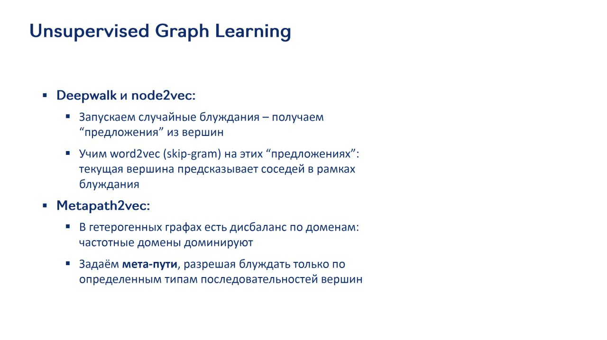

# Unsupervised Graph Learning в рекомендательных системах

## Описание

Unsupervised Graph Learning - это подход к обучению представлений узлов на графах без использования размеченных данных. В отличие от supervised методов, которые обучают эмбеддинги для конкретных задач (например, рекомендаций), unsupervised подходы учат эмбеддинги, сохраняя структуру графа и близость узлов.

## Основные подходы

**Изображение показывает:** В unsupervised graph learning подходах (DeepWalk и node2vec) запускаются случайные блуждания по графу для получения "предложений" из вершин. Затем обучается word2vec (skip-gram) на этих "предложениях": текущая вершина предсказывает соседей в рамках блуждания. Также в metapath2vec задаются мета-пути, позволяющие блуждать только по определенным типам последовательностей вершин в гетерогенных графах.

### DeepWalk

DeepWalk был одной из первых моделей, применивших подходы, вдохновленные NLP, к графам:
- Запускаются случайные блуждания по графу
- Результаты блужданий рассматриваются как "предложения" из вершин
- Используется skip-gram (word2vec) для обучения эмбеддингов: текущая вершина предсказывает соседей в рамках блуждания
- Сохраняет информацию о структурной роли вершин в графе

### node2vec

node2vec улучшает DeepWalk за счет:
- Более гибких случайных блужданий с параметрами, контролирующими исследование ("exploration") и возвращение ("return")
- Возможности настраивать типы смещений при блуждании
- Баланс между BFS (поиск в ширину) и DFS (поиск в глубину) стратегиями

### metapath2vec

metapath2vec решает проблему в гетерогенных графах:
- В гетерогенных графах часто бывают дисбалансы по доменам: частотные домены доминируют
- Задаются мета-пути, разрешающие блуждать только по определенным типам последовательностей вершин
- Позволяет лучше сбалансировать представления разных типов узлов
- Сохраняет семантические отношения между разными типами узлов

## Применение в рекомендательных системах

### Преимущества

- **Независимость от задачи**: обученные эмбеддинги можно использовать для разных задач
- **Отсутствие необходимости в размеченных данных**: снижает затраты на сбор данных
- **Обобщение на новые узлы**: могут работать с узлами, не виденными во время обучения
- **Сохранение структуры**: улавливают топологические и семантические отношения

### Примеры систем

- **TTGL**: использует unsupervised подход с модифицированными случайными блужданиями
- **Twitter TwHIN**: также использует unsupervised методы как часть более сложной системы

## Подходы к обучению

### Random Walk Based Learning

1. Генерация случайных блужданий по графу
2. Использование skip-gram или аналогичного метода для обучения эмбеддингов
3. Оптимизация: предсказание соседей в блуждании по текущей вершине

### Вариации стратегии блуждания

- **Стратегия сэмплирования**: как выбирать следующую вершину
- **Мета-пути**: в гетерогенных графах ограничение типов переходов
- **Веса ребер**: учет весов при сэмплировании

## Ограничения

- **Интерпретируемость**: не всегда ясно, какие аспекты графа сохраняются
- **Качество эмбеддингов**: могут уступать task-specific supervised методам
- **Шум в данных**: чувствительность к шумным или неправильным рёбрам
- **Масштаб**: вычислительная сложность на больших графах

## Современные развития

- **GraphSAGE**: частично использует unsupervised идеи, но добавляет индуктивность
- **GAT**: добавляет механизм внимания к подходам на основе случайных блужданий
- **Heterogeneous graph models**: более сложные подходы для гетерогенных графов

## Связи с другими темами

- [[graph_neural_networks_for_recommendations.md]] - Общее описание графовых методов
- [[TTGL.md]] - Пример применения unsupervised подхода в промышленности
- [[TwHIN.md]] - Сравнение с supervised подходами
- [[traditional_approaches.md]] - Классификация как графовый метод
- [[foundation_graph_models.md]] - Использование в фундаментальных моделях

## Источники

1. [DeepWalk: Online Learning of Social Representations] - оригинальная статья о DeepWalk
2. [node2vec: Scalable Feature Learning for Networks] - статья о node2vec
3. [metapath2vec: Scalable Representation Learning for Heterogeneous Networks] - статья о metapath2vec
4. [Unsupervised Representation Learning on Graphs] - обзор подходов к unsupervised обучению на графах
5. [TTGL: Graph Learning at TikTok] - современное промышленное применение