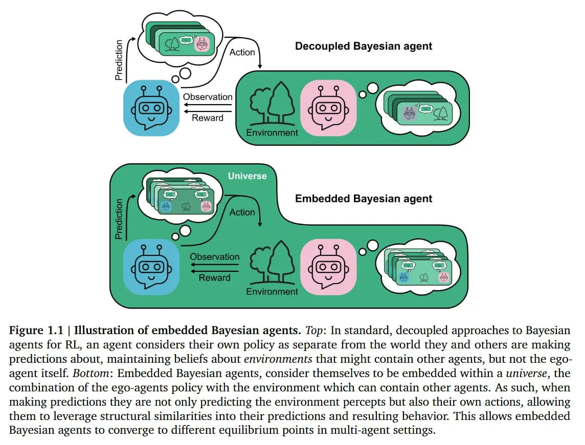
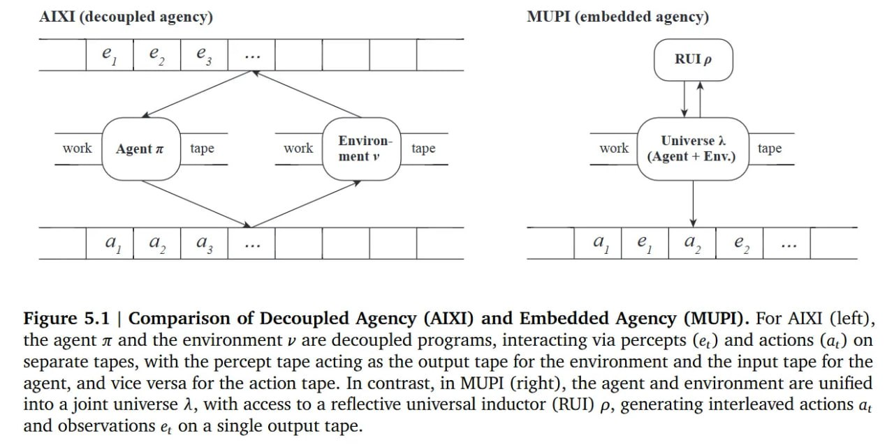

# Embedded Universal Predictive Intelligence (MUPI)

## Краткое описание

**Embedded Universal Predictive Intelligence (MUPI)** — это математический фреймворк для мультиагентного обучения, переопределяющий агентов не как внешних наблюдателей, а как сущности, встроенные *в* совместную вселенную. Вместо моделирования среды вводится байесовская смесь по «вселенным» (программам, определяющим совместную динамику агента и среды). Это решает проблему бесконечной рекурсии во взаимных предсказаниях и позволяет агентам достичь теории ума бесконечного порядка.

## Основная информация

MUPI представляет собой фундаментальное переосмысление традиционной парадигмы обучения с подкреплением, где агенты рассматриваются как отдельные сущности, отделенные от среды. В новом фреймворке агент моделирует себя как часть окружающей вселенной, что позволяет более точно предсказывать поведение других агентов, особенно тех, которые работают с похожими алгоритмами.

### Проблема обособленной агентности

Фундаментальная догма стандартного обучения с подкреплением — «обособленная агентность» (decoupled agency). Агент считается отдельной сущностью, отделенной от среды жестким интерфейсом сенсоров и актуаторов, и рассматривает динамику среды как внешний стохастический процесс. Для одиночных агентов это удобно, но в мультиагентном RL (MARL) парадигма ломается. Среда здесь состоит из других обучающихся агентов, что порождает нестационарность и делает ретроспективное обучение (на прошлых данных) фундаментально ошибочным.

### Решение через встроенные предсказания

В MUPI агенты предсказывают как будущие перцепты (наблюдения), так и свои собственные действия, моделируя себя как часть вселенной. Это создает "Связанные Убеждения" (Coupled Beliefs): информация о моих действиях дает свидетельства о природе внешнего мира (включая других агентов). Такое само-предсказание позволяет агентам рассуждать о других, работающих с похожими алгоритмами, и приводит к новым теоретико-игровым концепциям решения и новым формам сотрудничества, недостижимым для классических обособленных агентов.

## Ключевые концепции



**Иллюстрация показывает:** Сравнение стандартного подхода (обособленные агенты, где агент считает свою политику отдельной от мира) и встроенного подхода (встроенные байесовские агенты, которые рассматривают себя как часть вселенной, позволяя им предсказывать не только восприятие среды, но и свои собственные действия, используя структурные сходства в своих предсказаниях и поведении).

### Вселенная как атом

Ключевой сдвиг в MUPI — замена условной вероятности среды на меру совместной вероятности по всей истории, названную Вселенной. Вместо убеждений w(ν) о средах, агент поддерживает убеждения w(λ) о вселенных λ. Вселенная λ — это вероятностная мера над последовательностью *и* действий, *и* перцептов. Критически важно, что агент предсказывает свои собственные будущие действия.

Предиктивное распределение ρ определяется как байесовская смесь:
ρ(a_t, e_t | x_{<t}) = Σ w(λ | x_{<t}) λ(a_t, e_t | x_{<t})

В обособленном сеттинге убеждения обновляются только перцептами. Во встроенном — *действиями* тоже. Наблюдение собственного действия a_t исключает гипотезы λ, где агентская часть вселенной не совершила бы a_t.

### Рефлексивный универсальный индуктор (RUI)



**Иллюстрация показывает:** Сравнение обособленной агентности (AIXI) и встроенной агентности (MUPI). Для AIXI (слева) агент λ и среда μ представляют собой обособленные программы, взаимодействующие через перцепты (e_t) и действия (a_t) на отдельных лентах. В MUPI (справа) агент и среда объединены в совместную вселенную Λ, с доступом к рефлексивному универсальному индуктору (RUI) ρ, генерирующему чередующиеся действия a_t и наблюдения e_t на одной выходной ленте.

Главная теоретическая сложность — проблема Зерна Истины (Grain of Truth). Чтобы байесовский агент сошелся к оптимуму, истинная вселенная μ должна лежать в его классе гипотез. Но если вселенная содержит самого агента, а агент — сложный предиктор, мы попадаем в парадокс самореференции. Авторы решают это через Reflective Universal Inductor (RUI), опираясь на фреймворк рефлексивных оракулов.

Он строят класс вселенных на основе вероятностных машин с оракулом τ, который «рефлексивно» отвечает на вопросы об универсальной смеси ρ^τ, созданной этими машинами. Вопрос к оракулу выглядит как ⟨b, p, h⟩: «Вероятность ρ^τ(b|h) больше p?». Доказывается существование неподвижной точки, где ответы оракула согласуются со смесью.

### Субъективное встроенное равновесие (SEE)

MUPI вводит Субъективное Встроенное Равновесие (Subjective Embedded Equilibrium, SEE). Это состояние, где агент оптимален относительно субъективного убеждения ρ, и ρ совпадает с истиной μ *на траектории игры*. SEE разрешает кооперацию.

Также определено Embedded Equilibrium (EE) — объективный аналог Нэша, включающий распределение зависимостей q. EE учитывает контрфактуал: «Если бы я отклонился, другой агент (будучи похожим на меня), вероятно, тоже отклонился бы».

## Практические алгоритмы

RUI невычислим, это теоретический идеал. На практике предлагаются k-шаговые встроенные планировщики. Подобно MuZero, они не решают задачу бесконечного горизонта, а делают конечный lookahead:

π(a_t | x_{<t}) = arg max_{a} Q^k_ρ(x_{<t}, a)

Здесь Q^k_ρ — ценность, полученная разверткой модели ρ. Критично, что роллаут использует ρ для предсказания *и* будущих перцептов, *и* собственных действий. Это создает форму самообучающейся осознанности. Агент предсказывает свое будущее «я» и предвосхищает улучшение собственной политики.

## Структурное сходство

В MUPI агент понимает, что π_you = π_opponent в сценариях с двойником. Решение сотрудничать — сильное свидетельство того, что оппонент (тот же код, те же входы) тоже будет сотрудничать. Рациональный выбор — кооперация.

Из-за связанных убеждений политика агента π и среда ν (с другими агентами) не независимы; у них есть общая взаимная информация. Это меняет рациональное поведение в сценариях типа Дилеммы заключенного с двойником.

## Теоретические основания

Авторы доказывают, что универсальные прайоры (бритва Оккама) естественным образом ведут к осознанию структурного сходства. Если политика π и среда ν имеют общие подпрограммы (схожие алгоритмы, нейросетевые архитектуры), их совместная сложность K(π, ν) намного ниже суммы K(π) + K(ν):

S(π, ν) ≈ K(π) + K(ν) - K(λ) ≫ 0

Универсальный прайор (бритва Оккама) дает экспоненциально больший вес вселенным со структурным сходством. Вывод: вера в похожесть других агентов — фундаментальное следствие рационального байесовского вывода.

## Связи с другими темами

- [[aixi_universal_artificial_intelligence.md]] - Универсальный ИИ, на котором основан MUPI
- [[multi_agent_reinforcement_learning.md]] - Многоагентные системы и вызовы, которые решает MUPI
- [[theory_of_mind_in_ai.md]] - Теория ума и понимание поведения других агентов
- [[decision_theory.md]] - Теория решений, особенно эвиденциальная теория решений
- [[world_models.md]] - Модели мира и их роль в предсказательном интеллекте
- [[bayesian_reinforcement_learning.md]] - Байесовский подход к обучению с подкреплением

## Примеры применения

- **Кооперация в мультиагентных системах**: MUPI объясняет, как агенты могут сотрудничать в ситуациях, где классическая теория игр предсказывает отклонение
- **Моделирование взаимодействий ИИ**: Для создания ИИ-систем, способных предсказывать поведение других ИИ-систем
- **Фондовые модели (Foundation Models)**: MUPI теоретически обосновывает поведение современных ИИ-моделей, которые естественным образом предсказывают последовательности действий и наблюдений

## Ограничения и вызовы

1. **Невычислимость**: Встроенный AIXI и RUI являются теоретическими идеализациями
2. **Практические аппроксимации**: Реальные приближения могут нарушать строгое свойство зерна истины
3. **Догматические ловушки**: Агенты могут удерживать неправильные убеждения, мешающие надлежащей разведке
4. **Условия сходимости**: Теоремы сходимости зависят от условий, которые могут не всегда выполняться на практике

## Будущее развитие

MUPI предлагает золотой стандарт для встроенного мультиагентного обучения и указывает направление для разработки агентов, которые:
- Могут составлять непротиворечивые взаимные прогнозы
- Достигают теории ума бесконечного порядка
- Обосновывают новое игровое-теоретическое решение и формы сотрудничества

## Источники

1. [Embedded Universal Predictive Intelligence: a coherent framework for multi-agent learning](https://arxiv.org/abs/2511.22226) - Основная научная статья о MUPI, авторы: Alexander Meulemans, Rajai Nasser, Maciej Wołczyk, Marissa A. Weis, Seijin Kobayashi, Blake Richards, Guillaume Lajoie, Angelika Steger, Marcus Hutter, James Manyika, Rif A. Saurous, João Sacramento, and Blaise Agüera y Arcas (2025)

2. [arXivIQ Review: Embedded Universal Predictive Intelligence](https://arxiviq.substack.com/p/embedded-universal-predictive-intelligence) - Обзор статьи с углубленным анализом ключевых концепций и значения работы

## Медиа

1. [Figure 1.1: Illustration of embedded Bayesian agents](../../media/img_1765026629_aqadvbbrgwmdoel_figure_1_1_illustration_of_embedded.jpg) - Визуализация встроенных байесовских агентов, показывающая разницу между стандартным подходом (обособленные агенты) и встроенным подходом (агенты как часть вселенной)
2. [Figure 5.1: Comparison of Decoupled Agency (AIXI) and Embedded Agency (MUPI)](../../media/img_1765026629_aqadvhbrgwmdoel_image_figure_5_1.jpg) - Сравнение архитектур AIXI и MUPI, демонстрирующее различия в структуре взаимодействия агента и среды
3. [Theorem 4.31: k-step planning convergence in MUPI](../../media/img_1765026629_aqadvxbrgwmdoel_theorem_4_31_let_z_be_the.jpg) - Математическая формулировка сходимости k-шагового планирования в MUPI
4. [Theorem 5.36: Structural similarity in MUPI](../../media/img_1765026629_aqadwbbrgwmdoel_theorem_5_36_for_every_fixed.jpg) - Теорема о структурном сходстве в MUPI, показывающая, как универсальные приоритеты приводят к осознанию сходства между агентами

## Дополнительные материалы

- [[reflective_oracles.md]] - Рефлексивные оракулы, используемые в MUPI
- [[evidential_decision_theory.md]] - Эвиденциальная теория решений, поддерживаемая MUPI
- [[grain_of_truth_problem.md]] - Проблема зерна истины в мультиагентных системах

```metadata
category: ai
subcategory: reinforcement_learning
tags: multiagent_systems, predictive_intelligence, embedded_agents, universal_ai, decision_theory, bayesian_inference
```