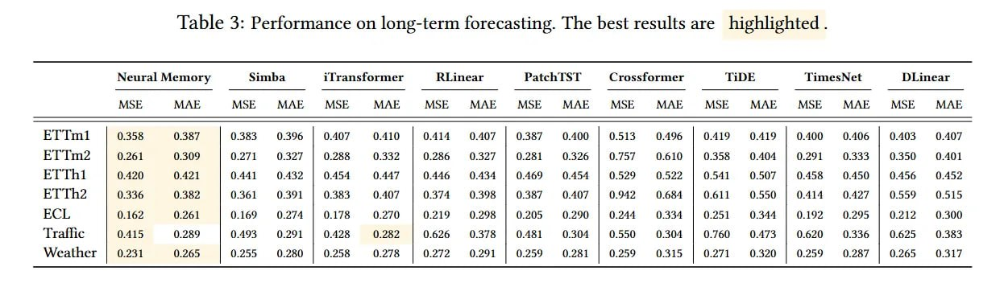

# Titans: Создание памяти для ИИ следующего поколения

## Описание

Titans: Learning to Memorize at Test Time - это новая парадигма для создания последовательных моделей с надёжной, адаптивной памятью, представленная исследователями из Google (Ali Behrouz, Peilin Zhong, Vahab Mirrokni). Titans решает фундаментальный компромисс между трансформерами и линейными рекуррентными моделями, сочетая мощную, динамически обновляемую долговременную память с точным кратковременным вниманием.

## Основная информация

Titans представляет собой семейство гибридных архитектур, построенных вокруг модуля нейронной долговременной памяти (LMM), который учится запоминать, рассуждать и забывать на лету. В отличие от традиционных подходов, LMM не просто обрабатывает данные, а адаптивно обучается тому, как запоминать и забывать информацию, оптимизируя собственные веса прямо во время инференса.

## Ключевые инновации

### Модуль долгосрочной памяти (LMM)
- **Глубокий MLP как метамодель**: LMM - это глубокий многослойный перцептрон, который функционирует как метамодель, выучивающая собственный алгоритм оптимизации с моментом и распадом весов
- **Обучение во время инференса**: Оптимизирует собственные параметры во время одного прямого прохода на этапе инференса
- **Механизм "удивления"**: Использует градиентную метрику с моментом для определения важных событий
- **Адаптивное забывание**: Включает механизм забывания с зависящим от данных гейтом

### Архитектурные варианты
- **MAC (Memory as Context)**: LMM извлекает релевантную историческую информацию, объединяемую с постоянной памятью и текущим сегментом
- **MAG (Memory as Gate)**: LMM и модуль внимания работают параллельно, выходы объединяются через нелинейный гейт
- **MAL (Memory as Layer)**: LMM действует как сжимающий слой, обрабатывающий вход перед подачей в модуль внимания

### Эффективное обучение
- **Параллелизуемость**: Несмотря на рекуррентную природу, обучение распараллеливается за счет тензоризации операций и parallel associative scan
- **Высокооптимизированные вычисления**: Доминируют матричные умножения
- **Масштабируемость**: Работает с контекстами более 2 миллионов токенов

## Технические детали

### Механизм "удивления" (Surprise)
Процесс обучения LMM основан на принципе "удивления":
- Формализуется через loss ассоциативной памяти: l(Mₜ₋₁; xₜ) = ||Mₜ₋₁(kₜ) – vₜ||₂
- "Удивление" измеряется градиентом этого loss
- Использует правило обновления на основе момента: Sₜ = ηₜ Sₜ₋₁ - θₜ ∇l(Mₜ₋₁; xₜ)
- Sₜ действует как "память об удивлении", позволяя запомнить всё событие целиком

### Адаптивное забывание
- Конечное обновление памяти регулируется зависящим от данных гейтом αₜ
- Аналогично распаду весов, позволяет удалять устаревшую информацию
- Формула: Mₜ = (1 - αₜ) Mₜ₋₁ + Sₜ

### Эффективность и производительность
- Эксперименты показывают, что более глубокие модули памяти приводят к лучшей перплексии
- Более надёжное масштабирование на длинных последовательностях
- Абляции подтверждают, что каждый компонент (момент, распад весов, глубокая память, свёртка) вносит положительный вклад

## Применение и результаты

### Задачи с длинным контекстом
- **Needle-in-a-Haystack (NIAH)**: Вариант MAC сохраняет высокую точность при увеличении длины контекста до 16 тыс. токенов, достигая 95.2% в сложной подзадаче S-NIAH-W
- **BABILong**: Вариант MAC превосходит все бейзлайны, включая гораздо более крупные модели (GPT-4, Llama3.1-70B), на бенчмарке, требующем рассуждений на основе фактов, разбросанных по документам в миллионы токенов

### Другие области
- **Языковое моделирование**: Варианты Titans стабильно превосходят трансформеры-бейзлайны и SOTA линейные рекуррентные модели
- **Рассуждения на основе здравого смысла**: Превосходство над современными подходами
- **Прогнозирование временных рядов**: Улучшенные результаты по сравнению с бейзлайнами
- **Геномика**: Отличные результаты на GenomicsBenchmarks

## Сравнение с существующими подходами

### Отличия от трансформеров
- Решает проблему квадратичной сложности за счёт гибридной архитектуры
- Возможность обучения во время инференса, а не только на этапе тренировки
- Комбинирует точность внимания с эффективностью рекуррентных подходов

### Отличия от State Space Models (Mamba и др.)
- Более выразительные для задач отслеживания состояния: Titans способны решать задачи за пределами класса сложности TC⁰
- Динамическое обучение параметров во время инференса
- Комбинация разных временных масштабов памяти

### Сравнение с градиентными рекуррентными моделями
- Превосходят Gated DeltaNet и TTT за счёт комбинации метрики удивления на основе момента, глубокой нелинейной структуры и адаптивного гейта забывания

## Практические аспекты

### Реализация
- Требует сложной инфраструктуры для управления динамически обновляемыми параметрами
- Необходимость в тщательной стабилизации для предотвращения нестабильности
- Оптимизирована для параллелизации обучения

### Преимущества
- Возможность обработки контекстов более 2 миллионов токенов
- Превосходство над крупными моделями на задачах с длинным контекстом
- Адаптивность и непрерывное обучение во время инференса
- Более надёжное масштабирование на длинных последовательностях

### Ограничения
- Вычислительные накладные расходы на градиентные обновления во время инференса
- Потенциальные задержки (latency) по сравнению с чисто state-space моделями
- Выразительность LMM связана с его глубиной, что влияет на скорость обучения
- Компромисс между результативностью и производительностью

## Значение для ИИ

Titans представляет собой важный шаг в направлении создания ИИ-систем, способных к непрерывному обучению и адаптации. Архитектура демонстрирует:
1. Возможность создания моделей, которые обучаются в процессе инференса
2. Эффективное сочетание краткосрочной и долгосрочной памяти
3. Новую парадигму для создания последовательных моделей с надёжной, адаптивной памятью
4. Потенциал "конфедерации специализированных систем памяти" как альтернативы монолитным архитектурам

## Визуализации

## Сравнение с бейзлайнами

## Связи с другими темами

- [[titan_architecture.md]] - Общая архитектура Titans
- [[lmm_long_term_memory_module.md]] - Подробное описание модуля LMM
- [[mac_mag_mal_architectures.md]] - Подробное описание архитектур MAC, MAG, MAL
- [[nested_learning.md]] - Развитие идей Titans в рамках парадигмы вложенного обучения
- [[hope_architecture.md]] - Архитектура HOPE, развивающая идеи Titans
- [[continuum_memory_system.md]] - Система непрерывной памяти, обобщающая концепцию Titans
- [[memory_augmented_transformers.md]] - Альтернативный подход к интеграции памяти в трансформеры
- [[state_space_models.md]] - Класс архитектур, решающих схожие задачи обработки последовательностей

## Источники

1. [Titans: Learning to Memorize at Test Time](https://arxiv.org/abs/2501.00663) - Оригинальная статья, описывающая архитектуру Titans, модуль LMM и архитектуры MAC, MAG, MAL
2. [ArXivIQ Review: Titans Learning to Memorize at Test Time](https://arxiviq.substack.com/p/titans-learning-to-memorize-at-test) - Обзор статьи с углубленным анализом ключевых концепций
3. [Google Research Blog: Introducing Nested Learning](https://research.google/blog/introducing-nested-learning-a-new-ml-paradigm-for-continual-learning/) - Объяснение от Google Research о новой парадигме и связанной работе

## См. также

- [[../../ai/llm/architectures/gated_deltanet.md]] - Gated DeltaNet: архитектура, сравниваемая с Titans в экспериментах
- [[../../ai/llm/architectures/test_time_training.md]] - TTT: альтернативный подход к обучению во время инференса, также сравниваемый с Titans
- [[../../ai/continual_learning/nested_learning.md]] - Вложенное обучение: развитие идей из статьи Titans
- [[../../ai/llm/architectures/mac_mag_mal_architectures.md]] - Детализация архитектур MAC, MAG, MAL, используемых в Titans
- [[../../ai/llm/architectures/lmm_long_term_memory_module.md]] - Детализация модуля LMM, центрального компонента Titans