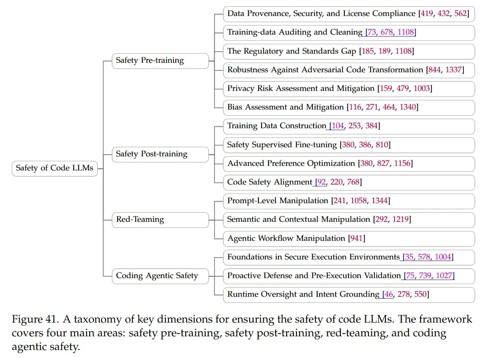

# Таксономия ключевых аспектов безопасности кодовых LLM

## Краткое описание

Данный документ представляет собой структурированную таксономию ключевых измерений для обеспечения безопасности языковых моделей, работающих с кодом (code LLMs). Основывается на визуальной схеме, представляющей систематический подход к обеспечению безопасности таких моделей.

 <!-- TODO: Broken image path -->

**Изображение показывает:** Схема, иллюстрирующая четыре основные области обеспечения безопасности кодовых LLM: безопасность на этапе предварительного обучения, безопасность на этапе пост-обучения, красное тестирование и безопасность агентных систем программирования.

## Основная информация (структурированно)

Согласно представленной таксономии, безопасность кодовых LLM охватывает четыре основных области:

### 1. Безопасность на этапе предварительного обучения (Safety pre-training)
- Обработка и очистка данных предварительной подготовки
- Удаление вредоносного или нежелательного контента из датасетов
- Обеспечение чистоты и этичности обучающих данных

### 2. Безопасность на этапе пост-обучения (Safety post-training)
- Адаптация и тонкая настройка моделей
- Алгоритмы выравнивания (alignment) для обеспечения соответствия модели целевым целям
- Проверка безопасности после дообучения

### 3. Красное тестирование (Red-teaming)
- Активное тестирование моделей для выявления уязвимостей
- Использование специализированных методов для поиска проблемных сценариев
- Итеративное улучшение безопасности на основе полученных результатов тестирования

### 4. Безопасность агентных систем программирования (Coding agentic safety)
- Безопасность автономных систем, взаимодействующих с кодом
- Контроль за действиями программных агентов
- Предотвращение нежелательного поведения в процессе автоматического программирования

## Новые концепции и термины

- **Code LLM (Language Model Models)**: Языковые модели, специализирующиеся на понимании и генерации программного кода
- **Safety pre-training**: Меры безопасности, принимаемые на этапе предварительного обучения модели
- **Safety post-training**: Меры безопасности, принимаемые после этапа обучения
- **Red-teaming**: Метод тестирования безопасности, при котором специалисты активно ищут уязвимости в системе
- **Coding agentic safety**: Безопасность программных агентов, работающих с кодом

## Примеры применения

Таксономия может быть использована:
- При разработке новых моделей для кода для обеспечения всестороннего подхода к безопасности
- При аудите существующих систем для выявления пробелов в обеспечении безопасности
- При создании стандартов и рекомендаций для индустрии

## Связи с другими темами

- [[../llm/safety.md]] - Общие вопросы безопасности LLM
- [[../agents/code_agents/index.md]] - Агенты, работающие с кодом
- [[../security/overview.md]] - Общие принципы безопасности в ИИ системах

## Источники

1. Taxonomy of key dimensions for ensuring the safety of code LLMs - Visual diagram showing the framework covering four main areas: safety pre-training, safety post-training, red-teaming, and coding agentic safety. The image file name is img_1765198206_aqadcrbrgwcvsel_figure_41_a_taxonomy_of_key.jpg with OCR text showing "Figure 41. A taxonomy of key dimensions for ensuring the safety of code LLMs."