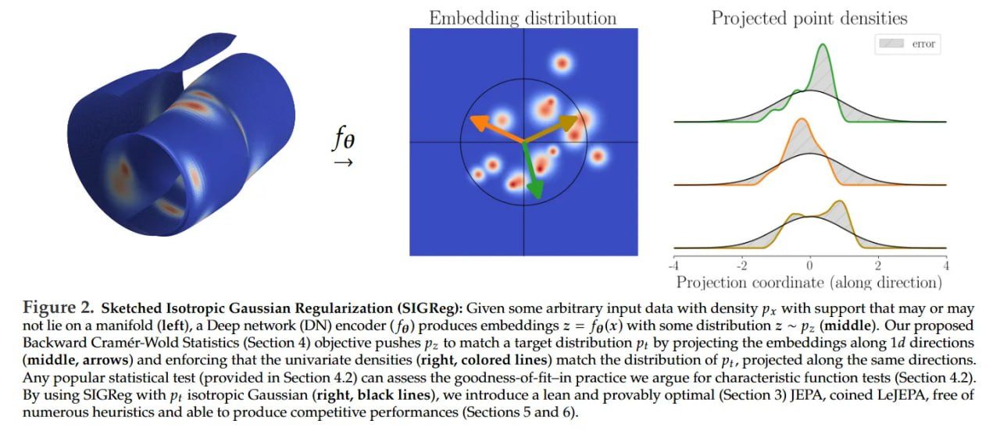

# LeJEPA: Проблема коллапса представлений в self-supervised learning решена

## Общее описание

LeJEPA (Latent-Euclidean Joint-Embedding Predictive Architecture) - это новый фреймворк для self-supervised learning (SSL), представленный Рэндаллом Балестриеро и Яном Лекуном. Он заменяет хрупкие эвристики существующих предиктивных архитектур с совместным эмбеддингом (JEPA) строгой теоретической базой, обеспечивая доказуемо оптимальные представления.

## Архитектурные особенности

### Проблема коллапса представлений в JEPA
Традиционные JEPA-архитектуры стремятся извлечь абстрактные, высокоуровневые знания, предсказывая представления одной части входа на основе другой (например, для изображения используется видимый блок патчей-"контекст" для предсказания представления замаскированного "целевого" блока). Однако этот подход страдает от постоянной проблемы - коллапса представлений, когда модель выучивает тривиальное решение, отображая все входы в одну и ту же точку. 

Для борьбы с этим исследователи разработали целый арсенал эвристик:
- stop-gradients
- сети "учитель-ученик" с экспоненциальным скользящим средним (EMA)  
- специальные whitening-слои

В результате процедуры обучения часто получаются хрупкими и трудномасштабируемыми.

### Решение через теоретическую основу
LeJEPA предлагает радикальный отход от этого цикла эмпирических исправлений. Вместо добавления очередной эвристики, авторы возвращаются к первым принципам, задавая фундаментальный вопрос: каким должно быть оптимальное распределение эмбеддингов модели, чтобы обеспечить максимальную пользу на будущих, неизвестных задачах?

## Теоретические основы

### Оптимальность изотропного гауссиана
Основной теоретический вклад работы - строгое доказательство того, что изотропное гауссовское распределение является единственным оптимальным целевым распределением для эмбеддингов foundation-модели. Авторы демонстрируют эту оптимальность, анализируя риск для downstream-задач, оцениваемых как с помощью линейных, так и нелинейных проб (probes).

- **Для линейных проб**: любое отклонение от изотропии увеличивает как смещение (bias), так и дисперсию (variance) выученного downstream-предсказателя
- **Для нелинейных проб**: изотропное гауссовское распределение является единственным минимизатором интеграла квадрата смещения

Интуиция проста и мощна: изотропное распределение, где дисперсия одинакова во всех направлениях, не делает никаких априорных предположений о том, какие признаки будут важны для будущих, невиданных задач. Относясь ко всем направлениям в пространстве эмбеддингов одинаково, оно создаёт наиболее универсальные и несмещённые представления, тем самым минимизируя риск в худшем случае при адаптации к новой downstream-задаче.

 <!-- TODO: Broken image path -->

**Описание:** Визуализация теоремы 2, демонстрирующая, как анизотропные (справа) эмбеддинги приводят к оценке с более высокой дисперсией по сравнению с изотропными эмбеддингами (слева). Используется 100 обучающих точек для задачи классификации с двумя классами, и подбирается логистическая регрессия, повторяя процесс на множественных обучающих выборках. Каждая выборка приводит к границе решения (фиолетовая линия), показывая, как изотропные эмбеддинги обеспечивают более стабильные и надежные оценки.

## Механизм: регуляризация SIGReg

### Описание SIGReg
В центре LeJEPA находится новая целевая функция SIGReg (Sketched Isotropic Gaussian Regularization), которая использует случайные одномерные проекции и сопоставление характеристических функций для наложения ограничений на многомерное пространство эмбеддингов с линейной сложностью по времени и памяти.

### Принцип работы
Метод использует принцип Крамера-Вольда: вместо того чтобы напрямую сопоставлять два многомерных распределения, он проецирует эмбеддинги на набор случайных одномерных направлений и требует, чтобы полученные одномерные распределения соответствовали стандартному одномерному гауссиану.

### Преимущества теста Эппса-Палли
Авторы выбрали тест Эппса-Палли, основанный на сравнении эмпирических характеристических функций (ECF), который обеспечивает:

1. **Линейная сложность**: O(N) по времени и памяти относительно размера батча
2. **Стабильность обучения**: доказано, что лосс, градиенты и кривизна ограничены
3. **Совместимость с распределённым обучением**: формулировка в виде простого среднего совместима с фреймворками распределённого обучения, такими как DDP

## Архитектура LeJEPA

### Формула и гиперпараметры
Итоговый фреймворк LeJEPA объединяет стандартный предиктивный лосс JEPA с новым регуляризационным членом SIGReg:

L_LeJEPA = (1-λ)L_pred + λL_SIGReg

Эта элегантная формулировка использует один надёжный гиперпараметр λ, который управляет компромиссом между предсказательной способностью и регуляризацией.

### Отказ от эвристик
В отличие от I-JEPA, LeJEPA полностью отказывается от эвристик:
- Не требует предсказательной сети
- Не требует сети "учитель-ученик" 
- Не требует stop-gradients
- Не требует whitening-слоёв

Напрямую навязывая невырожденное изотропное гауссовское распределение, член SIGReg устраняет коллапс по построению.

### Устойчивость и стабильность
- Обучение стабильно для более чем 60 различных архитектур
- Работает в широком диапазоне гиперпараметров
- Масштабируется до модели ViT-g с 1.8 млрд параметров с гладкой кривой обучения

## Практические результаты

### Информативная функция потерь
Важным прорывом является то, что лосс LeJEPA при обучении хорошо предсказывает качество на downstream-задачах. Авторы показывают корреляцию Спирмена до 99% между масштабированной версией лосса и итоговой точностью линейной пробы. Это даёт надёжный, дешёвый и не требующий разметки сигнал для выбора модели.

### Доменно-специфичное предобучение
Пожалуй, самый прорывной результат - это успех LeJEPA в доменно-специфическом предобучении. При обучении с нуля на небольших, специализированных датасетах, таких как Galaxy10 (~11 тыс. изображений), LeJEPA стабильно и значительно превосходит трансферное обучение от массивных frontier-моделей вроде DINOv2 и DINOv3. 

Этот вывод оспаривает преобладающий консенсус в духе "масштаб - это всё, что вам нужно" и вновь утверждает доменно-специфичный SSL как мощную и жизнеспособную стратегию, особенно в областях с дефицитом данных.

### Результаты на ImageNet
- На ImageNet-1K LeJEPA достигает 79% top-1 точности с моделью ViT-H/14
- Стабильно соответствует или превосходит предыдущие методы
- Часто требует значительно более коротких циклов обучения (например, 100 эпох против 300 у I-JEPA)

## Сравнение с другими подходами

| Фреймворк | Использование эвристик | Стабильность | Масштабируемость | Теоретическая основа |
|-----------|-------------------------|--------------|------------------|----------------------|
| Contrastive Learning | Да | Низкая | Средняя | Эмпирическая |
| I-JEPA | Да (stop-gradient, teacher-student) | Средняя | Средняя | Частичная |
| LeJEPA | Нет | Высокая | Высокая | Доказуемо оптимальная |

## Новые концепции и термины

- **JEPA (Joint-Embedding Predictive Architecture)**: предиктивные архитектуры с совместным эмбеддингом
- **SIGReg (Sketched Isotropic Gaussian Regularization)**: новая регуляризационная функция для self-supervised learning, обеспечивающая изотропное гауссовское распределение эмбеддингов
- **Изотропный гауссиан**: распределение с одинаковой дисперсией во всех направлениях
- **Downstream-задачи**: задачи, для которых используются предобученные представления
- **Проб (probe)**: метод оценки качества представлений (например, линейная проба)
- **Коллапс представлений**: проблема, при которой модель отображает все входы в одну точку
- **Cramér-Wold device**: математический принцип, позволяющий определять многомерные распределения через одномерные проекции
- **Epps-Pulley тест**: статистический тест, используемый для проверки нормальности распределения

## Примеры применения

### Визуальное обучение
- Эффективное обучение представлений для задач классификации изображений
- Использование global и local view для захвата как семантических, так и локальных паттернов
- Превосходные результаты на ImageNet-1K и других визуальных бенчмарках

### Доменно-специфичное обучение
- Эффективное предобучение на небольших специализированных датасетах
- Применение в областях с ограниченными данными (например, астрономия, медицинская визуализация)
- Альтернатива трансферу от large-scale моделей

## Визуализации

 <!-- TODO: Broken image path -->

**Описание:** Диаграмма архитектуры LeJEPA, показывающая основные компоненты фреймворка: входные данные, генерация view, энкодер, SIGReg регуляризация, и конечные эмбеддинги с изотропным гауссовским распределением.

## Связи с другими темами

- [[../embedders/matryoshka_representation_learning.md]] - Альтернативный подход к обучению представлений, фокусирующийся на сжатии векторного пространства
- [[../nlp/transformers/transformer_architecture.md]] - Трансформеры как архитектуры, которые могут использовать LeJEPA для self-supervised обучения
- [[../machine_learning.md]] - Общие концепции машинного обучения, включая задачи self-supervised learning
- [[../computer_vision/computer_vision.md]] - Компьютерное зрение, как область применения LeJEPA
- [[../self_supervised_learning.md]] - Общее описание методов self-supervised learning, контекст для понимания места LeJEPA в этой области

## Источники

1. [LeJEPA: Provable and Scalable Self-Supervised Learning Without the Heuristics](https://arxiv.org/abs/2511.08544) - Оригинальная статья Рэндалла Балестриеро и Яна Лекуна об архитектуре LeJEPA
2. [LeJEPA GitHub Repository](https://github.com/rbalestr-lab/lejepa) - Реализация фреймворка с документацией и примерами
3. [DINOv2: Learning Robust Visual Features without Supervision](https://arxiv.org/abs/2304.07193) - Предыдущая работа Яна Лекуна о self-supervised learning методах
4. [DINOv3: Improved Visual Features with Simple Transformers](https://arxiv.org/abs/2508.10104) - Развитие подхода DINO для визуального обучения