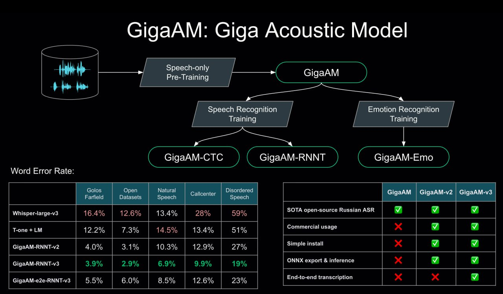

# GigaAM-v3: Новое поколение акустических моделей для распознавания речи

 <!-- TODO: Broken image path -->

**Описание:** Архитектура акустической модели GigaAM, показывающая структуру и компоненты новой версии модели, разработанной для распознавания русской речи.

## Краткое описание

GigaAM-v3 — это новое поколение акустических моделей распознавания речи, разработанных Sber AI, специально оптимизированных для русского языка. Модель основана на подходе HuBERT-CTC и предлагает значительные улучшения по сравнению с предыдущими версиями, включая поддержку пунктуации и нормализацию текста.

## Основные характеристики

### Архитектура
- **GigaAM-v3** — основная акустическая модель (foundation audio encoder), база для дообучения
- **GigaAM-v3-CTC** — улучшенная CTC модель распознавания с быстрым инференсом
- **GigaAM-v3-RNNT** — улучшенная RNNT модель распознавания с лучшим качеством
- **GigaAM-v3-e2e-CTC** — распознавание с пунктуацией и нормализацией, быстрый инференс
- **GigaAM-v3-e2e-RNNT** — распознавание с пунктуацией и нормализацией, максимальное качество

Пример e2e-вывода: "В твоём каталоге есть первая серия сезона 14 «Где логика»?"

## Технические улучшения в v3

### Масштаб предобучения
- Увеличение с 50k до 700k часов аудио на русском языке
- Общая наработка модели значительно превышает предыдущие версии

### Новые домены в обучении ASR
- Колл-центр: специфические особенности работы с телефонной речью
- Музыкальные запросы: распознавание обращений, связанных с мультимедиа
- Речь с особенностями: моделирование речи с нарушениями, акцентами и др.
- Разговорная речь: спонтанная речь в неформальной обстановке
- Суммарно: 2k часов специализированных данных

### Подход к пунктуации и нормализации
- Для всего корпуса обучающих данных восстановлена пунктуация и нормализация
- Использовалась система GigaChat Max Audio для автоматического восстановления

### Выбор архитектуры
- Линейка CTC/RNNT + e2e — выбор между скоростью и максимальным качеством
- CTC оптимизирована для быстрого инференса
- RNNT обеспечивает максимальное качество на сложных срезах
- e2e-архитектуры интегрируют пунктуацию и нормализацию в процесс распознавания

## Метрики производительности

### Открытые датасеты
- Golos, OpenSTT, Common Voice, LibriSpeech: паритет с GigaAM-v2

### Новые домены (WER, сравнение v2-RNNT → v3-RNNT):
- **речь с особенностями**: 27% → 19% 
- **колл-центр**: 13% → 10%
- **спонтанная речь**: 10.3% → 7%

### Пунктуация
- v3-e2e-RNNT vs reference + Whisper Forced Decoding
- F1-score по запятой: 84% vs 62%
- Остальные знаки препинания: ~паритет

### Side-by-Side оценка (Gemini 2.5 Pro as a judge)
- v3-e2e-RNNT vs Whisper-large-v3
- Колл-центр: 70:30 в пользу GigaAM-v3
- Common Voice: 64:36 в пользу GigaAM-v3

## Применение

- Интеграция в умные устройства Sber
- Бесплатное использование через бота @smartspeech_sber_bot
- Возможность дообучения под специфические задачи

## Связь с другими темами

- [[speech_recognition.md]] - Общие принципы распознавания речи
- [[whisper.md]] - Сравнение с эталонной моделью от OpenAI
- [[gigachat_overview.md]] - Связь с экосистемой GigaChat от Sber AI

## Источники

1. [GigaAM-v3: новый уровень качества, пунктуация, нормализация](https://habr.com/ru/articles/858440/) - Оригинальное объявление о релизе GigaAM-v3 на Хабре
2. [GigaAM GitHub Repository](https://github.com/salute-developers/GigaAM) - Репозиторий с исходным кодом и документацией
3. [GigaAM HuggingFace Models](https://huggingface.co/models?other=gigaam) - Модели GigaAM на HuggingFace

## Дополнительные технические детали

### Распределение данных по доменам
GigaAM-v3 использует распределение данных по различным доменам для улучшения качества распознавания в специфических сценариях. Включает домены колл-центра, музыкальных запросов, речи с особенностями, разговорной речи и другие.

### Эксперименты с масштабированием модели по параметрам
Модель была масштабирована с 50k до 700k часов аудио на русском языке, что значительно увеличило качество распознавания.

### Сравнение токенизаторов
В рамках разработки GigaAM-v3 проводились эксперименты с различными токенизаторами для оптимизации процесса распознавания речи.

### Анализ ошибок end-to-end моделей
Проводится детальный анализ ошибок в end-to-end моделях для улучшения качества распознавания и снижения WER (Word Error Rate) на различных доменах.

## LLM-as-a-judge для распознавания речи

В оценке качества GigaAM-v3 используется подход LLM-as-a-judge, где большие языковые модели используются для оценки качества распознавания речи. В частности, в side-by-side оценке используется Gemini 2.5 Pro в качестве судьи для сравнения качества GigaAM-v3 с Whisper-large-v3. На Хабре опубликована статья с подробной информацией о применении LLM-as-a-judge для оценки качества ASR-моделей.

## GigaAM на HuggingFace и сравнение с OmniLingual ASR

GigaAM-v3 ворвалась в top trending ASR-моделей на HuggingFace, обогнав свежий релиз OmniLingual ASR. Это достижение подтверждает высокое качество и актуальность модели в сравнении с другими современными решениями.

## Мероприятие "Салют, Гига!"

Планируется участие в мероприятии «Салют, Гига!», где разработчики GigaAM будут доступны для живого общения, вопросов по статье, получения деталей обучения мультиязычного GigaAM Max и обсуждения модификаций HuBERT-CTC для использования в GigaChat Audio.