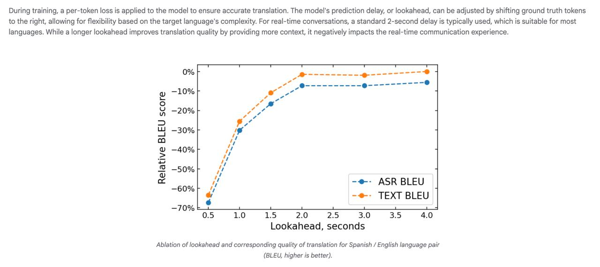

# Google Real-time Speech-to-Speech Translation

## Общая информация

**Google Real-time Speech-to-Speech Translation** — это инновационная технология, представленная командой Google Research, позволяющая вести живые разговоры на разных языках с минимальной задержкой. Технология позволяет говорить на одном языке и почти мгновенно слышать перевод на другом языке.

## Исторический контекст

До появления этой технологии процесс перевода речи в речь проходил через три этапа:
1. Распознавание речи (ASR)
2. Перевод текста (AST) 
3. Синтез новой речи (TTS)

Из-за этого задержка могла достигать десятков секунд, что делало невозможным свободное общение.

## Технические детали

### Архитектура

Google использовал инновационную сквозную (end-to-end) архитектуру, которая включает:
- **Потоковую архитектуру**: Аудио-специфичный потоковый архитектурный машинного обучения, построенный на основе AudioLM и базовых трансформерных блоков
- **RVQ аудио токены**: Аудио представлено в виде 2D набора токенов, где ось X представляет время, а ось Y — токены, описывающие аудио сегменты
- **Два основных компонента**:
  - Потоковый энкодер, который суммирует исходное аудио на основе предыдущих 10 секунд
  - Потоковый декодер, который автотрессивно предсказывает переведенное аудио
- **Технология SpectroStream**: Используется для иерархических аудио-представлений
- **16 токенов на 100мс фрагмент**: Обычно достаточно для высококачественного аудио-представления

### Производительность

- **Задержка**: Всего 2 секунды, в отличие от 4-5 секунд в каскадных системах
- **Гибридная квантизация**: Использует int8 и int4 квантизацию с оптимизированным CFG предвычислением для работы в реальном времени
- **Поддержка языков**: Изначально поддерживает 5 латинских языковых пар (Английский ↔ Испанский, Немецкий, Французский, Итальянский, Португальский)

## Отличия от предыдущих подходов

**Предыдущий каскадный подход:**
- Использовал отдельные блоки обработки: ASR (речь-в-текст) → AST (перевод текста) → TTS (текст-в-речь)
- Имел значительные задержки в 4-5 секунд
- Требовал разговора поочередно
- Накапливал ошибки на каждом этапе
- Не включал персонализацию

**Новый сквозной подход Google:**
- Прямой аудио-в-аудио перевод без промежуточных текстовых этапов
- Сокращает задержку всего до 2 секунд
- Сохраняет характеристики голоса оригинального оратора
- Исключает накопление ошибок между этапами
- Включает персонализационные функции

## Пайплайн данных

Google разработали масштабируемый пайплайн получения данных, который:
- Конвертирует сырое аудио в синхронизированные по времени входные/выходные датасеты с использованием ASR и TTS с точным выравниванием
- Использует аудио от различных источников, включая данные, сгенерированные TTS
- Проводит очистку и фильтрацию для одного спикера
- Производит транскрибирование ASR и вынужденное выравнивание
- Переводит текст машинным способом
- Генерирует переведенное аудио с помощью TTS
- Выполняет несколько этапов выравнивания для обеспечения правильного тайминга

**Описание:** Масштабируемый пайплайн получения данных для модели S2ST. Для каждой языковой пары работа начинается с получения сырого аудио. Используется разнообразный набор аудиоисточников, включая данные, сгенерированные моделями TTS. Это аудио проходит процесс очистки и фильтрации, чтобы убедиться, что в нем содержится только один спикер на исходном языке и соответствующий уровень шума. После начального сбора данных выполняется этап ASR, транскрибирующий исходный текст. После получения исходного аудио и текста алгоритм вынужденного выравнивания генерирует тайминги выравнивания (сопоставление аудио с текстом). Любые аудиосегменты, где выравнивание не удалось, отбрасываются. Остальные клипы машинно переводятся с исходного на целевой язык. Затем серия автоматических фильтров проверяет точность переведенного вывода и соответствие ему входного текста. Далее исходный транскрибированный и переведенный тексты также выравниваются для генерации соответствующих аннотаций времени (сопоставление текста с переведенным текстом). С помощью пользовательского движка генерации речи из текста переведенный текст преобразуется в переведенное аудио, сохраняя характеристики голоса из исходного аудио и создавая естественно звучащий вывод. Пайплайн завершается еще одним шагом вынужденного выравнивания переведенного текста и сгенерированной речи (сопоставление речи с текстом).

## Тренировка модели

- Использует синхронизированные по времени датасеты до 60-секундных фрагментов
- Техники аугментации аудио (понижение частоты дискретизации, реверберация, насыщение, удаление шума)
- Применение потоковой потери для точного перевода
- Регулируемая стратегия предсказания с опережением для оптимизации под конкретный язык
- 2-секундная стандартная задержка для разговоров в реальном времени

**Описание:** Во время тренировки применяется потеря на токен к модели для обеспечения точного перевода. Задержка предсказания модели или "заглядывание вперед" может быть скорректировано путем сдвига целевых токенов вправо, что позволяет обеспечить гибкость в зависимости от сложности целевого языка. Для разговоров в реальном времени обычно используется стандартная задержка 2 секунды, которая подходит для большинства языков. Хотя более длительное "заглядывание вперед" улучшает качество перевода за счет предоставления большего контекста, это негативно влияет на опыт общения в реальном времени. На диаграмме показана абляция задержки предсказания и соответствующего качества перевода для языковой пары испанский/английский (BLEU, выше - лучше).

## Применения

### Google Meet
- Серверный перевод в реальном времени для видеоконференций
- Использует большую языковую аудио модель от Google DeepMind
- Переводит устные слова на предпочтительный язык слушателя в реальном времени
- Сохраняет голос, тон и интонацию в переводе
- Когда кто-то говорит, вы все еще немного слышите их оригинальный голос с наложенным переведенным разговором
- Очень низкая задержка, позволяющая нескольким людям общаться одновременно

### На устройстве (Pixel 10)
- Функция Pixel Voice Translate на устройствах Pixel
- Перевод в реальном времени непосредственно на устройстве

### Поддерживаемые языки
- **Начальный выпуск**: Английский и Испанский
- **Скоро будут добавлены**: Итальянский, Немецкий и Португальский
- Дополнительные языки будут добавлены позже

## Примеры использования

- **Семейные разговоры**: Например, внуки, говорящие на английском, могут общаться с бабушками и дедушками, говорящими на испанском
- **Глобальные бизнес-коммуникации**: Позволяет коллегам в разных регионах подключаться в режиме реального времени
- **Межъязыковые встречи и сотрудничество**: Возможность проведения встреч между участниками, говорящими на разных языках

## Важные аспекты

- Технология информирует пользователей о синтетическом происхождении для предотвращения недобросовестного использования
- Представляет прорыв в области реального межъязыкового общения, превращая давно задуманную концепцию в реальность

## Связи с другими темами

- [[speech_to_speech_translation.md]] - Общая концепция перевода речи в речь
- [[asr/speech_recognition.md]] - Технология распознавания речи как компонент старого подхода
- [[tts/speech_synthesis.md]] - Технология синтеза речи как компонент старого подхода
- [[nlp/models/whisper.md]] - Модель с поддержкой перевода речи для сравнения с подходом Google
- [[asr/omnilingual_asr.md]] - Многоязычные системы распознавания речи

## Источники

1. [Google Research: Real-time speech-to-speech translation](https://research.google/blog/real-time-speech-to-speech-translation/) - Официальная статья Google Research о технологии реального времени перевода речи в речь
2. [TechCrunch: Google Meet real-time speech translation](https://techcrunch.com/2025/05/20/google-meet-is-getting-real-time-speech-translation/) - Статья о внедрении технологии в Google Meet