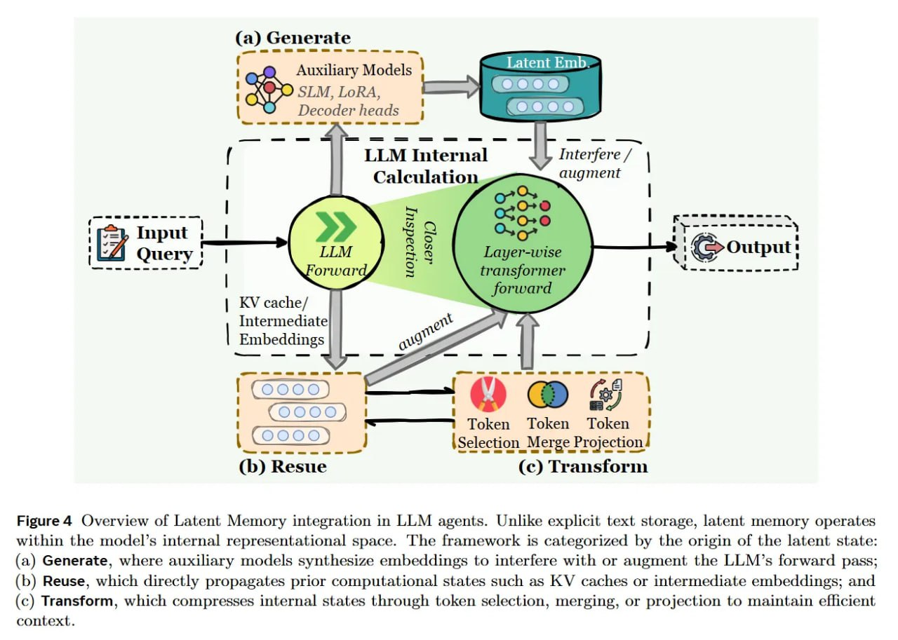

# Формы памяти в таксономии агентов

## Обзор

Формы памяти описывают, где и как физически представлена информация в системах памяти агентов. Они определяют архитектурный подход к хранению и отвечают на вопрос *где* и *как* информация представлена. Статья "Memory in the Age of AI Agents: A Survey" выделяет три основные формы: токенную, параметрическую и латентную память.

## Токенная память (Token-level Memory)

### Определение
- Информация хранится в дискретных, читаемых человеком единицах (куски текста, JSON-объекты)
- Хранится во внешних базах данных
- Является наиболее распространенной формой памяти агентов

### Преимущества
- Высокая интерпретируемость и возможность редактирования
- Легкость доступа и понимания содержимого
- Возможность ручного вмешательства и коррекции

### Недостатки
- Страдает от задержек при поиске
- Ограниченная плотность информации
- Могут возникнуть проблемы с масштабированием

### Организация хранения
1. **Плоская организация**: линейные логи взаимодействий
2. **Планарная организация**: графы или деревья внутри одного слоя
3. **Иерархическая организация**: многослойные пирамиды хранения

## Параметрическая память (Parametric Memory)

### Определение
- Информация встраивается прямо в веса модели
- Может быть внутренней (через методы редактирования модели) или внешней (через адаптеры)

### Внутренняя параметрическая память
- Использует методы редактирования модели, такие как ROME (https://arxiv.org/abs/2202.05262) или MEMIT (https://arxiv.org/abs/2210.07229)
- Информация становится частью архитектуры модели
- Мгновенная реакция без необходимости поиска

### Внешняя параметрическая память
- Использует адаптеры типа LoRA (https://arxiv.org/abs/2106.09685)
- Информация хранится в дополнительных модулях, подключаемых к основной модели

### Преимущества
- Мгновенная реакция, нет необходимости в поиске
- Имитирует биологический "инстинкт"
- Эффективное использование параметров (LoRA уменьшает количество обучаемых параметров)

### Недостатки
- Катастрофическое забывание при обновлениях
- Высокая стоимость обновлений
- Сложность в интерпретации и контроле

## Латентная память (Latent Memory)

### Определение
- Данные хранятся как непрерывные векторные представления или состояния KV-кэша
- Компромиссный вариант с высокой плотностью информации
- Высокая совместимость с архитектурой трансформеров

### Преимущества
- Высокая плотность информации в хранилище
- Нативная совместимость с машиной (архитектурой трансформеров)
- Эффективное использование вычислительных ресурсов

### Недостатки
- Потеря человеческой интерпретируемости
- Сложность в ручной корректировке
- Требует специализированных инструментов для понимания содержимого

## Сравнение форм памяти

| Форма памяти | Интерпретируемость | Скорость доступа | Плотность | Устойчивость | Обновляемость |
|--------------|-------------------|------------------|-----------|--------------|---------------|
| Токенная | Высокая | Низкая | Низкая | Высокая | Высокая |
| Параметрическая | Низкая | Высокая | Высокая | Средняя | Низкая |
| Латентная | Очень низкая | Высокая | Высокая | Средняя | Средняя |

## Практические применения

### Токенная память
- Векторные базы данных для агентов
- История взаимодействий в чат-ботах
- Хранение пользовательских профилей

### Параметрическая память
- Специализированные навыки, встроенные в модель
- Информация, требующая мгновенного доступа
- Базовые знания, не требующие частого обновления

### Латентная память
- Хранение признаков и паттернов
- Внутренние представления контекста
- Мультимодальные эмбеддинги

## Визуализация

 <!-- TODO: Broken image path -->

**Image shows:** The framework categorizes latent memory by the origin of the latent state: (a) Generate, where auxiliary models synthesize embeddings to interfere with or augment the LLM's forward pass; (b) Reuse, which directly propagates prior computational states such as KV caches or intermediate embeddings; and (c) Transform, which compresses internal states through token selection, merging, or projection to maintain efficient context.

## Источники

- Memory in the Age of AI Agents: A Survey (https://arxiv.org/abs/2512.13564)
- ROME: Accurate Real-time Patching of Language Models (https://arxiv.org/abs/2202.05262)
- MEMIT: Editing Memory in Transformers (https://arxiv.org/abs/2210.07229)
- LoRA: Low-Rank Adaptation of Large Language Models (https://arxiv.org/abs/2106.09685)

## См. также

[[unified_taxonomy_agent_memory.md]] - Основная таксономия памяти агентов
[[memory_systems_for_ai_agents.md]] - Общие системы памяти для агентов
[[retrieval_augmented_generation.md]] - Сравнение с RAG-системами