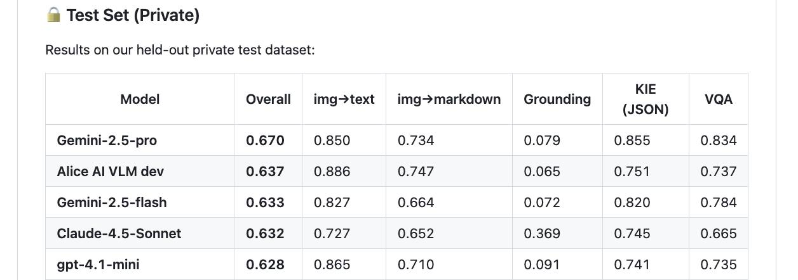

# MWS Vision Bench

## Описание

MWS Vision Bench - это бенчмарк для оценки визуально-языковых моделей (VLM), разработанный для комплексной оценки способности моделей понимать и обрабатывать как визуальные, так и текстовые данные. Бенчмарк предназначен для оценки производительности мультимодальных моделей в различных сценариях.

## Метрики и результаты

### Overall private test
- Основная метрика бенчмарка, оценивающая общую производительность модели
- Состоит из нескольких подкомпонентов, оценивающих разные аспекты работы VLM

### Подкатегории оценки

1. **img→text** - оценка способности модели генерировать текст на основе изображения
2. **img→markdown** - оценка способности модели представлять изображение в формате markdown
3. **Grounding** - оценка способности модели локализовать объекты на изображении
4. **KIE (JSON)** - оценка извлечения ключевой информации из документов
5. **VQA** - ответы на визуальные вопросы

## Результаты моделей

 <!-- TODO: Broken image path -->

**Image shows:** Таблица с результатами моделей на бенчмарке MWS Vision Bench, включая Gemini-2.5-pro, Alice AI VLM dev, Claude-4_5-Sonnet и gpt-4.1-mini по различным метрикам.

### Alice AI VLM dev
- **Overall private test**: 0.637
- **img→text**: 0.886
- **img→markdown**: 0.747
- **Grounding**: 0.065
- **KIE (JSON)**: 0.751
- **VQA**: 0.737

### Gemini-2.5-pro
- **Overall**: 0.670
- **img→text**: 0.850
- **img→markdown**: 0.734
- **Grounding**: 0.079
- **KIE (JSON)**: 0.855
- **VQA**: 0.834

### Claude-4_5-Sonnet
- **Overall**: 0.637

### GPT-4.1-mini
- **Overall**: 0.628
- **img→text**: 0.865
- **img→markdown**: 0.710
- **Grounding**: 0.091
- **KIE (JSON)**: 0.741
- **VQA**: 0.735

## Значение

MWS Vision Bench важен для оценки прогресса в области визуально-языковых моделей, особенно в контексте их применения в реальных сценариях, где требуется как понимание визуальной информации, так и генерация качественного текстового ответа.

## Связи

- [[../../applications/yandex/yandex_alice/alice_ai_vlm_dev]] - Версия Alice AI VLM, достигшая высоких результатов на бенчмарке
- [[../../applications/yandex/yandex_alice/alice_ai_vlm]] - Основная визуально-языковая модель Alice AI
- [[../llm/models/qwen/vlm_models.md]] - Общее понятие о визуально-языковых моделях

## Источники

1. [Технический отчет о создании новой генерации Alice AI моделей от Yandex](https://share.google/rT7zV3ccA3CP5sfOH) - описание результатов на бенчмарке MWS Vision Bench
2. [Яндекс Маркет показал обновлённого ИИ-агента на базе Alice AI — добавили VLM и персонализацию](https://habr.com/ru/companies/yandex/news/963778/) - упоминание о VLM и её достижениях