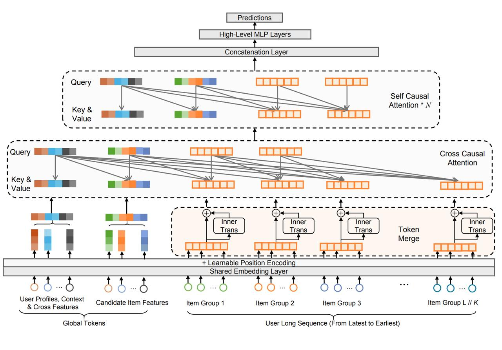

# LONGER: Scaling Up Long Sequence Modeling in Industrial Recommenders

## Описание

LONGER - архитектура для эффективных end-to-end рекомендаций на GPU с использованием длинных пользовательских последовательностей (до 10 тыс. событий), разработанная командой ByteDance и представленная на конференции RecSys'25. Работа охватывает кейсы Douyin (китайского TikTok) в рекламе и e-commerce сценариях.

## Основная проблема

Основная проблема длинных последовательностей - квадратичная сложность аттеншна по длине последовательности L. LONGER решает эту задачу через несколько инновационных подходов.

**Изображение показывает:** Архитектуру LONGER с компонентами Token Merging, Global Tokens и другими элементами для эффективной обработки длинных пользовательских последовательностей.

## Архитектурные компоненты

### 1. Token Merging (Объединение токенов)

#### Описание
Рядом стоящие токены в истории группируются по K штук. Группировка выполняется либо простой конкатенацией, либо через лёгкий внутренний трансформер (InnerTrans). Это уменьшает эффективную длину последовательности с L до L/K.

#### Влияние на производительность
Для типичных настроек (L=2000, d=32) TokenMerge(K=4) снижает FLOPs аттеншна примерно на 40–50% при минимальной потере качества.

#### Ablation study
Авторы провели детальное исследование TokenMerge и InnerTrans:
- Без Merge (L=2000): FLOPs ≈ 3,73e9
- С Merge (K=8, concat, L=250): FLOPs ≈ 3,03e9, ΔAUC +1,58%, ΔLogLoss −3,48%
- Добавление InnerTrans даёт ещё небольшой, но устойчивый буст

Таким образом, TokenMerge не только снижает вычислительные затраты, но и даёт буст по метрикам качества, в сравнении с ванильным вариантом.

### 2. Global Tokens (Глобальные токены)

На вход подаётся конкатенация глобальных токенов и пользовательской истории. Глобальные токены играют роль "якорей", включая:
- User Profiles (профили пользователей)
- Context & Cross Features (контекстные и кросс-функции)

### 3. Особенности обучения

- Dense- и sparse-параметры (огромные embedding-таблицы) находятся на GPU-кластере
- Обучение в BF16/FP16
- Часть активаций не хранится, а пересчитывается на backward (activation recomputation)
- На инференсе используется KV Cache Serving

## Эксперименты и результаты

### Офлайн-эксперименты

LONGER решает задачу предсказания conversion rate (CVR) на 5,2 млрд примеров (130 дней данных Douyin Ads) на кластере 48 × A100.

#### Сравнение с базовой моделью:
- AUC: +0,21%
- LogLoss: -0,39%

### Онлайн A/B-тесты в Douyin Ads

| Тип контента | ADSS | ADVV |
|--------------|------|------|
| Live Streaming | +1,06% | +1,17% |
| Short Video | +2,10% | +2,15% |
| Mall | +1,82% | +1,41% |

### Онлайн A/B-тесты в Douyin E-commerce

| Тип контента | Order/U | GMV/U |
|--------------|---------|-------|
| Live Streaming | +7,92% | +6654% |
| Short Video | +4,61% | +5,28% |

## Применение и масштаб

- Поддержка последовательностей до 10,000 событий
- Применение в Douyin (TikTok) для рекламных и e-commerce рекомендаций
- Высокая эффективность на GPU кластерах
- End-to-end архитектура для промышленных рекомендательных систем

## Сравнение с другими подходами

| Характеристика | LONGER | Традиционные трансформеры |
|----------------|--------|---------------------------|
| Длина последовательности | до 10,000 событий | ограничено квадратичной сложностью |
| Сложность аттеншна | O(L/K)² через Token Merging | O(L²) |
| Вычислительная эффективность | ~40-50% снижение FLOPs | стандартная |
| Глобальное внимание | через Global Tokens | ограниченно |

## Связи с другими темами

- [[transformer_based_models.md]] - Трансформерные модели в системах рекомендаций: контекст для понимания архитектурных решений
- [[scaling_generative_recsys.md]] - Масштабирование генеративных рекомендательных систем: связан с подходами к масштабированию
- [[attention_mechanisms.md]] - Механизмы внимания: основа для понимания улучшений в аттеншне
- [[token_compression.md]] - Сжатие токенов: связано с подходом Token Merging
- [[tbgrecall.md]] - TBGRecall: другая архитектура для работы с длинными последовательностями поведения пользователей
- [[session_based_recommendations.md]] - Сессионные рекомендательные системы: контекст применения систем с длинными последовательностями

## Источники

1. [LONGER: Scaling Up Long Sequence Modeling in Industrial Recommenders] - оригинальная статья от ByteDance, представленная на RecSys'25, описывающая архитектуру и эксперименты
2. [RecSys 2025 Conference Proceedings] - конференция, на которой была представлена работа
3. [ByteDance Research Team] - команда исследователей, разработавших архитектуру LONGER