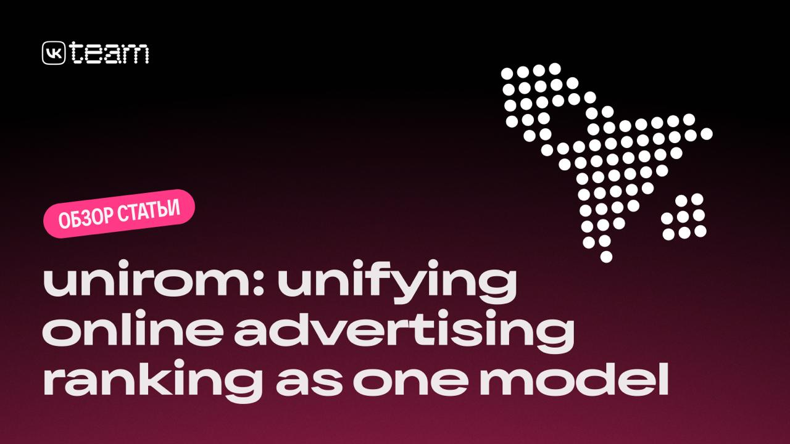

# UniROM: Промышленная end-to-end архитектура для рекламных систем

## Описание

**Рисунок показывает:** Архитектуру UniROM - объединяющую модель для онлайн рекламного ранжирования (unirom: unifying online advertising ranking as one mocel)

UniROM - первая промышленная end-to-end архитектура для ранжирования рекламных объявлений, представленная исследователями из Meituan. Система заменяет традиционную многостадийную архитектуру (Multi-Stage Architecture, MCA) одной моделью, которая генерирует финальный список объявлений сразу из полного пула кандидатов в Location-Based Services (LBS).

### Контекст проблемы

Большинство современных рекламных и рекомендательных систем используют многостадийную архитектуру (MCA):
1. Быстрая генерация пула кандидатов
2. Последующее ранжирование тяжёлой моделью

Этот подход масштабируем, но имеет системные недостатки:
- Несогласованность оптимизационных целей между стадиями
- Смещение распределений пользователей и айтемов
- Падение качества финальных рекомендаций, доходности и UX

## Архитектура UniROM

UniROM состоит из двух основных модулей:

### 1. RecFormer
Модуль, моделирующий интересы пользователя и externalities между объявлениями:
- **Global Cluster-Former** - снижает сложность с O(N*N) до O(N*C), где C - число кластеров
- **Mid-Fusion Interest Former** - балансирует между ранним и поздним объединением признаков, учитывая намерения пользователя

### 2. AucFormer
Модуль, генерирующий финальный список объявлений. Характерные особенности:
- **Non-autoregressive присвоение позиций** - позволяет эффективно распределять объявления по позициям без последовательной генерации
- **Permutation-aware оценка pCTR/pCVR** - учитывает влияние порядка объявлений на вероятности клика и конверсии
- **Отдельная payment-network** - обеспечивает корректное ценообразование в аукционе

## Обучение модели

Обучение осуществляется в два этапа:
1. **Обучение pCTR на реальных логах** - начальный этап для точной оценки вероятности клика
2. **Дообучение через RL** - оптимизация аукциона и соблюдение IC/IR-ограничений (Incentive Compatibility и Individual Rationality)

## Результаты

### Оффлайн-эксперименты
- **Recall @../topics/---** ↑ +20.4%
- **AUC** ↑ +1.48%
- **eCTR** ↑ +8.3%
- **eRPM** ↑ +11.4%

### Онлайн A/B-тесты (7 дней)
- **CTR** ↑ +5.2%
- **RPM** ↑ +13.6%
- **ROI рекламодателей** ↑ +3.1%

При этом задержка выросла всего на 2.2%, несмотря на обработку пула кандидатов, увеличенного в сотни раз (около 100,000 кандидатов на один запрос).

## Значимость и влияние

Итог: модель одновременно улучшила доход платформы, пользовательский опыт и эффективность рекламодателей — редкое сочетание для рекламных систем.

UniROM демонстрирует, что end-to-end ранжирование может успешно заменить классическую каскадную архитектуру в реальной индустриальной среде. Такой подход:
- Убирает рассинхрон между стадиями
- Учитывает externalities между объявлениями
- Снижает зависимость от ручного feature engineering
- Улучшает бизнес-показатели без серьёзного роста задержек

## Открытые вопросы

Открытым остаётся вопрос масштабирования: можно ли распространить подход с 100k кандидатов до уровней, где речь идёт о десятках-сотнях миллионов?
Если это удастся, UniROM способен изменить стандарт разработки рекомендательных и рекламных систем глобального масштаба.

## Связи с другими темами

- [[end_to_end_generative_recommendation_systems.md]] - End-to-end генеративные рекомендательные системы: контекст для понимания эволюции подходов
- [[ranking.md]] - Ранжирование в рекомендательных системах: сравнение с традиционными подходами
- [[target_aware_architectures_in_ranking.md]] - Target Aware архитектуры в ранжировании: современные подходы к моделированию
- [[transformer_based_models.md]] - Трансформерные модели в системах рекомендаций: контекст для RecFormer и AucFormer
- [[Meituan EGA v1]] - Реализация end-to-end генеративной рекомендательной системы от Meituan, представленная на CIKM'25

## Источники

1. [UniROM: End-to-End Advertising System by Meituan Researchers] - статья о первой промышленной end-to-end архитектуре для рекламных систем от Meituan, представленная командой AI VK
2. [CIKM'25 Conference: End-to-End Advertising Systems] - материалы конференции CIKM'25, содержащие информацию о новых подходах к рекламным системам
3. [Meituan's Industrial Implementation of UniROM] - технический отчет о внедрении UniROM в промышленной среде, включая оффлайн и онлайн эксперименты с улучшением метрик