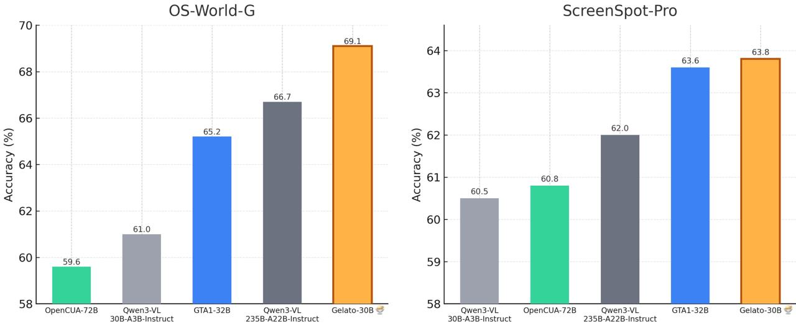

# Gelato - библиотека для управления вычислительными графами в ML

## Краткое описание

Gelato - это минималистичная библиотека от mlfoundations, которая помогает собирать, анализировать и оптимизировать вычислительные графы в машинном обучении. Она упрощает разбор сложных пайплайнов, позволяет визуализировать зависимости и управлять вычислениями на уровне узлов.

**Описание:** На изображении показана визуализация архитектуры или функциональности библиотеки Gelato, демонстрирующая управление вычислительными графами в машинном обучении.

## Основная информация

### Основные концепции

1. **Понятное представление графа ML-модели**: Библиотека предоставляет ясное и интуитивно понятное представление вычислительного графа любой ML-модели, позволяя разработчикам легко понимать структуру и зависимости внутри модели.

2. **Управление на уровне узлов**: Возможность управления вычислениями на уровне отдельных узлов графа, что дает более тонкий контроль над процессами обработки данных.

3. **Анализ и оптимизация**: Удобные инструменты для анализа производительности и оптимизации вычислительных графов, включая выявление узких мест и анализ производительности.

4. **Модификация графов**: Инструменты для модификации структуры графов, что полезно при экспериментах с новыми архитектурами моделей и кастомными связями между компонентами.

### Архитектура и методология

Использование Gelato включает:

1. **Построение графа**: Создание вычислительного графа из любой ML-модели с понятной визуализацией структуры и зависимостей.

2. **Анализ производительности**: Инструменты для выявления узких мест и анализа производительности на уровне узлов и ребер графа.

3. **Модификация структуры**: Возможность экспериментировать с изменением структуры модели и тестировать различные архитектуры.

4. **Интеграция с проектами**: Простая интеграция в существующие проекты машинного обучения с минимальными изменениями в коде.

### Отличия от существующих подходов

В отличие от:

- **Стандартных фреймворков**: Таких как TensorFlow или PyTorch, которые предоставляют более общие инструменты
- **Инструментов профилирования**: Которые показывают только производительность, но не структуру вычислений
- **Графических интерфейсов**: Которые могут быть менее гибкими для программного анализа

Gelato:

- Предоставляет специализированные инструменты для работы с вычислительными графами
- Фокусируется на простоте и минимализме
- Позволяет более глубоко анализировать и модифицировать структуру вычислений

## Новые концепции и термины

- **Вычислительный граф модели (Model computational graph)**: Граф, представляющий структуру вычислений внутри ML-модели, где узлы - это операции, а ребра - потоки данных.
- **Узел графа (Graph node)**: Отдельная операция или тензор в вычислительном графе.
- **Зависимости в графе (Graph dependencies)**: Отношения между узлами, показывающие, какие операции зависят от результатов других операций.
- **Манипуляции с графом (Graph manipulation)**: Процесс изменения структуры вычислительного графа для оптимизации или анализа.
- **Визуализация графа (Graph visualization)**: Отображение структуры вычислительного графа в понятной для человека форме.

## Примеры применения

- **Эксперименты с архитектурой**: Тестирование новых моделей и кастомных связей между компонентами
- **Анализ узких мест**: Выявление компонентов модели, тормозящих вычисления
- **Оптимизация производительности**: Модификация графа для улучшения скорости и эффективности
- **Образовательные цели**: Понимание структуры и работы ML-моделей на примере их вычислительных графов

## Связи с другими темами

[[ai/llm/reasoning/computational_graphs_in_llm_reasoning.md]] - Общее описание вычислительных графов в рассуждениях LLM
[[ai/tools/ggml.md]] - Другой фреймворк для эффективного выполнения вычислений графов машинного обучения
[[ai/llm/reasoning/attribution_graphs_interpretability.md]] - Атрибуционные графы и их роль в интерпретируемости трансформеров

## Источники

1. [Gelato GitHub](https://github.com/mlfoundations/Gelato) - официальный репозиторий проекта Gelato, минималистичной библиотеки для управления вычислительными графами в ML
2. [Gelato-30B-A3B Model](https://huggingface.co/mlfoundations/Gelato-30B-A3B) - модель, разработанная с использованием Gelato
3. [Click-100k Dataset](https://huggingface.co/datasets/mlfoundations/Click-100k) - набор данных, связанный с проектом Gelato