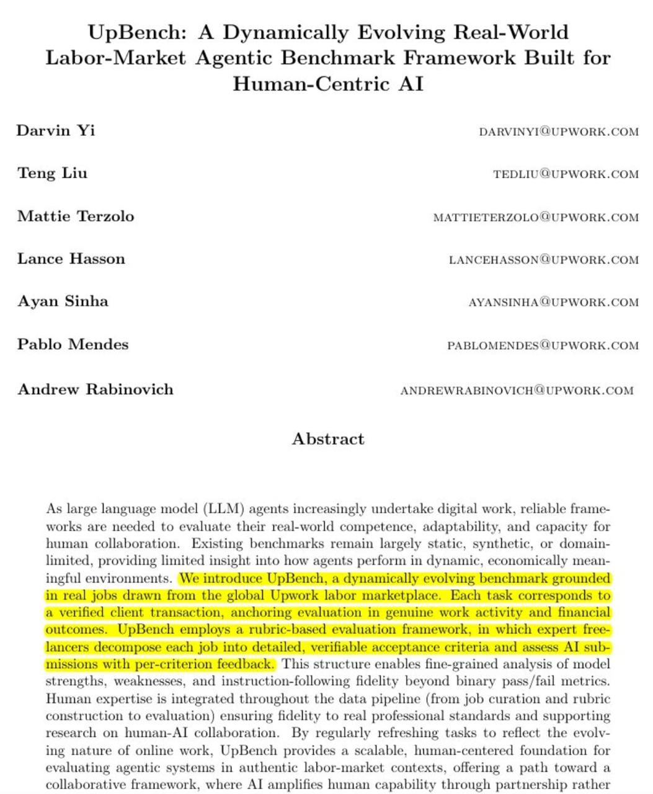

# Исследование Upwork: эффективность LLM-агентов и сотрудничество с человеком

Upwork опубликовал исследование с важным выводом: самые мощные LLM-агенты часто не справляются даже с простыми рабочими задачами, если действуют полностью автономно. Однако, когда в процесс вовлекается эксперт-человек, уровень успеха возрастает до 70%.

## Методология исследования

- **Объем**: 300 реальных оплачиваемых проектов (до $500) в различных областях:
  - Написание текстов
  - Дата-сайенс
  - Веб-разработка
  - Инженерия
  - Продажи
  - Перевод
- **Сложность задач**: Задачи намеренно упрощались, чтобы дать агентам шанс
- **Оценка**: Строгая шкала pass/fail на финальных результатах с внешней независимой проверкой

## Ключевые выводы

### Улучшение производительности при наличии обратной связи от человека

Исследование показало значительные улучшения, когда опытные фрилансеры давали краткий отзыв (в среднем 20 минут):

- **Claude Sonnet 4 (данные)**: 64% → 93% уровень успеха
- **Gemini 2.5 Pro (маркетинг/продажи)**: 17% → 31% уровень успеха
- **GPT-5 (инженерия)**: 30% → 50% уровень успеха

### Паттерны производительности в зависимости от типа задач

- **Детерминированные задачи** (программирование, преобразование данных): Агенты справляются лучше
- **Креативные и открытые задачи** (написание текстов, маркетинг, перевод): Агенты чаще ошибаются
- Эффект улучшения особенно силен в задачах, требующих вкуса, контекста и оценочных решений
- Один цикл обратной связи может улучшить результаты до 17 процентных пунктов в этих областях

### Экономическое влияние

- Комбинация "человек-агент" дешевле и быстрее, чем подходы только с человеком
- Расходы на ИИ на Upwork увеличились на 53% по сравнению с прошлым годом в Q3-25
- Бенчмарки плохо отражают реальные сценарии работы

## Планы Upwork на будущее

Upwork разрабатывает "Uma" - оркестратор, который:
- Направляет задачи между людьми и моделями
- Проверяет результаты
- Замыкает циклы улучшения через итеративную обратную связь

## Источники

Полный отчет: [upwork.com/static/webflow/assets/webflow-human-agent-productivity-index/upbench_paper.pdf](https://upwork.com/static/webflow/assets/webflow-human-agent-productivity-index/upbench_paper.pdf)

**Описание изображения:** На диаграмме представлены результаты исследования Upwork, показывающие значительное увеличение эффективности выполнения задач LLM-агентами при участии человека-эксперта. Визуализация демонстрирует сравнение успеха агентов в различных категориях задач с и без человеческой обратной связи.