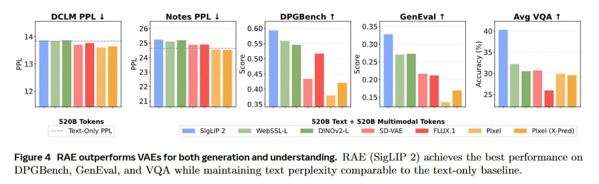
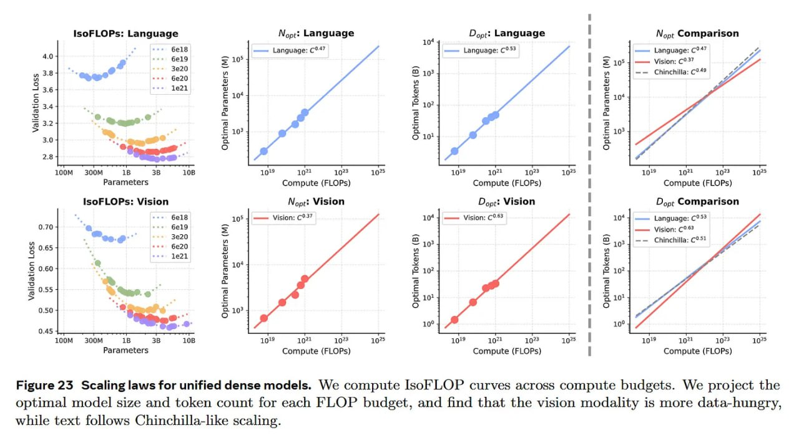
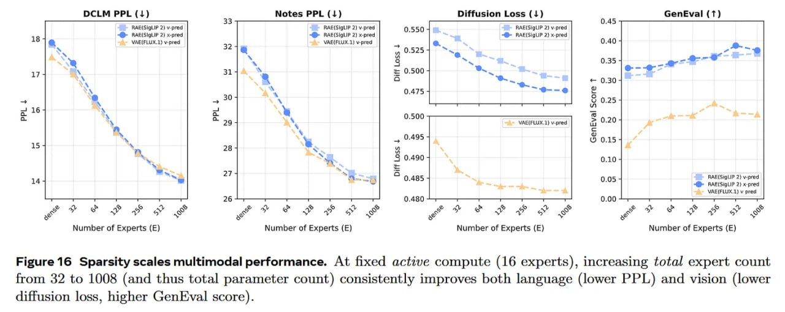
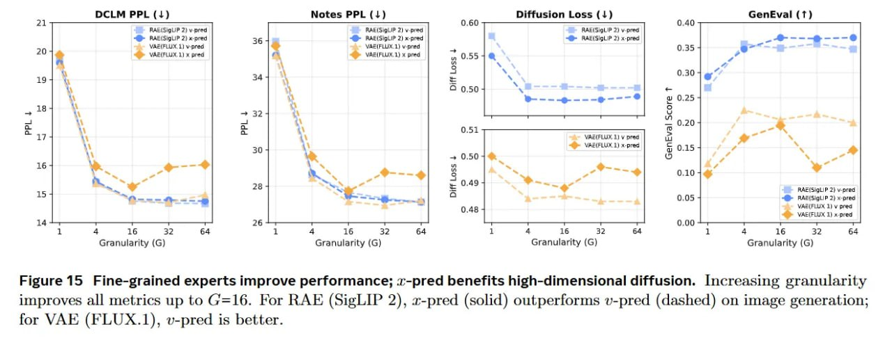
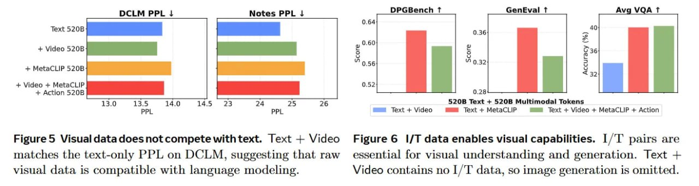
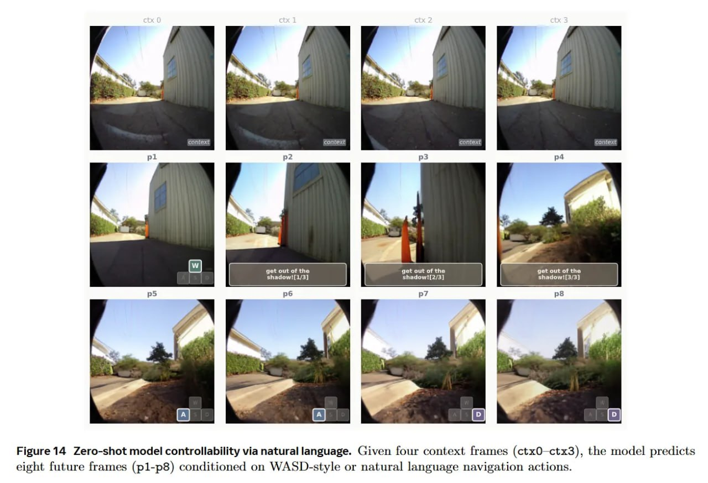
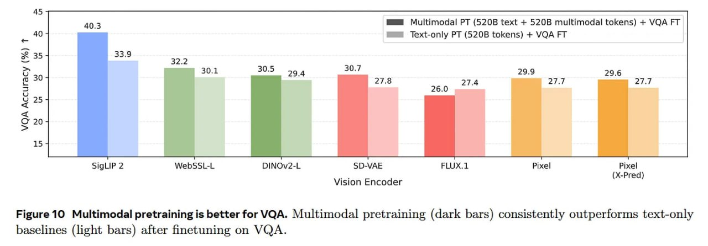
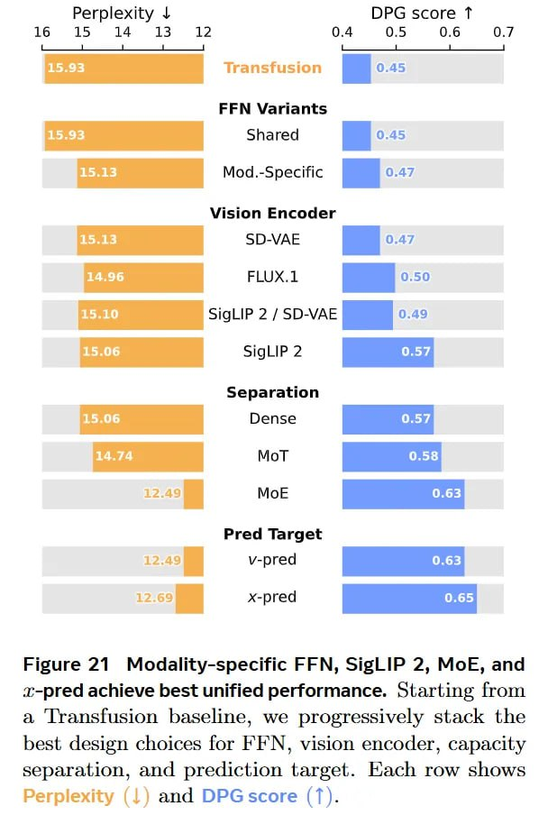

# Beyond Language Modeling: Унифицированное мультимодальное предобучение с нуля

## Краткое описание

**Beyond Language Modeling: An Exploration of Multimodal Pretraining** — контролируемое эмпирическое исследование унифицированного мультимодального предобучения с нуля от исследователей FAIR (Meta) и NYU. Работа демонстрирует, что единый автоэнкодер репрезентаций (Representation Autoencoder, RAE) отлично справляется и с пониманием, и с генерацией, а архитектура Mixture-of-Experts (MoE) естественно решает проблему асимметрии скейлинга между текстом и изображениями.

**Авторы:** Shengbang Tong, David Fan, John Nguyen, Ellis Brown, Gaoyue Zhou, Shengyi Qian, Boyang Zheng, Théophane Vallaeys, Junlin Han, Rob Fergus, Naila Murray, Marjan Ghazvininejad, Mike Lewis, Nicolas Ballas, Amir Bar, Michael Rabbat, Jakob Verbeek, Luke Zettlemoyer, Koustuv Sinha, Yann LeCun, Saining Xie

**Дата:** Март 2026

**Статья:** [arXiv:2603.03276](https://arxiv.org/abs/2603.03276)

**Сайт проекта:** [beyond-llms.github.io](https://beyond-llms.github.io/)

---

## Ключевые новшества

### 1. Унифицированное предобучение с нуля

Исследователи провели контролируемые эксперименты по обучению мультимодальных моделей **с нуля**, без использования предобученных LLM или специализированных визуальных адаптеров. Это позволило изолировать переменные, управляющие мультимодальным обучением, и картировать нативные законы скейлинга для унифицированных моделей.

### 2. Representation Autoencoder (RAE)

Вместо разделения на семантические энкодеры для понимания и VAE (например, SD-VAE) для генерации, авторы используют **единый автоэнкодер репрезентаций (RAE)** на основе замороженного семантического энкодера **SigLIP 2**.

**Результаты:**
- Замена стандартного VAE на RAE повышает метрику генерации DPG с **0.47 до 0.57**
- RAE сходится в **4 раза быстрее** по GenEval и в **4.6 раза быстрее** по DPG-Bench по сравнению с VAE (FLUX)
- Единый энкодер работает и для понимания, и для генерации

### 3. Mixture-of-Experts для асимметрии скейлинга

Авторы выявили серьёзную **асимметрию скейлинга** между модальностями:

| Модальность | Экспонента скейлинга (b) |
|-------------|-------------------------|
| Язык (Chinchilla-like) | b ≈ 0.53 |
| Зрение | b ≈ 0.63 (более прожорливо до данных) |

**Решение:** Архитектура MoE с **мелкомодульной маршрутизацией (G = 16)** гармонизирует скейлинг:
- Отвязывает общую ёмкость от активных вычислений
- Сдвигает экспоненту языкового скейлинга ближе к режиму зрения
- Gap между модальностями сокращается с **0.10 → 0.05**

**Практический результат:** MoE allocates **45% fewer active parameters** while training on **2–2.5× more tokens**.

### 4. Navigation World Models (NWM)

Унифицированный скейлинг приносит плоды в задачах физического ризонинга. Модель демонстрирует **zero-shot world modeling**:
- Генерирует темпорально и визуально согласованные роллауты видео
- Отвечает на out-of-distribution текстовые команды (например, «делай большие шаги вперёд»)
- Действия форматируются как текстовые токены (WASD или естественный язык)
- Не требуются специфичные для действий адаптеры

---

## Архитектура Transfusion

### Дискретные токены и непрерывные флоу

Модель объединяет два принципиально разных распределения:

**Для языка (L_LM):**
```
L_LM = -∑ log p_θ(x_i | x_{<i})
```
где p_θ — вероятности предсказаний модели для дискретных токенов x_i.

**Для зрения (L_flow):**
```
L_flow = E [ ||v_θ(z_t, t, ·) - (z_0 - ε)||^2_2 ]
```
где z_t = (1 - t)ε + t z_0 — интерполированное состояние, v_θ — предсказанное поле скоростей.

**Общая целевая функция:**
```
L = λ_LM * L_LM + λ_flow * L_flow
```

### Авторегрессионный мультимодальный механизм

**Форматирование последовательности:**
```
[Text Tokens] -> <BOI> -> [Visual Patches] -> <EOI>
```

1. Текст токенизируется через токенизатор LLaMA-3 в дискретные эмбеддинги
2. Видео обрабатывается покадрово через замороженный SigLIP 2 → непрерывные латентные патчи
3. Оба типа репрезентаций скармливаются в единый трансформерный бэкбон

**Гибридная маска внимания (FlexAttention):**
- Текстовые токены: строгая каузальная маска
- Визуальные патчи внутри <BOI>/<EOI>: двунаправленное внимание, но только на предыдущие токены

**Проекция на последнем слое:**
- Текстовые состояния → vocabulary head для L_LM
- Визуальные состояния → линейная проекция для L_flow

**Инференс:** Динамическое переключение между авторегрессионным сэмплированием текста и денойзингом патчей через сэмплер Эйлера после токена <BOI>.

---

## Балансировка и MoE

### Проблема конкуренции модальностей

Плотные (dense) сети заставляют язык и зрение конкурировать за одну ёмкость параметров. Отказ от MoE в пользу плотной модели:
- Увеличивает текстовую перплексию с **12.49 до 15.06**
- Сильно бьёт по текстовым способностям

### Гранулярность экспертов

Авторы ввели понятие **гранулярности эксперта**:
```
G = 4 * d_model / d_expert
```

**Результат:** Мелкомодульная маршрутизация (**G = 16**) значительно повышает качество обеих модальностей по сравнению со стандартными крупными экспертами.

### Адаптивное центрирование лосса

Для стабильного совместного предобучения при расходящихся величинах лоссов:

```
c_current = α * L_flow + (1 - α) * L_LM
```

где α ∈ [0, 1] задаёт приоритет модальности. Текущий центр обновляется через экспоненциальное скользящее среднее, автоматически балансируя веса лоссов.

---

## Законы скейлинга (IsoFLOP анализ)

### Плотные модели

| Модель | Язык (D_opt ∝ C^b) | Зрение (D_opt ∝ C^b) |
|--------|-------------------|---------------------|
| Dense | b ≈ 0.53 | b ≈ 0.63 |

**Проблема:** Для 1 триллиона параметров удовлетворение потребностей зрения в данных потребовало бы невозможных объёмов вычислений.

### MoE модели

MoE гармонизирует скейлинг:
- Gap между модальностями: **0.10 → 0.05**
- Обе модальности масштабируются эффективно
- World modeling saturates at **1% in-domain data** при предобучении на общих мультимодальных данных

---

## Ограничения

### Инженерные ограничения

- **Неравномерное распределение токенов по экспертам** создаёт боттлнеки в утилизации оборудования при распределённом обучении (до 128 H100/H200 GPU)

### Ограничения репрезентаций

- SigLIP 2 обеспечивает превосходное понимание и высокоуровневую когерентность генерации
- **Послойный пробинг** показывает: в глубоких слоях отбрасывается мелкозернистая пространственная информация
- В абсолютной точности реконструкции на уровне пикселей RAE немного отстаёт от специализированных VAE

---

## Архитектурный контекст

### Связь с предыдущими работами

- **Transfusion** ([arXiv:2408.11039](https://arxiv.org/abs/2408.11039)) — базовый фреймворк, объединяющий next-token prediction и diffusion
- Эта работа расширяет Transfusion, доказывая работу на больших масштабах **без U-Net-подобных архитектур**

---

## Иллюстрации

### Общая архитектура исследования


**Рисунок 1:** Общая архитектура модели. Верх: модель обучается с next-token prediction для текста и flow matching для зрения. Низ: пять осей исследования — визуальные репрезентации, данные, world modeling, архитектура и скейлинг.

### RAE превосходит VAE



**Рисунок 4:** RAE (SigLIP 2) достигает лучших результатов на DPGBench, GenEval и VQA, сохраняя перплексию текста сравнимой с text-only baseline.

### Законы скейлинга



**Рисунок 23:** Законы скейлинга для унифицированных плотных моделей. IsoFLOP кривые показывают, что зрение более прожорливо до данных, тогда как текст следует Chinchilla-подобному скейлингу.

### MoE и разреженность



**Рисунок 16:** Разреженность масштабирует мультимодальную производительность. При фиксированных активных вычислениях (16 экспертов) увеличение общего количества экспертов с 32 до 1008 улучшает и язык (ниже PPL), и зрение (ниже diffusion loss, выше GenEval).



**Рисунок 15:** Мелкомодульные эксперты улучшают производительность; x-pred benefits high-dimensional diffusion. Увеличение гранулярности улучшает все метрики до G=16. Для RAE (SigLIP 2) x-pred (сплошная линия) превосходит v-pred (пунктир) на генерации изображений.

### Конкуренция модальностей



**Рисунок 5:** Визуальные данные не конкурируют с текстом. Text + Video соответствует text-only PPL на DCLM, что говорит о совместимости визуальных данных с языковым моделированием.

### Zero-shot controllability



**Рисунок 14:** Zero-shot контролируемость модели — генерация видео в ответ на текстовые команды.

### Мультимодальное предобучение



**Рисунок 10:** Мультимодальное предобучение превосходит унимодальное.

### Modality-specific FFN



**Рисунок 21:** Modality-specific FFN для SigLIP — разделение экспертов по модальностям улучшает обучение.

### Сравнение с альтернативами

| Подход | Архитектура | Энкодеры |
|--------|-------------|----------|
| **Beyond LM** | Unified Transformer | Единый RAE (SigLIP 2) |
| **Janus series** | Two-encoder | Разные для генерации/понимания |
| **Chameleon** | Early-fusion | Unified approach |

**Вывод:** Работа бросает вызов философии двух энкодеров, показывая, что один RAE может сравниться со специализированными моделями.

---

## Итоги и рекомендации

### Ключевые инсайты

1. **Конкуренция модальностей** — архитектурный артефакт жёсткого распределения ёмкости, а не фундаментальный недостаток
2. **MoE с мелкомодульным роутингом** элегантно решает проблему асимметрии скейлинга
3. **Единое пространство семантических репрезентаций** (RAE/SigLIP 2) работает для обеих задач
4. **Структурная разреженность** балансирует асимметричный голод к данным у текстов и физической реальности

### Рекомендации для foundation-моделей

- Отказывайтесь от постфактум прикручивания модальностей (замороженные LLM + визуальные адаптеры)
- Используйте единое пространство семантических репрезентаций
- Полагайтесь на структурную разреженность (MoE) для балансировки модальностей
- Обучайте модели с нуля для изоляции нативной механики скейлинга

---

## Связи с другими темами

- [[../../algorithms/neural_networks/transformers/mixture_of_experts.md]] — Смесь экспертов (MoE): архитектурный подход с разреженной активацией
- [[../../algorithms/neural_networks/architectures/flow_matching.md]] — Flow Matching: метод обучения генеративных моделей с непрерывными потоками
- [[../../applications/generative_models/representation_autoencoders_rae.md]] — Representation Autoencoders (RAE): альтернатива VAE для генерации изображений
- [[../../applications/computer_vision/multimodal_models.md]] — Мультимодальные модели (CLIP, SigLIP): общие понятия и применение
- [[../../vision_transformers/attention_mechanisms/siglip.md]] — SigLIP: визуальный энкодер с сигмоидной функцией потерь
- [[../../algorithms/specialized/diffusion_models/architectures/diffusion_language_models_overview.md]] — Transfusion: мультимодальная генерация (текст + изображения)
- [[../../ai/world_models/index.md]] — World Models: модели, предсказывающие эволюцию состояний в средах
- [[../../algorithms/neural_networks/transformers/models/multimodal/index.md]] — Мультимодальные трансформерные архитектуры

---

## Источники

1. **Beyond Language Modeling: An Exploration of Multimodal Pretraining** — Shengbang Tong et al., FAIR, NYU, 2026. arXiv:2603.03276. [https://arxiv.org/abs/2603.03276](https://arxiv.org/abs/2603.03276)
   - Основная статья с методологией, экспериментами и законами скейлинга
   - Сайт проекта: [https://beyond-llms.github.io/](https://beyond-llms.github.io/)

2. **Ревью на arxivIQ** — [https://arxiviq.substack.com/p/beyond-language-modeling-an-exploration](https://arxiviq.substack.com/p/beyond-language-modeling-an-exploration)
   - Разбор ключевых результатов и архитектурных решений

3. **Transfusion: Predict the Next Token and Diffuse Images with a Multi-Modal Transformer** — Meta FAIR, 2024. arXiv:2408.11039. [https://arxiv.org/abs/2408.11039](https://arxiv.org/abs/2408.11039)
   - Базовый фреймворк, объединяющий next-token prediction и diffusion

4. **SigLIP 2: Multilingual Vision-Language Encoders with Improved Semantic Understanding** — Tschannen et al., 2025. arXiv:2502.14786. [https://arxiv.org/abs/2502.14786](https://arxiv.org/abs/2502.14786)
   - Визуальный энкодер, используемый в RAE

5. **FlexAttention** — arXiv:2412.05496. [https://arxiv.org/abs/2412.05496](https://arxiv.org/abs/2412.05496)
   - Реализация гибридной маски внимания

6. **LLaMA-3 Tokenizer** — arXiv:2407.21783. [https://arxiv.org/abs/2407.21783](https://arxiv.org/abs/2407.21783)
   - Токенизатор для дискретных текстовых эмбеддингов

---

## Дополнительные материалы

- **Chinchilla: Training Compute-Optimal Large Language Models** — arXiv:2203.15556. [https://arxiv.org/abs/2203.15556](https://arxiv.org/abs/2203.15556)
- **SD-VAE** — arXiv:2112.10752. [https://arxiv.org/abs/2112.10752](https://arxiv.org/abs/2112.10752)
- **Janus Series** — arXiv:2410.13848. [https://arxiv.org/abs/2410.13848](https://arxiv.org/abs/2410.13848)
- **Chameleon** — arXiv:2405.09818. [https://arxiv.org/abs/2405.09818](https://arxiv.org/abs/2405.09818)

```metadata
category: ai
subcategory: vision_language_models
tags: мультимодальное_обучение, multimodal_pretraining, RAE, MoE, flow_matching, Transfusion, SigLIP_2, world_modeling, скейлинг, FAIR, NYU
```
