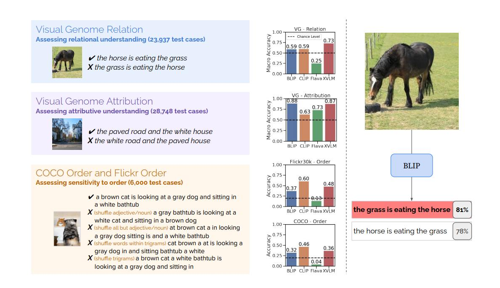
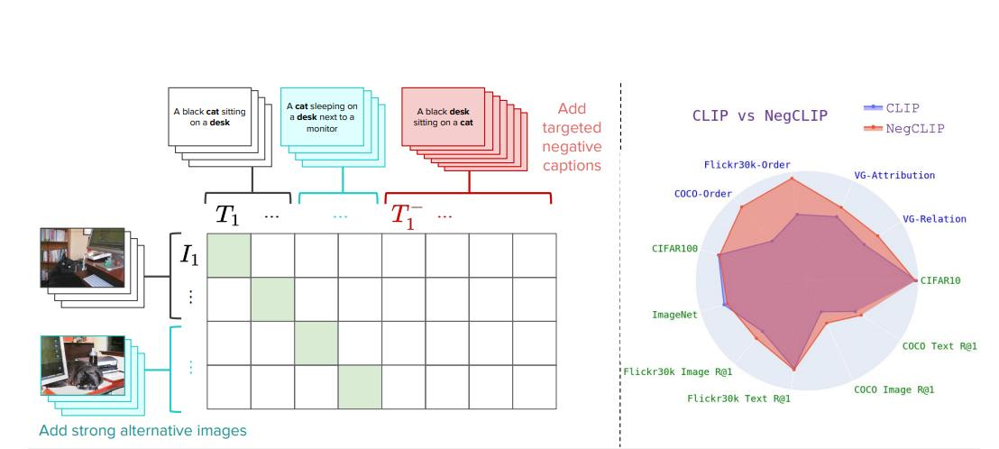

# Проблема bags-of-words в визуально-языковых моделях (VLM)

## Краткое описание

**Проблема bags-of-words (BoW)** в визуально-языковых моделях (VLM) — это явление, при котором модели, такие как CLIP, ведут себя так, будто текст — просто набор слов без учёта структуры, порядка слов и отношений между объектами. Несмотря на то, что VLM должны понимать смысл, порядок и отношения между объектами, на практике они часто игнорируют синтаксис и ловят только поверхностные совпадения слов.

Эта проблема была систематически исследована в работе "When and why vision-language models behave like bags-of-words, and what to do about it?", где авторы предложили бенчмарк ARO для оценки этой проблемы и метод NegCLIP для её решения.

## Бенчмарк ARO (Attribution, Relation, and Order)

Авторы создали специальный бенчмарк **ARO (Attribution, Relation, and Order)** для тестирования трёх ключевых аспектов понимания VLM:

### 1. Отношения между объектами (Relation)
Тестирует, понимает ли модель отношения между объектами:
- Пример: "horse eats grass" vs "grass eats horse"
- Модель должна выбрать корректное описание изображения
- Многие модели не проходят порог случайного угадывания (0.5)

### 2. Атрибуты объектов (Attribution)
Проверяет, различает ли модель атрибуты:
- Пример: "paved road" vs "white road"
- Модель должна связать правильный атрибут с правильным объектом

### 3. Порядок слов (Order)
Оценивает чувствительность к порядку слов:
- Тесты с перестановкой слов в подписях
- Многие модели показывают результаты на уровне случайного выбора

## Датасеты для тестирования

### Visual Genome (VG)
- Берётся картинка и две подписи — правильная и с переставленными словами
- Модели должны выбрать корректный вариант
- На графиках видно, что не все модели уверенно проходят порог 0.5
- Например, Flava в некоторых настройках чаще выбирает неправильные подписи

### COCO Order
- Расширяет тесты за счёт различных видов искажений:
  - Перемешивание существительных и прилагательных
  - Перемешивание почти всех слов
  - Перемешивание слов внутри триграмм

### Flickr Order
- Аналогично COCO Order
- Создаётся набор, где рядом стоит оригинальный текст и несколько "сломанных" вариантов

## Эксперименты с CLIP

### Можно ли обучить CLIP как BoW?

Авторы проверили, что будет, если обучить CLIP так, чтобы текстовый энкодер вообще не видел порядок слов:

**Методология**:
- Текст подаётся как bag-of-words (без учёта порядка)
- Оцениваются retrieval-метрики

**Результат**:
- Качество падает совсем немного
- Модель можно обучить на беспорядочных текстах, и она всё равно будет работать почти так же
- Это подтверждает гипотезу, что CLIP-подобные модели часто не используют синтаксис и порядок, а просто ловят совпадения слов

### Эксперимент с изображениями

Авторы провели аналогичный тест для визуального энкодера:

**Методология**:
- Изображение режется на патчи 3×3
- Патчи перемешиваются случайным образом
- Оценивается качество модели

**Результат**:
- Качество падает сильнее, чем при BoW-представлении текста
- Но всё равно остаётся приемлемым
- Вывод: даже порядок визуальных частей модели часто не критичен

## Причины проблемы

### 1. Контрастивное обучение
Стандартное contrastive learning (InfoNCE loss) слишком легко проходит на поверхностных совпадениях:
- Модель учится находить простые корреляции между словами и визуальными паттернами
- Нет необходимости понимать структуру предложения

### 2. Архитектурные ограничения
- Текстовые энкодеры в CLIP не всегда эффективно кодируют порядок слов
- Внимание к ключевым словам может быть достаточным для хороших retrieval-метрик

### 3. Данные обучения
- Пары изображение-текст из интернета часто содержат шум
- Модель может учиться на поверхностных статистических закономерностях

## Последствия

### Для практического применения
- **Поиск изображений**: может работать хорошо на простых запросах
- **Сложные запросы**:fails на запросах, требующих понимания отношений
- **Безопасность**: уязвимость к адверсарным атакам через перестановку слов

### Для исследований
- Необходимость новых архитектур и методов обучения
- Важность оценки не только retrieval-метрик, но и понимания структуры

## Решение: NegCLIP

Для решения проблемы bags-of-words авторы предложили **NegCLIP** — метод с улучшенным контрастивным обучением.

### Основные идеи NegCLIP

1. **Strong alternative images**:
   - Самые похожие картинки по эмбеддингам CLIP
   - Добавляются как сильные негативы
   - Заставляют модель учиться более тонким различиям

2. **Targeted negative captions**:
   - Подписи, где слова специально переставлены или подменены
   - Создают "жёсткие" негативные примеры
   - Требуют от модели понимания структуры, а не только слов

### Результаты NegCLIP

По итоговой диагrame видно, что NegCLIP заметно улучшает результаты на:
- **VG-Relation**: понимание отношений между объектами
- **VG-Attribution**: правильное связывание атрибутов с объектами
- **COCO-Order**: чувствительность к порядку слов
- **Flickr-Order**: устойчивость к перестановкам

## Новые концепции и термины

- **Bags-of-words (BoW) поведение**: когда модель игнорирует порядок слов и структуру предложения
- **ARO бенчмарк**: Attribution, Relation, Order — три аспекта понимания VLM
- **NegCLIP**: метод контрастивного обучения с hard negative mining для VLM
- **Strong alternative images**: визуально похожие изображения как сложные негативы
- **Targeted negative captions**: текстовые негативы с переставленными словами

## Примеры применения

### Оценка моделей
- Использование ARO бенчмарка для тестирования новых VLM
- Сравнение архитектур на чувствительность к порядку слов

### Улучшение обучения
- Применение hard negative mining в контрастивном обучении
- Добавление структурированных негативных примеров

## Связи с другими темами

- [[negclip.md]] - Метод NegCLIP для решения проблемы BoW
- [[../applications/computer_vision/multimodal_models.md]] - Общие понятия о мультимодальных моделях, включая CLIP
- [[../applications/computer_vision/vl_jepa_model.md]] - Альтернативный подход к VLM без авторегрессии
- [[../llm/models/qwen/vlm_models.md]] - Другие визуально-языковые модели
- [[contrastive_learning.md]] - Контрастивное обучение, используемое в CLIP
- [[typography_gap_in_vlm.md]] - Другая форма поверхностного восприятия в VLM: модели читают текст, но не видят шрифт (typography blindness)

## Источники

1. [When and why vision-language models behave like bags-of-words, and what to do about it?](https://openreview.net/forum?id=KRLUvxh8uaX) - Основная статья о проблеме BoW в VLM и методе NegCLIP, авторы: Mert Yuksekgonul, Federico Bianchi, Pratyusha Kalluri, Dan Jurafsky, James Zou
2. [GitHub репозиторий с кодом и экспериментами](https://github.com/mertyg/vision-language-models-are-bows) - Код и данные для воспроизведения экспериментов
3. [Visual Genome Dataset](https://visualgenome.org/) - Датасет, используемый в бенчмарке ARO
4. [COCO Dataset](https://cocodataset.org/) - Датасет для тестирования порядка слов
5. [Flickr30k Dataset](https://shannon.cs.illinois.edu/DenotationGraph/) - Датасет для оценки VLM

## Медиафайлы

 <!-- TODO: Broken image path -->
*Рисунок: Оценка отношений на Visual Genome — пример теста из бенчмарка ARO, где модель должна выбрать правильное описание изображения*

 <!-- TODO: Broken image path -->
*Рисунок: Обзор бенчмарка ARO и результатов различных моделей на тестах Relation, Attribution и Order*
