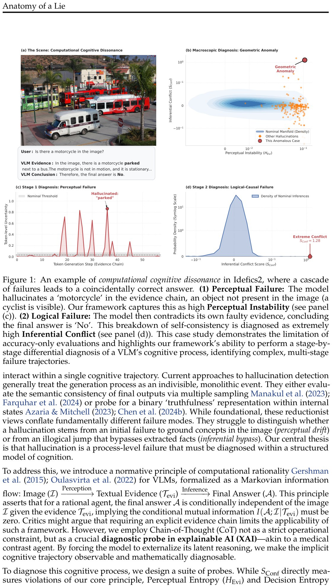

# Cognitive Anomaly Detection (CAD): Многоэтапный диагностический фреймворк для детекции галлюцинаций в VLM

## Краткое описание

**Anatomy of a Lie: A Multi-Stage Diagnostic Framework for Tracing Hallucinations in Vision-Language Models** — работа исследователей из Национального университета Сингапура (NUS) и Университета Монаша, предлагающая новую парадигму диагностики галлюцинаций в визуально-языковых моделях (VLM). Авторы переосмысливают галлюцинации не как статические ошибки вывода, а как **динамические патологии вычислительного познания** модели.

**Авторы:** Lexiang Xiong, Qi Li, Jingwen Ye, Xinchao Wang

**Организации:** National University of Singapore, Monash University

**Дата:** Март 2026

**Статья:** [arXiv:2603.15557](https://arxiv.org/abs/2603.15557)

**Код:** [GitHub - CAD](https://github.com/Lexiang-Xiong/CAD)

---

## Ключевая проблема: Вычислительный когнитивный диссонанс

Авторы начинают с поразительного парадокса: когда VLM спрашивают «Есть ли мотоцикл на изображении?», модель может уверенно галлюцинировать доказательства — «На изображении мотоцикл припаркован рядом с автобусом» — но затем необъяснимо заключить: «Следовательно, окончательный ответ — Нет».

Этот каскад ошибок назван **вычислительным когнитивным диссонансом** (computational cognitive dissonance). Что делает этот случай особенно драматичным — **двойная ошибка** (восприятие несуществующего объекта, затем логическое противоречие этому восприятию) приводит к **случайно правильному финальному ответу**.

 <!-- TODO: Broken image path -->

**Image shows:** Figure 1 — Пример вычислительного когнитивного диссонанса в Idefics2, где каскад ошибок приводит к случайно правильному ответу. (1) Перцептивная ошибка: модель галлюцинирует «мотоцикл» в цепочке доказательств, объект, отсутствующий на изображении (виден велосипедист). Фреймворк фиксирует это как высокую перцептивную нестабильность. (2) Логическая ошибка: модель противоречит своим собственным ошибочным доказательствам, заключая, что финальный ответ — «Нет». Этот распад самосогласованности диагностируется как экстремально высокий логический конфликт.

### Ключевой инсайт

Галлюцинации редко бывают монолитными ошибками, диагностируемыми одной метрикой вроде «точности» или «самосогласованности». Вместо этого они часто представляют собой **комплексные многоэтапные патологии**, где различные ошибки — такие как перцептивный дрейф (perceptual drift) и логический обход (inferential bypass) — компонируются и взаимодействуют в рамках единой когнитивной траектории.

---

## Нормативный принцип вычислительной рациональности

Авторы вводят нормативный принцип вычислительной рациональности для VLM, формализованный как **марковианский информационный поток**:

```
Image (I) → Perception → Textual Evidence (T_evi) → Inference → Final Answer (A)
```

Этот принцип утверждает, что для рационального агента **финальный ответ A условно независим от изображения I при наличии доказательств T_evi**, что подразумевает:

```
I(A; I | T_evi) = 0
```

То есть условная взаимная информация между финальным ответом и изображением при условии доказательств должна быть равна нулю.

**Важное замечание:** Авторы используют Chain-of-Thought (CoT) не как строгое операционное ограничение, а как **диагностический зонд в explainable AI (XAI)** — аналогично медицинскому контрастному агенту. Принуждая модель экстернализировать её латентные рассуждения, неявная когнитивная траектория становится наблюдаемой и математически диагностируемой.

---

## Три диагностических зонда и когнитивное пространство состояний

Для диагностики когнитивного процесса авторы проектируют высокоразмерную внутреннюю траекторию генерации в **интерпретируемое 3D когнитивное пространство состояний** (Cognitive State Space). Каждая генерация представляется как **Cognitive State Vector**:

```
v = [H_Evi, S_Conf, H_Ans]
```

### 1. Перцептивная нестабильность (H_Evi)

**Perceptual Entropy (H_Evi)** измеряет неопределённость на этапе восприятия (I → T_evi).

**Методология:**
- Моделируют выбор токена на каждом шаге как бернуллиевское испытание: C_i ∈ {Factual, Uncertain}
- Определяют два непересекающихся множества токенов: фактуальное множество V_f и множество неопределённости V_u
- Для логитов l_i каждого токена проецируют softmax-распределение на семантическую ось
- Вычисляют энтропию Шеннона на уровне токена: H_i = H(C_i)
- Финальная метрика — усреднённая по пути энтропия:

```
H_Evi = (1/|T_evi|) × Σ H_i
```

**Интерпретация:** Высокий H_Evi сигнализирует о нестабильной стартовой точке когнитивной траектории — модель неуверена в том, что «видит» на изображении.

### 2. Логико-причинный сбой (S_Conf)

**Inferential Conflict (S_Conf)** напрямую квантует нарушение нормативного принципа — измеряет «утечку информации» между изображением и финальным ответом в обход доказательств.

**Методология:**
- Оценивает Conditional Pointwise Mutual Information (CPMI)
- Измеряет силу нелегального прямого причинного пути от I к A
- Вычисляется как лог-разность вероятностей:

```
S_Conf = log(p_v(A_token | I, T_evi) / p_t(A_token | T_evi))
```

где:
- p_v — вероятность с визуальным контекстом
- p_t — контрфактуальная вероятность без визуального входа (с аблированным изображением)

**Интерпретация:** Большой положительный S_Conf указывает на сильный прямой информационный поток от визуального входа к финальному ответу, не опосредованный доказательствами — нарушение d-сепарации.

**Практическое условие:** Архитектура VLM должна позволять причинное вмешательство (аблирование изображения).

### 3. Решающая неоднозначность (H_Ans)

**Decision Entropy (H_Ans)** измеряет финальную неопределённость на терминальной стадии траектории.

**Методология:**
- Вычисляет энтропию распределения вероятностей над возможными финальными ответами

```
H_Ans = -Σ p(a) × log(p(a))
```

**Интерпретация:** Высокая энтропия указывает, что система не сошлась к стабильному, определённому состоянию — модель «не уверена» в своём ответе.

---

## Геометрически-информационная дуальность

Центральное теоретическое открытие работы — **геометрически-информационная дуальность** (geometric-information duality):

> Геометрическая аномальность когнитивной траектории в пространстве состояний фундаментально эквивалентна её высокой информационно-теоретической сюрпризальности.

**Нормативные когнитивные траектории** эволюционируют к стабильным «бассейнам притяжения» с низкой энергией, формируя плотное подмногообразие (dense submanifold).

**Галлюцинации** — это высокоэнергетические отклонения, «вытолкнутые» за пределы этого многообразия, проявляющиеся как **геометрические аномалии**.

Эта дуальность служит теоретическим мостом, переводящим семантическую проблему галлюцинации в строгую задачу **геометрического обнаружения аномалий**.

---

## Алгоритм CAD: Диагностика через обнаружение геометрических аномалий

Фреймворк работает в два этапа:

### Этап 1: Обучение геометрии номинального когнитивного пространства

**Калибровка** выполняется на калибровочном наборе D_cal и требует **только ground-truth финальных ответов** (например, «Да»/«Нет») — форма слабого супервизия, vastly более доступная и масштабируемая, чем получение тонкозернистых токенизированных меток галлюцинаций.

**Процесс:**
1. Генерируют когнитивные траектории для калибровочных данных
2. Извлекают 3D векторы v = [H_Evi, S_Conf, H_Ans]
3. Применяют **Coherence Filter**: отбирают только правильные финальные ответы и исключают «удачные догадки» (например, когда модель отвечает «Да», но её доказательства явно утверждают «Такого объекта нет на изображении»)
4. Стандартизируют каждое измерение
5. Определяют оптимальное число компонент GMM через Bayesian Information Criterion (BIC)
6. Фитируют **Gaussian Mixture Model (GMM)** для моделирования плотности p(v | nominal)

**Гипотеза:** Ландшафт номинальных состояний мультимодальный — различные типы валидных когнитивных процессов (например, простое распознавание объектов vs. комплексный реляционный ризонинг) могут формировать различные плотные кластеры.

### Этап 2: Диагностика галлюцинации как высоко-сюрпризального когнитивного события

С точки зрения информационной геометрии, галлюцинация — это когнитивный процесс, чей вектор состояния v **геометрически удалён** от изученных областей с высокой плотностью (аттракторов).

**Hallucination Score** — это self-information content (сюрпризальность) наблюдения этого атипичного вектора состояния:

```
S_hall = -log p(v_new | M_GMM)
```

Эта метрика квантует «неожиданность» наблюдаемой когнитивной траектории. Номинальные процессы — частые, предсказуемые, низкоинформационные события; галлюцинации — редкие, высокоинформационные отклонения.

### Алгоритм 1: Cognitive Anomaly Detection Framework (CAD)

```
Function DIAGNOSEHALLUCINATION(I, Q, M, CalibratedComponents):
    1. (M_GMM, μ, σ) ← CalibratedComponents
    
    2. // Генерация когнитивной траектории и извлечение метрик
    3. (T_evi, A_model, scores) ← M.generate(I, Q, output_scores=True)
    4. H_Evi ← CalcPerceptualEntropy(scores_evi)
    5. S_Conf ← CalcInferentialConflict(I, Q, T_evi, M)
    6. H_Ans ← CalcDecisionEntropy(scores_ans)
    
    7. // Вычисление аномалии в когнитивном пространстве
    8. v_new ← [H_Evi, S_Conf, H_Ans]
    9. Стандартизация v_new используя μ, σ
    10. S_hall ← -log p(v_new | M_GMM)
    
    11. return S_hall
```

**Примечание:** CalibratedComponents предварительно вычисляются офлайн фитированием GMM на векторах когнитивных состояний из очищенного набора не-галлюцинаторных сэмплов.

---

## Результаты экспериментов

### Бенчмарки

Фреймворк валидирован на спектре задач:
- **POPE** (Adversarial subset) — контролируемый бинарный QA
- **MME** — комплексный ризонинг и перцепция
- **MS-COCO** — неограниченное открытое каптионирование

### Таблица 1: AUC на POPE (Adversarial)

| Метод | Cost | Llava-v1.6 | Idefics2 | Qwen2-VL | DeepSeek-VL | Average |
|-------|------|------------|----------|----------|-------------|---------|
| Token Entropy | 1x | 0.603 | 0.806 | 0.409 | 0.732 | 0.638 |
| Neg Log Prob | 1x | 0.604 | 0.832 | 0.428 | 0.710 | 0.644 |
| Supervised Probe | 1x | 0.787 | 0.898 | 0.762 | 0.715 | 0.791 |
| Semantic Entropy | 10x | 0.711 | 0.751 | 0.673 | 0.702 | 0.709 |
| **Ours (CAD)** | **1x** | **0.910** | **0.947** | **0.776** | **0.798** | **0.858** |

### Таблица 2: Macro-averaged AUC на MME

| Метод | Llava-v1.6 | Idefics2 | Qwen2-VL | DeepSeek-VL | Average |
|-------|------------|----------|----------|-------------|---------|
| Token Entropy | 0.5106 | 0.5486 | 0.5291 | 0.6687 | 0.5643 |
| Neg Log Prob | 0.5061 | 0.5449 | 0.5136 | 0.6578 | 0.5556 |
| Supervised Probe | 0.7620 | 0.7905 | 0.7408 | 0.7104 | 0.7509 |
| Semantic Entropy | 0.6811 | 0.7081 | 0.6616 | 0.6199 | 0.6677 |
| **Ours (CAD)** | **0.8514** | **0.8411** | **0.7233** | **0.7680** | **0.7960** |

**Ключевые результаты:**
- **SOTA производительность** на всех бенчмарках
- **Однопроходный** (single-pass) метод — требует только одну генерацию плюс один не-авторегрессивный forward pass
- **Слабое супервизирование** — требует только ground-truth финальных ответов, не тонкозернистых меток галлюцинаций
- **Робастность к шуму** — остаётся высоко робастным даже при загрязнении калибровочных данных до **30% шума**

---

## Практические преимущества фреймворка

### 1. Эффективность
- **Однопроходный метод** — значительно быстрее мульти-сэмпл методов консистентности
- После калибровки требует только начальную генерацию и один не-авторегрессивный forward pass через языковой декодер
- Высоко масштабируем для реального деплоя

### 2. Слабое супервизирование
- Требует только ground-truth финальных ответов
- Не требует дорогих, часто неоднозначных токенизированных аннотаций галлюцинаций
- Vastly более доступен и масштабируем

### 3. Робастность
- Остаётся высоко робастным при загрязнении калибровочных данных до 30% шумом
- Устойчив к «удачным догадкам» благодаря Coherence Filter

### 4. Интерпретируемость
- Обеспечивает **причинную атрибуцию ошибок** — маппинг наблюдаемых ошибок на различные патологические состояния:
  - Перцептивная нестабильность (H_Evi)
  - Логико-причинный сбой (S_Conf)
  - Решающая неоднозначность (H_Ans)
- Открывает путь к построению AI систем, чьи рассуждения прозрачны, аудируемы и диагностируемы по дизайну

---

## Новые концепции и термины

- **Вычислительный когнитивный диссонанс** (Computational Cognitive Dissonance) — каскад ошибок в VLM, где перцептивная ошибка компонируется с логическим противоречием, иногда приводя к случайно правильному ответу
- **Нормативный принцип вычислительной рациональности** — аксиома, что финальный ответ должен быть условно независим от изображения при наличии доказательств: I(A; I | T_evi) = 0
- **Когнитивное пространство состояний** (Cognitive State Space) — 3D интерпретируемое пространство, спроектированное из высокоразмерной траектории генерации
- **Cognitive State Vector** — вектор v = [H_Evi, S_Conf, H_Ans], представляющий одну когнитивную траекторию
- **Геометрически-информационная дуальность** — принцип, что геометрическая аномальность траектории эквивалентна её высокой информационно-теоретической сюрпризальности
- **Перцептивная нестабильность (H_Evi)** — метрика неопределённости на этапе восприятия
- **Логический конфликт (S_Conf)** — метрика нарушения нормативного принципа, измеряющая утечку информации
- **Решающая неоднозначность (H_Ans)** — метрика финальной неопределённости
- **Coherence Filter** — этап очистки калибровочных данных для исключения «удачных догадок»

---

## Связи с другими темами

- [[clip_bow_problem.md]] — Проблема bags-of-words в VLM: поверхностное восприятие визуального контента, где модели игнорируют структуру и порядок
- [[modality_gap.md]] — Разрыв модальностей в мультимодальных LLM: снижение производительности, когда текст подаётся как изображение
- [[typography_gap_in_vlm.md]] — Типографическая слепота VLM: модели распознают содержание текста, но не его визуальное оформление
- [[beyond_language_modeling_multimodal_pretraining.md]] — Унифицированное мультимодальное предобучение: исследование скейлинга и архитектуры мультимодальных моделей
- [[../../algorithms/neural_networks/transformers/hallucination_detection/hallucinations_in_llm.md]] — Обнаружение галлюцинаций в языковых моделях: общие подходы и методы для LLM, включая PsiloQA и Binary RAR
- [[../../algorithms/neural_networks/transformers/hallucination_detection/psiloqa.md]] — Многоязычная система обнаружения галлюцинаций на уровне спанов
- [[../../algorithms/neural_networks/transformers/hallucination_detection/binary_rar.md]] — Метод обучения с бинарным вознаграждением для снижения галлюцинаций
- [[../../applications/computer_vision/multimodal_models.md]] — Мультимодальные модели: общие понятия и применение

---

## Источники

1. **Anatomy of a Lie: A Multi-Stage Diagnostic Framework for Tracing Hallucinations in Vision-Language Models** — Lexiang Xiong, Qi Li, Jingwen Ye, Xinchao Wang
   - National University of Singapore, Monash University, 2026
   - URL: [https://arxiv.org/abs/2603.15557](https://arxiv.org/abs/2603.15557)
   - GitHub: [https://github.com/Lexiang-Xiong/CAD](https://github.com/Lexiang-Xiong/CAD)
   - Ключевые результаты: SOTA на POPE (0.858 avg AUC), MME (0.796 avg AUC), MS-COCO
   - Метрики: H_Evi (Perceptual Entropy), S_Conf (Inferential Conflict), H_Ans (Decision Entropy)

2. **Ревью на ChatPaper** — [https://chatpaper.com/zh-CN/paper/253112](https://chatpaper.com/zh-CN/paper/253112)
   - Краткое изложение работы на китайском языке

3. **PDF версия статьи** — [https://arxiv.org/pdf/2603.15557](https://arxiv.org/pdf/2603.15557)
   - Полная версия с деталями методологии и экспериментов

---

## Дополнительные материалы

- **CHAIR Metric** — Rohrbach et al., 2018. Пионерская метрика для измерения галлюцинированных объектов в каптионах
- **POPE Benchmark** — Li et al., 2023. Стабильный polling-based бенчмарк для оценки галлюцинаций VLM
- **MME Benchmark** — Fu et al. Комплексный бенчмарк для мультимодального ризонинга и перцепции
- **MS-COCO** — Lin et al., 2014. Датасет для неограниченного открытого каптионирования
- **VADE** — Prabhakaran et al., 2025. Метод анализа attention map sequences для детекции галлюцинаций
- **Hallucination-Induced Optimization (HIO)** — Chen et al., 2024a. Метод с «evil» моделью для контрастивного сигнала

```metadata
category: ai
subcategory: vision_language_models
tags: VLM_галлюцинации, cognitive_anomaly_detection, CAD, вычислительный_когнитивный_диссонанс, H_Evi, S_Conf, H_Ans, геометрическая_аномалия, NUS, 2026
```
