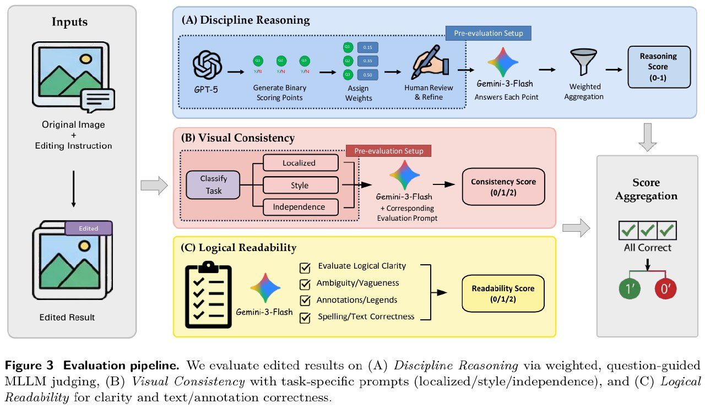

# GRADE: Benchmarking Discipline-Informed Reasoning in Image Editing

**GRADE** (Grounded Reasoning Assessment for Discipline-informed Editing) — первый бенчмарк для оценки способности мультимодальных моделей выполнять редактирование изображений с использованием дисциплинарных знаний и логического вывода.

> **Ключевая проблема:** Современные бенчмарки для image editing проверяют в основном простые инструкции типа "сделай небо розовым" на естественных изображениях, не требуя реальных предметных знаний. GRADE поднимает планку, требуя от моделей редактирования научных изображений с использованием дисциплинарных знаний уровня PhD.

## Обзор

| Характеристика | Значение |
|----------------|----------|
| **Количество задач** | 520 carefully curated samples |
| **Академических дисциплин** | 10 (от естественных до социальных наук) |
| **Дата публикации** | March 13, 2026 |
| **Авторы** | Shanghai Jiao Tong University и др. |
| **Тип оценки** | Multi-dimensional automated evaluation |

## Академические дисциплины

GRADE охватывает 10 академических дисциплин с иерархической категоризацией (второй уровень поддисциплин):

1. **Mathematics** — plane geometry, solid geometry, functions, graph and statistics
2. **Physics**
3. **Chemistry** — chemical structures, reaction diagrams
4. **Biology**
5. **History**
6. **Geography**
7. **Sports**
8. **Music**
9. **Computer Science**
10. **Economics** — market equilibrium, supply/demand curves

### Примеры задач

- Нарисовать кратчайший путь в графе (CS/Math)
- Добавить энантиомер молекулы (Chemistry)
- Отметить новое рыночное равновесие на графике спроса (Economics)
- Исправить геометрические диаграммы
- Модифицировать химические структуры
- Уточнить визуализации данных

## Метрики оценки

GRADE вводит **трёхмерную систему оценки**, выходящую за рамки эстетического качества и реалистичности:

### 1. Discipline Reasoning (Дисциплинарное рассуждение)

**Цель:** Оценка правильности применения дисциплинарных знаний при редактировании.

**Методология:**
- Structured, question-guided evaluation strategy
- GPT-5 генерирует взвешенные бинарные вопросы для каждого семпла
- Вопросы выравниваются с требуемыми дисциплинарными знаниями
- Все веса суммируются в 1
- Два человеческих эксперта проверяют scoring points
- Третий эксперт проводит кросс-валидацию
- Gemini-3-Flash оценивает результат с явным ссылками на scoring points и GT изображение
- Финальный score: weighted aggregation responses (нормализовано 0-1)

**Преимущество:** Decomposition discipline-informed reasoning into explicit, verifiable criteria позволяет targeted evaluation правильности понимания и применения концепций.

### 2. Visual Consistency (Визуальная согласованность)

**Цель:** Оценка когерентной интеграции редактирования в визуальную структуру.

**Три типа консистентности:**

| Тип | Описание | Пример |
|-----|----------|--------|
| **Localized Consistency** | Только специфичные регионы/элементы должны измениться | Заполнение пропусков в timeline, корректировка кривых — все остальные элементы неизменны |
| **Style Consistency** | Глобальные edits, стиль представления должен сохраниться | Химическая реакция: bond-line representation → bond-line (не ball-and-stick) |
| **Consistency Independence** | Консистентность с оригиналом не требуется | Engineering orthographic views из rendered image mechanical part |

**Scoring:** 0/1/2 для каждого семпла

### 3. Logical Readability (Логическая читаемость)

**Цель:** Оценка логически связного и структурно корректного представления знаний.

**Критерии:**
- Кривые на диаграмме должны быть визуально различимы
- Сопровождаться ясными аннотациями или легендами
- Использовать корректные и консистентные текстовые labels
- Следовать когерентной representational convention

**Scoring:** 0/1/2 для каждого семпла

### Score Aggregation

**Overall Accuracy:** Требуется **joint satisfaction** всех трёх критериев. Семпл считается correct только если модель достигает **максимального score во всех трёх измерениях**. В противном случае — failure.

## Evaluation Pipeline

**Figure 3:** Evaluation pipeline оценивает edited results по трём направлениям:
- **(A) Discipline Reasoning** — weighted, question-guided MLLM judging
- **(B) Visual Consistency** — task-specific prompts (localized/style/independence)
- **(C) Logical Readability** — clarity и text/annotation correctness

## Основные результаты

Оценено **20 state-of-the-art моделей** (10 closed-source + 10 open-source).

### Топ модели (Overall Accuracy)

| Модель | Reasoning | Consistency | Readability | **Accuracy** |
|--------|-----------|-------------|-------------|--------------|
| **▼ Closed Source** | | | | |
| Nano Banana Pro | 77.5 | 89.5 | 95.8 | **46.2** |
| Nano Banana 2 | 72.6 | 86.4 | 95.9 | **39.6** |
| Seedream 5.0 | 64.1 | 87.5 | 90.6 | **24.7** |
| GPT-Image-1.5 | 54.5 | 82.3 | 90.7 | **16.0** |
| FLUX.2 Max | 47.8 | 67.2 | 68.6 | **11.9** |
| **▼ Open Source** | | | | |
| Qwen-Edit-2511 | 18.6 | 45.2 | 52.1 | **2.7** |
| Step-1x (think+reflect) | 19.2 | 57.2 | 66.9 | **2.3** |
| Step-1x (think) | 17.6 | 56.3 | 68.2 | **1.4** |
| DreamOmni | 17.4 | 83.2 | 89.1 | **1.0** |
| OmniGen | 9.7 | 33.6 | 51.6 | **0.0** |

### Ключевые наблюдения

1. **Огромный разрыв closed-source vs open-source:**
   - Лучшая open-source модель Qwen-Edit-2511: **2.7%**
   - Лучшая closed-source Nano Banana Pro: **46.2%**
   - Разрыв в **17 раз**

2. **Сильная дискриминативная способность:**
   - Модели с похожей производительностью на других бенчмарках (Nano Banana Pro 46.2% vs GPT-Image-1.5 16.0%) показывают markedly different behaviors на GRADE
   - Выделяет implicit academic knowledge и structured reasoning

3. **Абсолютная производительность низкая:**
   - Даже лучшая модель fails >50% случаев
   - Большинство open-source моделей: near-zero или zero accuracy

4. **Dimension-wise disparities:**
   - Closed-source доминируют во всех измерениях
   - Nano Banana Pro Reasoning 77.5% vs Seedream 5.0 64.1% vs GPT-Image-1.5 54.5%

## Сравнение с другими бенчмарками

### Image Editing Benchmarks

| Бенчмарк | Фокус | Тип знаний |
|----------|-------|------------|
| **ImgEdit** | Traditional editing tasks | Explicit operations, reasoning не центральный |
| **RISEBench** | Temporal, causal, spatial, logical reasoning | General-purpose commonsense |
| **KRISBench** | Cognitively motivated taxonomies | General reasoning |
| **GRADE** | **Discipline-informed reasoning** | **Domain-specific academic knowledge** |

### Discipline-Specific Benchmarks

| Бенчмарк | Модальность | Задача |
|----------|-------------|--------|
| **MMMU** | Multimodal understanding | Reasoning across 30+ disciplines |
| **HLE** | Visual comprehension | PhD-level multi-disciplinary understanding |
| **MMMG / Sridbench** | Text-to-image generation | Disciplinary concept illustration |
| **GenExam** | Text-to-image generation | Professional disciplinary knowledge |
| **GRADE** | **Image editing** | **Discipline-informed reasoning + editing** |

## Вклад авторов

1. **Первый бенчмарк** дисциплинарного image editing с охватом multiple academic domains для rigorous evaluation knowledge grounding и reasoning
2. **Multi-dimensional automated evaluation pipeline** — scalable, strong alignment с human judgments
3. **Comprehensive analysis** 20+ SoTA моделей — key limitations и actionable guidance для future research

## Ресурсы

- **Project Page:** https://grade-bench.github.io/
- **Evaluation Code:** https://github.com/VisionXLab/GRADE
- **Benchmark Dataset:** https://huggingface.co/datasets/VisionXLab/GRADE
- **Paper:** arxiv.org/abs/2603.12264

## Выводы

**Implicit discipline-informed reasoning остаётся major bottleneck** для современных моделей. GRADE pinpoints key directions для future development unified multimodal models, advancing research на discipline-informed image editing и reasoning.

---

## Источники

1. **GRADE: Benchmarking Discipline-Informed Reasoning in Image Editing** — Mingxin Liu et al., Shanghai Jiao Tong University, March 13, 2026. arxiv.org/abs/2603.12264
2. **Project Page** — https://grade-bench.github.io/
3. **Hugging Face Dataset** — https://huggingface.co/datasets/VisionXLab/GRADE

## См. также

- [[multimodal_models.md]] — Мультимодальные модели (CLIP, SigLIP, Seedream)
- [[../../applications/computer_vision/multimodal_models.md]] — Применение мультимодальных моделей
- [[typography_gap_in_vlm.md]] — Typography Gap в VLM: проблемы восприятия текста в изображениях
- [[fontbench_benchmark.md]] — Бенчмарк FontBench для оценки типографического восприятия
- [[../../applications/agents/benchmarks.md]] — Другие бенчмарки для оценки моделей
