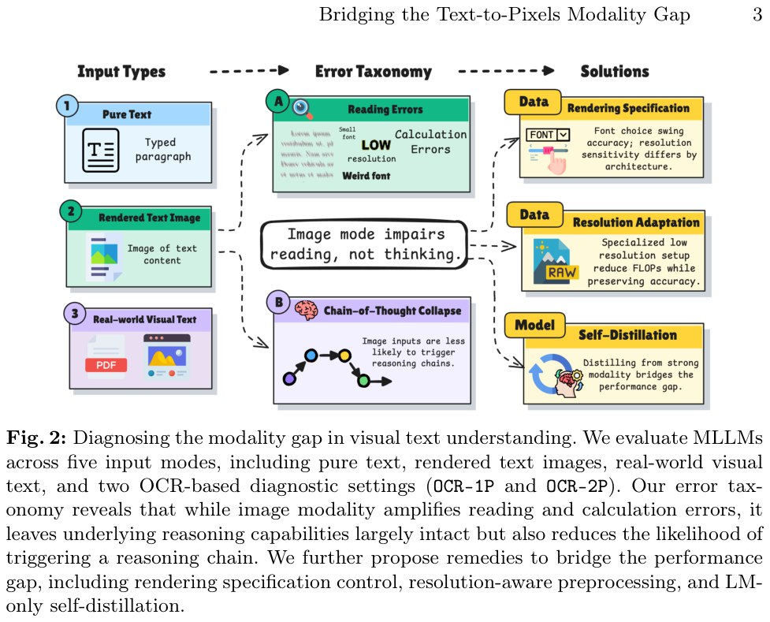

# Разрыв модальностей в мультимодальных LLM (Modality Gap)

## Краткое описание

**Разрыв модальностей (modality gap)** — это систематическое снижение производительности мультимодальных больших языковых моделей (MLLM), когда один и тот же текстовый контент подаётся на вход как изображение, а не как текстовые токены.

Это явление было детально исследовано в работе Johns Hopkins University "Reading, Not Thinking: Understanding and Bridging the Modality Gap When Text Becomes Pixels in Multimodal LLMs" [[arxiv_2603.09095](#источники)].

## Суть проблемы

Когда вы показываете мультимодальной LLM текст как картинку вместо токенов — модель «тупеет». На задачах по математике разрыв достигает **60+ процентных пунктов**.

### Ключевое открытие

Авторы провели анализ **4000+ ошибок** и выяснили: **image-режим ломает чтение, а не мышление**. Модель делает больше перцептивных и вычислительных ошибок, но концептуальные ошибки остаются теми же.

## Диагностика разрыва модальностей

### Пять режимов ввода

Исследователи оценивали MLLM в пяти различных режимах:

| Режим | Описание |
|-------|----------|
| **Pure Text** | Только текстовый контент (референсный режим) |
| **Pure Image** | Текст рендерится в изображение (1280×720, белый фон, чёрный текст) |
| **Instr.+Image** | Инструкция текстом + контент изображением (VQA-стиль) |
| **OCR-1P** (one pass) | Модель должна извлечь текст и решить задачу за один проход |
| **OCR-2P** (two passes) | Двухэтапный пайплайн: сначала OCR, затем решение задачи на извлечённом тексте |



**Image shows:** Figure 2 — Диагностика разрыва модальностей в визуальном понимании текста. MLLM оцениваются в пяти режимах ввода, включая чистый текст, рендеринги текста, реальный визуальный текст и два OCR-диагностических режима. Error taxonomy показывает, что image-мода усиливает ошибки чтения и вычислений, но оставляет способности к рассуждениям нетронутыми, одновременно снижая вероятность запуска цепочки рассуждений.

## Результаты на синтетических изображениях

### Таблица производительности по бенчмаркам

| Бенчмарк | Модель | Pure Text | Pure Image | Разрыв |
|----------|--------|-----------|------------|--------|
| **GSM8K** (математика) | Qwen2.5-VL-7B | 92.72% | 30.71% | **-62.01** |
| **GSM8K** (математика) | InternVL3-8B | 89.50% | 42.53% | **-46.97** |
| **MMLU** (знания) | GPT-5.2 | 88.5% | 85.2% | -3.3 |
| **ARC** (наука) | Qwen2.5-VL-7B | 89.8% | 89.42% | -0.38 |
| **GPQA** (graduate-level) | GPT-5.2 | 65.2% | 57.1% | -8.1 |
| **HumanEval** (код) | Qwen2.5-VL-32B | 31.10% | 85.98% | **+54.88** (инверсия!) |

**Ключевые наблюдения:**

1. **GSM8K показывает наибольший разрыв** — более 60 процентных пунктов для некоторых моделей
2. **MMLU и GPQA** — умеренные разрывы (1-8 пунктов)
3. **HumanEval** — модель-зависимое поведение: Qwen2.5-VL-32B показывает инверсию (текст хуже изображения!)

## Результаты на натуральных изображениях

На натуральных изображениях (QASPER — статьи arXiv, SQuAD — Wikipedia) тренд **меняется**:

| Датасет | Модель | Pure Text | Pure Image | Разрыв |
|---------|--------|-----------|------------|--------|
| **QASPER** | GPT-5.2 | 51.92% | 77.25% | **+25.33** |
| **QASPER** | Qwen3-8B-VL | 53.27% | 70.75% | **+17.48** |
| **SQuAD v2** | Qwen2.5-VL-7B | 80% | 83.5% | **+3.5** |
| **SQuAD v2** | GPT-5.2 | 97.5% | 71.69% | **-25.81** |

**Вывод:** На натуральных документальных изображениях MLLM часто **превосходят** текстовый режим, что указывает на выравнивание с предобучающими данными (PDF-документы в претрейне).

## Конфаундеры рендеринга

### Влияние шрифта (Font Effect)

**Критический инсайт:** Выбор шрифта влияет на точность **до 47 процентных пунктов**!

| Тип рендеринга | Влияние на точность |
|----------------|---------------------|
| Default (NotoSansMath) | Базовый уровень |
| Inverted (белый на чёрном) | Минимальное влияние |
| Monospaced (DejaVuSans Mono) | Минимальное влияние |
| **Handwriting (Priestacy)** | **Катастрофическое падение** |

Это подтверждает гипотезу, что разрыв модальностей — частично **артефакт распределения обучающих данных**: стили, распространённые в претрейне (инвертированный, моноширинный), вызывают минимальные проблемы, тогда как рукописный шрифт (редкий в стандартных корпусах) приводит к наибольшему спаду.

### Влияние разрешения

Большинство моделей демонстрируют **порог разрешения**:
- Производительность стабильна при 0.50×–1.0×
- Резкое падение при более низких разрешениях
- **InternVL3.5-8B** с Visual Resolution Router (ViR) — remarkably resolution-invariant, без падения даже при 0.25×

## Error Analysis: Таксономия ошибок

Анализ 4000+ ошибок выявил следующие категории:

### Типы ошибок

| Тип ошибки | Увеличение в image-режиме |
|------------|---------------------------|
| **Перцептивные ошибки** (чтение текста) | **1.5×** |
| **Вычислительные ошибки** (calculation) | **1.5×** |
| **Форматирование** | **1.5×** |
| **Концептуальные/рассуждения** | Без изменений |

### Chain-of-Thought Collapse

**Критическое наблюдение:** В image-режиме модели **перестают генерировать chain-of-thought**, выдавая короткие ответы вместо пошаговых рассуждений.

Это означает, что image-режим не отключает способность к рассуждениям, но **снижает вероятность запуска цепочки рассуждений**.

## Решение: Self-Distillation

### Методология

Авторы предлагают **self-distillation подход**: модель обучается на своих же текстовых рассуждениях, но с image-входом.

**Процесс:**
1. Модель генерирует reasoning traces в текстовом режиме
2. Эти же traces используются как цели для обучения с image-входом
3. Модель дистиллирует свою текстовую компетентность в визуальный путь

### Результаты

| Метрика | До | После | Улучшение |
|---------|-----|-------|-----------|
| **GSM8K (image-режим)** | 30.71% | **92.72%** | **+62.01** |
| **Перенос на unseen бенчмарки** | — | Да | Без catastrophic forgetting |

**Вклад компонентов:**
- **Vision encoder adaptation** — частичный вклад
- **Language model adaptation** — больший вклад

## Практические рекомендации

### Для исследователей

1. **Контролируйте рендеринг** — шрифт, разрешение, сжатие могут исказить результаты
2. **Используйте натуральные изображения** — синтетические рендеринги могут не отражать реальную производительность
3. **Разделяйте чтение и рассуждения** — используйте OCR-2P для диагностики

### Для практиков

1. **Self-distillation** — эффективный метод для улучшения image-режима
2. **Resolution-aware preprocessing** — выбирайте разрешение с учётом возможностей модели
3. **Font specification control** — используйте шрифты, распространённые в претрейне

## Новые концепции и термины

- **Modality gap** — разрыв производительности между текстовым и визуальным режимами ввода
- **Chain-of-thought collapse** — феномен, когда модель перестаёт генерировать пошаговые рассуждения в image-режиме
- **OCR-1P / OCR-2P** — диагностические режимы для разделения чтения и рассуждения
- **Reading vs Thinking** — ключевое различие: image-режим ломает чтение, а не мышление
- **Rendering confounders** — шрифт, разрешение, сжатие как источники систематических ошибок

## Связи с другими темами

- [[typography_gap_in_vlm.md]] — Типографическая слепота VLM: модели распознают содержание текста, но не его визуальное оформление (шрифт, размер, стиль)
- [[../../applications/computer_vision/multimodal_models.md]] — Общие понятия о мультимодальных моделях, включая архитектуры и применение
- [[../../algorithms/neural_networks/transformers/distillation_challenges.md]] — Проблемы дистилляции знаний, включая exposure bias и self-distillation
- [[../../applications/computer_vision/ocr/deepseek_ocr.md]] — OCR модели для обработки документов, включая DeepSeek-OCR с эффективным сжатием визуальных токенов
- [[clip_bow_problem.md]] — Проблема bags-of-words в VLM: поверхностное восприятие визуального контента
- [[../../algorithms/neural_networks/transformers/models/qwen/vlm_models.md]] — Визуально-языковые модели Qwen, показывающие modality gap

## Источники

1. **Reading, Not Thinking: Understanding and Bridging the Modality Gap When Text Becomes Pixels in Multimodal LLMs** — Kaiser Sun, Xiaochuang Yuan, Hongjun Liu, Chen Zhao, Cheng Zhang, Mark Dredze, Fan Bai
   - Johns Hopkins University, Amazon, New York University, Texas A&M University
   - URL: https://arxiv.org/abs/2603.09095
   - Дата: Март 2026
   - Ключевые результаты: GSM8K 30.71% → 92.72% после self-distillation, анализ 4000+ ошибок

2. **GSM8K Benchmark** — Grade-school math word problems dataset
   - 8.5K высококачественных математических задач
   - Стандартный бенчмарк для оценки рассуждений LLM

3. **Font Effect Analysis** — Влияние шрифта на точность MLLM
   - До 47 процентных пунктов разницы между шрифтами
   - Рукописные шрифты вызывают катастрофическое падение

## Медиафайлы


*Figure 2: Диагностика разрыва модальностей в визуальном понимании текста. Пять режимов ввода, error taxonomy, и предлагаемые решения.*

```metadata
category: ai
subcategory: vision_language_models
tags: modality_gap, mllm, multimodal, chain_of_thought, self_distillation, ocr, visual_text_understanding, gsm8k, reading_vs_thinking, rendering_confounders
```
