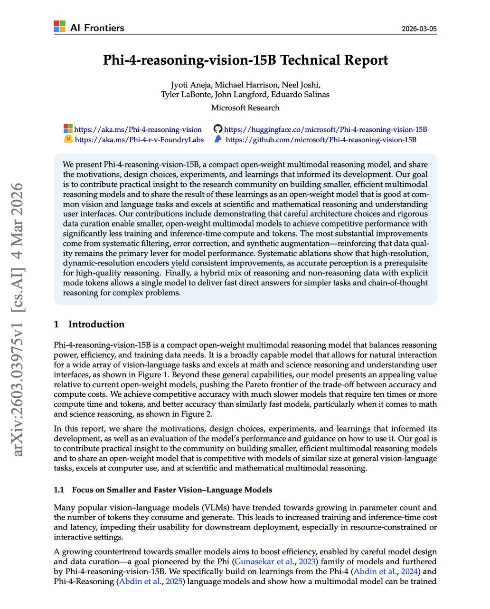

# Phi-4-reasoning-vision-15B



**Изображение:** Титульная страница технического отчёта Phi-4-reasoning-vision-15B. Авторы: Jyoti Aneja, Michael Harrison, Neel Joshi, Tyler LaBonte, John Langford, Eduardo Salinas (Microsoft Research). Frontiers 2026-03-05.

## Краткое описание

**Phi-4-reasoning-vision-15B** — компактная мультимодальная reasoning-модель с открытыми весами от Microsoft Research, разработанная для эффективного решения задач визуального понимания и логического вывода. Модель балансирует между мощностью рассуждений, эффективностью и потребностями в обучающих данных, достигая конкурентоспособной производительности при значительно меньших вычислительных затратах по сравнению с аналогами.

**Ключевая особенность:** Модель использует всего **200 миллиардов токенов** мультимодальных данных для обучения, что в 5+ раз меньше, чем у современных аналогов (Qwen 3 VL, Kimi-VL, Gemma3 используют >1 трлн токенов).

## Основные характеристики

| Параметр | Значение |
|----------|----------|
| **Параметры** | 15 миллиардов |
| **Архитектура** | Mid-fusion (среднее слияние модальностей) |
| **Визуальный энкодер** | SigLIP-2 (Tschannen et al., 2025) |
| **Языковая основа** | Phi-4-Reasoning |
| **Обучающие токены** | ~200 млрд (мультимодальные) |
| **Контекстное окно** | до 16 384 токенов |
| **Разрешение изображений** | Динамическое (до 3600 визуальных токенов, ~720p HD) |

## Архитектура

### Mid-fusion подход

Phi-4-reasoning-vision-15B использует **mid-fusion архитектуру** (также называемую late fusion), где визуальная и текстовая информация объединяются после предварительной обработки отдельными энкодерами:

```
Изображение → SigLIP-2 Vision Encoder → Визуальные токены → MLP Projector → Встраивание в LLM
Текст → Token Embeddings → Phi-4-Reasoning LLM → Выход
```

**Преимущества mid-fusion перед early-fusion:**
- Управляемые затраты на обучение и инференс
- Использование предварительно обученных компонентов
- Практический компромисс между выразительностью и эффективностью
- Возможность независимой оптимизации модальностей

### Визуальный энкодер и обработка изображений

Модель использует **SigLIP-2 vision encoder** с **динамическим разрешением** (NaFlex variant), что позволяет адаптироваться к изображениям разного размера без искажений.

#### Сравнение подходов к обработке изображений

| Метод | Макс. токены | MathVista | ScreenSpot | ScreenSpot-Pro | V*Bench |
|-------|--------------|-----------|------------|----------------|---------|
| Dynamic-S² | 3096 | 42.9 | 78.4 | 9.4 | 52.9 |
| Multi-crop | 3096 | 43.4 | 67.8 | 5.4 | 51.8 |
| Multi-crop + S² | 2048 | 43.4 | 79.1 | 10.6 | 57.1 |
| **Dynamic resolution** | **2048** | **45.2** | **81.5** | 9.2 | 51.3 |
| **Dynamic resolution** | **3600** | **44.9** | **79.7** | **17.5** | **56.0** |

**Ключевые выводы из аблаций:**
- **Динамическое разрешение с большим числом визуальных токенов** (3600) даёт наилучшие результаты на бенчмарках высокого разрешения, особенно ScreenSpot-Pro
- **Multi-crop с S²** превосходит стандартный multi-crop при меньшем числе токенов
- Динамическое разрешение производит в среднем больше токенов благодаря отсутствию ограничений тайлинга

## Процесс обучения

### Трёхэтапная стратегия

| Этап | Обучаемые модули | Данные | Токены | learning rate |
|------|------------------|--------|--------|---------------|
| **1. MLP Pretraining** | Только MLP | Выравнивание изображение-текст | 1.4 млрд | 1×10⁻³ |
| **2. Instruction Tuning** | MLP + Vision Encoder + LLM | Single-image instruction tuning | 188.5 млрд | 2×10⁻⁵ |
| **3. Long Context & RAI** | MLP + Vision Encoder + LLM | Long content, multi-image, RAI | 12 млрд | 7×10⁻⁷ |

#### Этап 1: Предобучение MLP
- **Цель:** Выравнивание пространства визуальных признаков SigLIP-2 с пространством текстовых эмбеддингов Phi-4-Reasoning
- **Замороженные модули:** Vision encoder, LLM
- **Данные:** 2M чистых пар изображение-описание

#### Этап 2: Instruction Tuning
- **Цель:** Основное обучение на широком спектре задач
- **Обучаемые модули:** Все компоненты (MLP, vision encoder, LLM)
- **Задачи:** VQA, математическое и научное реazoning, grounding, captioning, OCR, computer-use
- **Формат:** Смесь reasoning traces (`<think>`) и прямых ответов (`<nothink>`)

#### Этап 3: Long Context, Multi-Image и RAI
- **Цель:** Расширение возможностей для длинных контекстов и мультимодального взаимодействия
- **Специализированные данные:** Понимание длинных документов, multi-image задачи, safety (RAI)
- **Максимальная длина последовательности:** 16 384 токенов

## Подготовка данных

### Категории качества данных

Процесс улучшения open-source данных включал ручную классификацию по категориям:

1. **Excellent-quality data** — высококачественные вопросы с правильными ответами
2. **Good questions with wrong answers** — качественные вопросы, но с ошибками в ответах (перегенерировано через GPT-4o/o4-mini)
3. **Low-quality questions** — бессмысленные или неотвечаемые вопросы
4. **Low-quality images** — повторяющиеся или дефектные изображения
5. **High-quality with formatting errors** — ошибки форматирования (исправлены программно)

### Техники аугментации данных

1. **Генерация описаний изображений** — для математических/научных датасетов созданы детальные описания изображений через Phi-4-Reasoning
2. **Double-duty данные** — модификация текста для одновременного обучения instruction following и domain-specific задачам
3. **Multi-image данные** — создание записей со scrambled captions и caption-matching форматами (~5 изображений)
4. **"What's changed?" данные** — последовательные скриншоты для улучшения навигации в реальном времени (CUA/робототехника)
5. **Упрощение промптов** — замена over-engineered промптов на разнообразные человеческие формулировки

### Баланс Mathematics vs Computer-Use

| General | Math | CUA | Total | MMMU-CoT | MathVista | ScreenSpot-V2 |
|---------|------|-----|-------|----------|-----------|---------------|
| 1M | 150K | 450K | 1.6M | 44.0 | 37.4 | 48.2 |
| 1M | 150K | 850K | 2.0M | 44.1 | 37.3 | 60.0 |
| 1M | 450K | 450K | 1.9M | 45.3 | 36.0 | 48.3 |
| **1M** | **450K** | **850K** | **2.3M** | **43.4** | **38.9** | **63.1** |

**Вывод:** Увеличение математических данных в 3× при сохранении computer-use данных улучшает **оба** типа бенчмарков одновременно.

### Нормализация координат

Все пространственные координаты в данных нормализованы к диапазону **[0.0, 1.0]** относительно размеров изображения для обеспечения согласованного представления.

## Производительность

### Позиционирование на рынке

Phi-4-reasoning-vision-15B достигает **конкурентной точности** с моделями, требующими в **10+ раз больше вычислений и токенов**, и превосходит аналогичные по скорости модели, особенно в математическом и научном reasoning.

**Бенчмарки (усреднённые):**
- ChartQA (TEST)
- MathVista (MINI)
- MMMU (VAL)
- ScreenSpot_v2

Модель **pushes the Pareto frontier** компромисса между точностью и вычислительными затратами.

## Режимы работы

### Гибридный режим reasoning/non-reasoning

Модель поддерживает **явные mode tokens** для переключения между режимами:

- **`<think>`** — chain-of-thought reasoning для сложных задач
- **`<nothink>`** — быстрые прямые ответы для простых задач

Это позволяет **единой модели** адаптироваться к сложности задачи без необходимости отдельных моделей для разных сценариев использования.

## Применение

### Основные области

1. **Научное и математическое reasoning** — решение задач STEM с визуальными компонентами
2. **Понимание пользовательских интерфейсов** — анализ GUI, скриншотов, веб-страниц
3. **Компьютерное использование (Computer Use)** — навигация по рабочему столу, браузерам
4. **Общие задачи vision-language** — captioning, VQA, OCR, grounding
5. **Мультимодальное взаимодействие** — работа с несколькими изображениями, длинными документами

### Примеры использования

- Интерпретация квитанций и документов
- Чтение инструкций по уходу за одеждой
- Анализ научных диаграмм и графиков
- Навигация по пользовательским интерфейсам
- Описание путешествий по фотографиям

## Связи с другими темами

- [[siglip_visual_encoder.md]] — SigLIP-2 используется как vision encoder
- [[multimodal_architecture_comparison.md]] — Mid-fusion архитектура в контексте других подходов
- [[multimodal_models.md]] — Общее описание мультимодальных моделей
- [[omnialign_v.md]] — Выравнивание мультимодальных моделей с человеческими предпочтениями
- [[phi_information_decomposition_phid.md]] — Механистическая интерпретируемость в семействе Phi

## Источники

1. **Phi-4-reasoning-vision-15B Technical Report** — Jyoti Aneja, Michael Harrison, Neel Joshi, Tyler LaBonte, John Langford, Eduardo Salinas. Microsoft Research, 2026. [arXiv:2603.03975](https://arxiv.org/abs/2603.03975v1)
2. **Hugging Face Model Card** — [microsoft/Phi-4-reasoning-vision-15B](https://huggingface.co/microsoft/Phi-4-reasoning-vision-15B)
3. **GitHub Repository** — [microsoft/Phi-4-reasoning-vision-15B](https://github.com/microsoft/Phi-4-reasoning-vision-15B)
4. **Azure Foundry Labs** — [Phi-4-reasoning-vision FoundryLabs](https://aka.ms/Phi-4-r-v-FoundryLabs)

## Дополнительные материалы

- **SigLIP-2 Documentation** — Tschannen et al., 2025. Multilingual vision-language encoders with improved semantic understanding
- **Phi-4-Reasoning** — Abdin et al., 2025. Языковая основа для Phi-4-reasoning-vision-15B
- **Phi-4** — Abdin et al., 2024. Базовая языковая модель
